*********************
augmenters.arithmetic
*********************

Add
---

Add a value to all pixels in an image.

API link: :class:`~imgaug.augmenters.arithmetic.Add`

**Example.**
Add random values between -40 and 40 to images, with each value
being sampled once per image and then being the same for all pixels::

    import imgaug.augmenters as iaa
    aug = iaa.Add((-40, 40))

.. figure:: ../../images/overview_of_augmenters/arithmetic/add.jpg
    :alt: Add

**Example.**
Add random values between -40 and 40 to images. In 50% of all
images the values differ per channel (3 sampled value). In the other 50% of
all images the value is the same for all channels::

    aug = iaa.Add((-40, 40), per_channel=0.5)

.. figure:: ../../images/overview_of_augmenters/arithmetic/add_per_channel.jpg
    :alt: Add per channel

AddElementwise
--------------

Add values to the pixels of images with possibly different values
for neighbouring pixels.

API link: :class:`~imgaug.augmenters.arithmetic.AddElementwise`

**Example.**
Add random values between -40 and 40 to images, with each value being sampled
per pixel::

    import imgaug.augmenters as iaa
    aug = iaa.AddElementwise((-40, 40))

.. figure:: ../../images/overview_of_augmenters/arithmetic/addelementwise.jpg
    :alt: AddElementwise

**Example.**
Add random values between -40 and 40 to images. In 50% of all images the
values differ per channel (3 sampled values per pixel).
In the other 50% of all images the value is the same for all channels per pixel::

    aug = iaa.AddElementwise((-40, 40), per_channel=0.5)

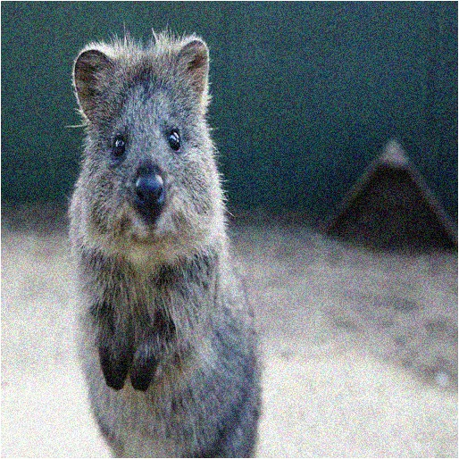

AdditiveGaussianNoise
---------------------

Add noise sampled from gaussian distributions elementwise to images.

API link: :func:`~imgaug.augmenters.arithmetic.AdditiveGaussianNoise`

**Example.**
Add gaussian noise to an image, sampled once per pixel from a normal
distribution ``N(0, s)``, where ``s`` is sampled per image and varies between
``0`` and ``0.2*255``::

    import imgaug.augmenters as iaa
    aug = iaa.AdditiveGaussianNoise(scale=(0, 0.2*255))

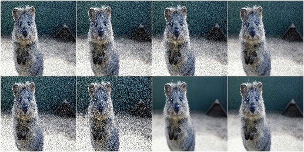

**Example.**
Add gaussian noise to an image, sampled once per pixel from a normal
distribution ``N(0, 0.05*255)``::

    aug = iaa.AdditiveGaussianNoise(scale=0.2*255)

**Example.**
Add gaussian noise to an image, sampled channelwise from
``N(0, 0.2*255)`` (i.e. three independent samples per pixel)::

    aug = iaa.AdditiveGaussianNoise(scale=0.2*255, per_channel=True)

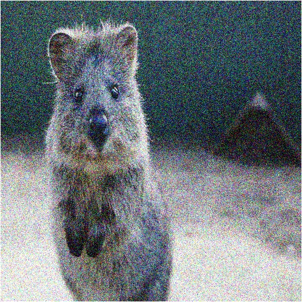

.. Add gaussian noise from ``N(0, 0.05*255)`` to an image. For 50% of all images,
    a single value is sampled for each pixel and re-used for all three channels
    of that pixel. For the other 50% of all images, three values are sampled
    per pixel (i.e. channelwise sampling).::

        aug = iaa.AdditiveGaussianNoise(scale=0.2*255, per_channel=0.5)

    .. figure:: ../../images/overview_of_augmenters/arithmetic/additivegaussiannoise_per_channel.jpg
        :alt: AdditiveGaussianNoise per channel

AdditiveLaplaceNoise
---------------------

Add noise sampled from laplace distributions elementwise to images.

The laplace distribution is similar to the gaussian distribution, but
puts more weight on the long tail. Hence, this noise will add more
outliers (very high/low values). It is somewhere between gaussian noise and
salt and pepper noise.

API link: :func:`~imgaug.augmenters.arithmetic.AdditiveLaplaceNoise`

**Example.**
Add laplace noise to an image, sampled once per pixel from ``Laplace(0, s)``,
where ``s`` is sampled per image and varies between ``0`` and ``0.2*255``::

    import imgaug.augmenters as iaa
    aug = iaa.AdditiveLaplaceNoise(scale=(0, 0.2*255))

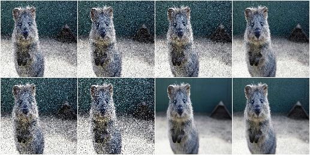

**Example.**
Add laplace noise to an image, sampled once per pixel from
``Laplace(0, 0.2*255)``::

    aug = iaa.AdditiveLaplaceNoise(scale=0.2*255)

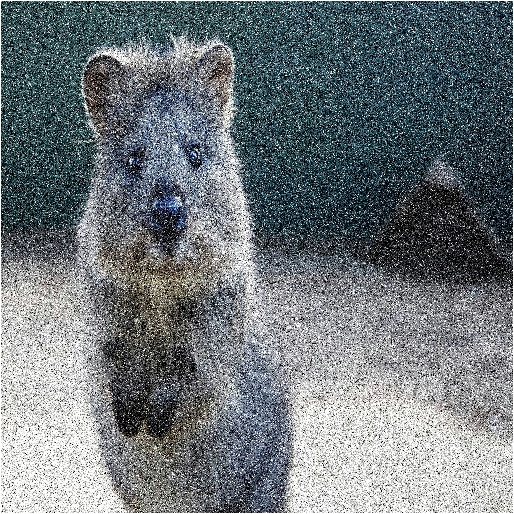

**Example.**
Add laplace noise to an image, sampled channelwise from
``Laplace(0, 0.2*255)`` (i.e. three independent samples per pixel)::

    aug = iaa.AdditiveLaplaceNoise(scale=0.2*255, per_channel=True)

.. Add laplace noise from ``N(0, 0.05*255)`` to an image. For 50% of all images,
    a single value is sampled for each pixel and re-used for all three channels
    of that pixel. For the other 50% of all images, three values are sampled
    per pixel (i.e. channelwise sampling).::

        aug = iaa.AdditiveLaplaceNoise(scale=0.2*255, per_channel=0.5)

    .. figure:: ../../images/overview_of_augmenters/arithmetic/additivelaplacenoise_per_channel.jpg
        :alt: AdditiveLaplaceNoise per channel

AdditivePoissonNoise
---------------------

Add noise sampled from poisson distributions elementwise to images.

Poisson noise is comparable to gaussian noise, as e.g. generated via
``AdditiveGaussianNoise``. As poisson distributions produce only positive
numbers, the sign of the sampled values are here randomly flipped.

Values of around ``20.0`` for ``lam`` lead to visible noise (for ``uint8``).
Values of around ``40.0`` for ``lam`` lead to very visible noise (for
``uint8``).
It is recommended to usually set ``per_channel`` to ``True``.

API link: :func:`~imgaug.augmenters.arithmetic.AdditivePoissonNoise`

**Example.**
Add poisson noise to an image, sampled once per pixel from ``Poisson(lam)``,
where ``lam`` is sampled per image and varies between ``0`` and ``40``::

    import imgaug.augmenters as iaa
    aug = iaa.AdditivePoissonNoise(scale=(0, 40))

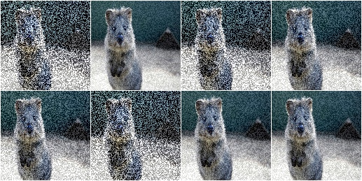

**Example.**
Add poisson noise to an image, sampled once per pixel from ``Poisson(40)``::

    aug = iaa.AdditivePoissonNoise(40)

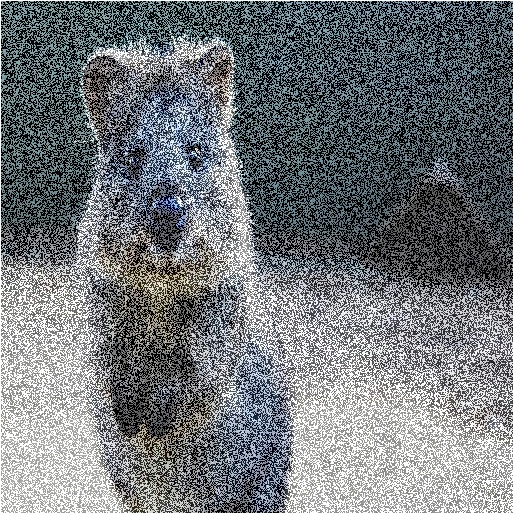

**Example.**
Add poisson noise to an image, sampled channelwise from
``Poisson(40)`` (i.e. three independent samples per pixel)::

    aug = iaa.AdditivePoissonNoise(scale=40, per_channel=True)

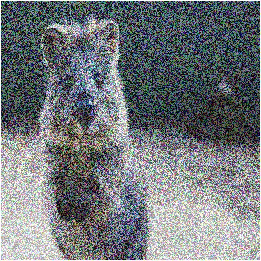

.. Add poisson noise from ``Poisson(40)`` to an image. For 50% of all images,
    a single value is sampled for each pixel and re-used for all three channels
    of that pixel. For the other 50% of all images, three values are sampled
    per pixel (i.e. channelwise sampling).::

        aug = iaa.AdditivePoissonNoise(scale=40, per_channel=0.5)

    .. figure:: ../../images/overview_of_augmenters/arithmetic/additivepoissonnoise_per_channel.jpg
        :alt: AdditivePoissonNoise per channel

Multiply
--------

Multiply all pixels in an image with a specific value, thereby making the
image darker or brighter.

API link: :class:`~imgaug.augmenters.arithmetic.Multiply`

**Example.**
Multiply each image with a random value between 0.5 and 1.5::

    import imgaug.augmenters as iaa
    aug = iaa.Multiply((0.5, 1.5))

.. figure:: ../../images/overview_of_augmenters/arithmetic/multiply.jpg
    :alt: Multiply

**Example.**
Multiply 50% of all images with a random value between 0.5 and 1.5
and multiply the remaining 50% channel-wise, i.e. sample one multiplier
independently per channel::

    aug = iaa.Multiply((0.5, 1.5), per_channel=0.5)

.. figure:: ../../images/overview_of_augmenters/arithmetic/multiply_per_channel.jpg
    :alt: Multiply per channel

MultiplyElementwise
-------------------

Multiply values of pixels with possibly different values for neighbouring
pixels, making each pixel darker or brighter.

API link: :class:`~imgaug.augmenters.arithmetic.MultiplyElementwise`

**Example.**
Multiply each pixel with a random value between 0.5 and 1.5::

    import imgaug.augmenters as iaa
    aug = iaa.MultiplyElementwise((0.5, 1.5))

.. figure:: ../../images/overview_of_augmenters/arithmetic/multiplyelementwise.jpg
    :alt: MultiplyElementwise

**Example.**
Multiply in 50% of all images each pixel with random values between 0.5 and 1.5
and multiply in the remaining 50% of all images the pixels channel-wise, i.e.
sample one multiplier independently per channel and pixel::

    aug = iaa.MultiplyElementwise((0.5, 1.5), per_channel=0.5)

.. figure:: ../../images/overview_of_augmenters/arithmetic/multiplyelementwise_per_channel.jpg
    :alt: MultiplyElementwise per channel

Cutout
------

Fill one or more rectangular areas in an image using a fill mode.

See paper "Improved Regularization of Convolutional Neural Networks with
Cutout" by DeVries and Taylor.

In contrast to the paper, this implementation also supports replacing
image sub-areas with gaussian noise, random intensities or random RGB
colors. It also supports non-squared areas. While the paper uses
absolute pixel values for the size and position, this implementation
uses relative values, which seems more appropriate for mixed-size
datasets. The position parameter furthermore allows more flexibility, e.g.
gaussian distributions around the center.

.. note::

    This augmenter affects only image data. Other datatypes (e.g.
    segmentation map pixels or keypoints within the filled areas)
    are not affected.

.. note::

    Gaussian fill mode will assume that float input images contain values
    in the interval ``[0.0, 1.0]`` and hence sample values from a
    gaussian within that interval, i.e. from ``N(0.5, std=0.5/3)``.

API link: :class:`~imgaug.augmenters.arithmetic.MultiplyElementwise`

**Example.**
Fill per image two random areas, by default with grayish pixels::

    import imgaug.augmenters as iaa
    aug = iaa.Cutout(nb_iterations=2)

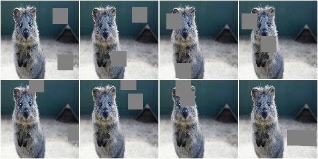

**Example.**
Fill per image between one and five areas, each having ``20%``
of the corresponding size of the height and width (for non-square
images this results in non-square areas to be filled). ::

    aug = iaa.Cutout(nb_iterations=(1, 5), size=0.2, squared=False)

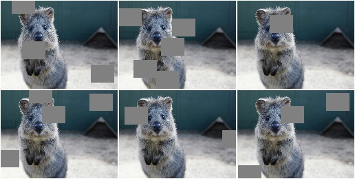

**Example.**
Fill all areas with white pixels::

    aug = iaa.Cutout(fill_mode="constant", cval=255)

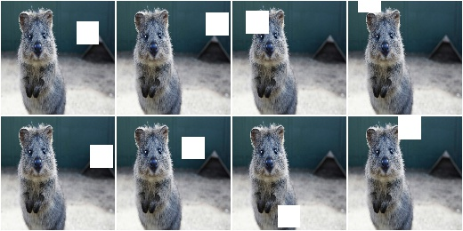

**Example.**
Fill ``50%`` of all areas with a random intensity value between
``0`` and ``256``. Fill the other ``50%`` of all areas with random colors. ::

    aug = iaa.Cutout(fill_mode="constant", cval=(0, 255),
                     fill_per_channel=0.5)

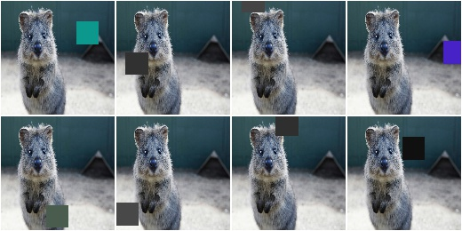

**Example.**
Fill areas with gaussian channelwise noise (i.e. usually RGB). ::

    aug = iaa.Cutout(fill_mode="gaussian", fill_per_channel=True)

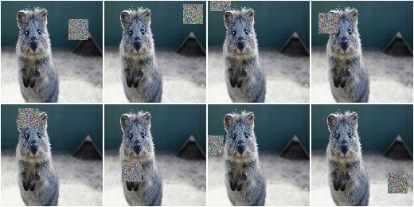

Dropout
-------

Augmenter that sets a certain fraction of pixels in images to zero.

API link: :func:`~imgaug.augmenters.arithmetic.Dropout`

**Example.**
Sample per image a value ``p`` from the range ``0<=p<=0.2`` and then drop
``p`` percent of all pixels in the image (i.e. convert them to black pixels)::

    import imgaug.augmenters as iaa
    aug = iaa.Dropout(p=(0, 0.2))

.. figure:: ../../images/overview_of_augmenters/arithmetic/dropout.jpg
    :alt: Dropout

**Example.**
Sample per image a value ``p`` from the range ``0<=p<=0.2`` and then drop
``p`` percent of all pixels in the image (i.e. convert them to black pixels),
but do this independently per channel in 50% of all images::

    aug = iaa.Dropout(p=(0, 0.2), per_channel=0.5)

.. figure:: ../../images/overview_of_augmenters/arithmetic/dropout_per_channel.jpg
    :alt: Dropout per channel

CoarseDropout
-------------

Augmenter that sets rectangular areas within images to zero.

API link: :func:`~imgaug.augmenters.arithmetic.CoarseDropout`

**Example.**
Drop 2% of all pixels by converting them to black pixels, but do
that on a lower-resolution version of the image that has 50% of the original
size, leading to 2x2 squares being dropped::

    import imgaug.augmenters as iaa
    aug = iaa.CoarseDropout(0.02, size_percent=0.5)

.. figure:: ../../images/overview_of_augmenters/arithmetic/coarsedropout.jpg
    :alt: CoarseDropout

**Example.**
Drop 0 to 5% of all pixels by converting them to black pixels, but do
that on a lower-resolution version of the image that has 5% to 50% of the
original size, leading to large rectangular areas being dropped::

    import imgaug.augmenters as iaa
    aug = iaa.CoarseDropout((0.0, 0.05), size_percent=(0.02, 0.25))

.. figure:: ../../images/overview_of_augmenters/arithmetic/coarsedropout_both_uniform.jpg
    :alt: CoarseDropout p and size uniform

**Example.**
Drop 2% of all pixels by converting them to black pixels, but do
that on a lower-resolution version of the image that has 50% of the original
size, leading to 2x2 squares being dropped. Also do this in 50% of all
images channel-wise, so that only the information of some channels in set
to 0 while others remain untouched::

    aug = iaa.CoarseDropout(0.02, size_percent=0.15, per_channel=0.5)

.. figure:: ../../images/overview_of_augmenters/arithmetic/coarsedropout_per_channel.jpg
    :alt: CoarseDropout per channel

Dropout2D
---------

Drop random channels from images.

For image data, dropped channels will be filled with zeros.

.. note::

    This augmenter may also set the arrays of heatmaps and segmentation
    maps to zero and remove all coordinate-based data (e.g. it removes
    all bounding boxes on images that were filled with zeros).
    It does so if and only if *all* channels of an image are dropped.
    If ``nb_keep_channels >= 1`` then that never happens.

API link: :func:`~imgaug.augmenters.arithmetic.Dropout2d`

**Example.**
Create a dropout augmenter that drops on average half of all image
channels. Dropped channels will be filled with zeros. At least one
channel is kept unaltered in each image (default setting). ::

    import imgaug.augmenters as iaa
    aug = iaa.Dropout2d(p=0.5)

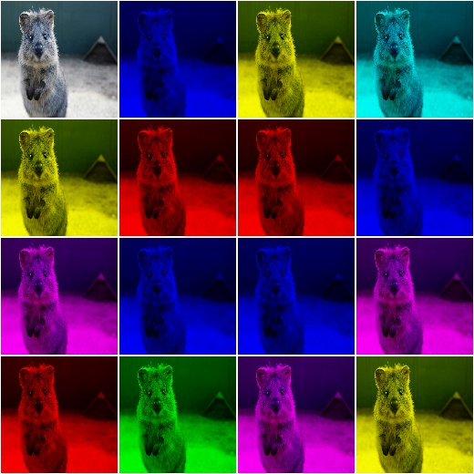

**Example.**
Create a dropout augmenter that drops on average half of all image
channels *and* may drop *all* channels in an image (i.e. images may
contain nothing but zeros)::

    import imgaug.augmenters as iaa
    aug = iaa.Dropout2d(p=0.5, nb_keep_channels=0)

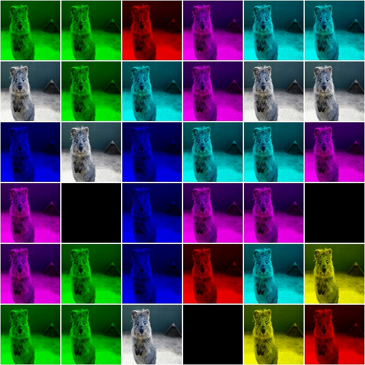

TotalDropout
------------

Drop all channels of a defined fraction of all images.

For image data, all components of dropped images will be filled with zeros.

.. note::

    This augmenter also sets the arrays of heatmaps and segmentation
    maps to zero and removes all coordinate-based data (e.g. it removes
    all bounding boxes on images that were filled with zeros).

API link: :func:`~imgaug.augmenters.arithmetic.TotalDropout`

**Example.**
Create an augmenter that sets *all* components of all images to zero::

    import imgaug.augmenters as iaa
    aug = iaa.TotalDropout(1.0)

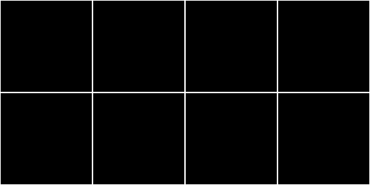

**Example.**
Create an augmenter that sets *all* components of ``50%`` of all images to
zero::

    aug = iaa.TotalDropout(0.5)

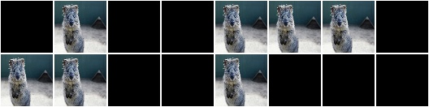

ReplaceElementwise
------------------

Replace pixels in an image with new values.

API link: :class:`~imgaug.augmenters.arithmetic.ReplaceElementwise`

**Example.**
Replace ``10%`` of all pixels with either the value ``0`` or the value
``255``::

    import imgaug.augmenters as iaa
    aug = ReplaceElementwise(0.1, [0, 255])

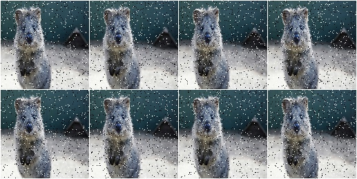

**Example.**
For ``50%`` of all images, replace ``10%`` of all pixels with either the value
``0`` or the value ``255`` (same as in the previous example). For the other
``50%`` of all images, replace *channelwise* ``10%`` of all pixels with either
the value ``0`` or the value ``255``. So, it will be very rare for each pixel
to have all channels replaced by ``255`` or ``0``. ::

    aug = ReplaceElementwise(0.1, [0, 255], per_channel=0.5)

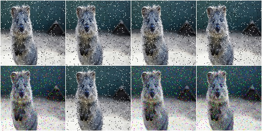

**Example.**
Replace ``10%`` of all pixels by gaussian noise centered around ``128``. Both
the replacement mask and the gaussian noise are sampled for ``50%`` of all
images. ::

    import imgaug.parameters as iap
    aug = ReplaceElementwise(0.1, iap.Normal(128, 0.4*128), per_channel=0.5)

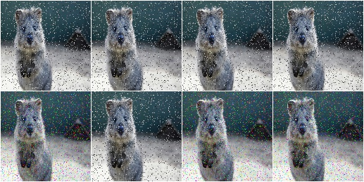

**Example.**
Replace ``10%`` of all pixels by gaussian noise centered around ``128``. Sample
the replacement mask at a lower resolution (``8x8`` pixels) and upscale it to
the image size, resulting in coarse areas being replaced by gaussian noise. ::

    aug = ReplaceElementwise(
        iap.FromLowerResolution(iap.Binomial(0.1), size_px=8),
        iap.Normal(128, 0.4*128),
        per_channel=0.5)

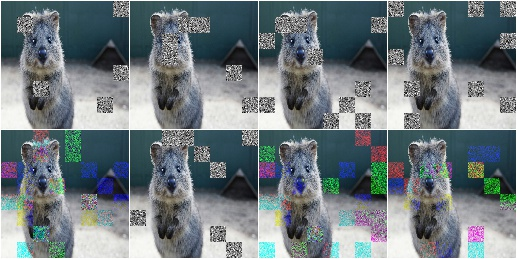

ImpulseNoise
------------

Add impulse noise to images.

This is identical to ``SaltAndPepper``, except that ``per_channel`` is
always set to ``True``.

API link: :func:`~imgaug.augmenters.arithmetic.ImpulseNoise`

**Example.**
Replace ``10%`` of all pixels with impulse noise::

    import imgaug.augmenters as iaa
    aug = iaa.ImpulseNoise(0.1)

.. figure:: ../../images/overview_of_augmenters/arithmetic/impulsenoise.jpg
    :alt: ImpulseNoise

SaltAndPepper
-------------

Replace pixels in images with salt/pepper noise (white/black-ish colors).

API link: :func:`~imgaug.augmenters.arithmetic.SaltAndPepper`

**Example.**
Replace ``10%`` of all pixels with salt and pepper noise::

    import imgaug.augmenters as iaa
    aug = iaa.SaltAndPepper(0.1)

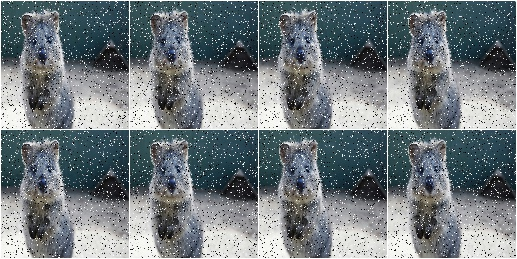

**Example.**
Replace *channelwise* ``10%`` of all pixels with salt and pepper
noise::

    aug = iaa.SaltAndPepper(0.1, per_channel=True)

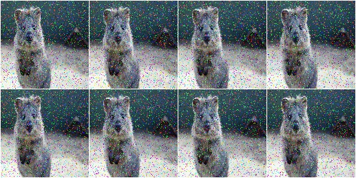

CoarseSaltAndPepper
-------------------

Replace rectangular areas in images with white/black-ish pixel noise.

API link: :func:`~imgaug.augmenters.arithmetic.CoarseSaltAndPepper`

**Example.**
Mark ``5%`` of all pixels in a mask to be replaced by salt/pepper
noise. The mask has ``1%`` to ``10%`` the size of the input image.
The mask is then upscaled to the input image size, leading to large
rectangular areas being marked as to be replaced. These areas are then
replaced in the input image by salt/pepper noise. ::

    import imgaug.augmenters as iaa
    aug = iaa.CoarseSaltAndPepper(0.05, size_percent=(0.01, 0.1))

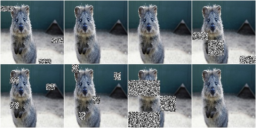

**Example.**
Same as in the previous example, but the replacement mask before upscaling
has a size between ``4x4`` and ``16x16`` pixels (the axis sizes are sampled
independently, i.e. the mask may be rectangular). ::

    aug = iaa.CoarseSaltAndPepper(0.05, size_px=(4, 16))

.. figure:: ../../images/overview_of_augmenters/arithmetic/coarsesaltandpepper_pixels.jpg
    :alt: CoarseSaltAndPepper with size_px

**Example.**
Same as in the first example, but mask and replacement are each sampled
independently per image channel. ::

    aug = iaa.CoarseSaltAndPepper(
        0.05, size_percent=(0.01, 0.1), per_channel=True)

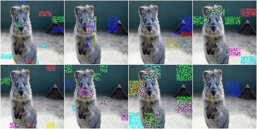

Salt
----

Replace pixels in images with salt noise, i.e. white-ish pixels.

This augmenter is similar to ``SaltAndPepper``, but adds no pepper noise to
images.

API link: :func:`~imgaug.augmenters.arithmetic.Salt`

**Example.**
Replace ``10%`` of all pixels with salt noise (white-ish colors)::

    import imgaug.augmenters as iaa
    aug = iaa.Salt(0.1)

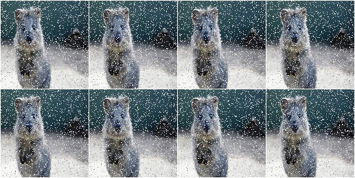

**Example.**
Similar to ``SaltAndPepper``, this augmenter also supports the ``per_channel``
argument, which is skipped here for brevity.

CoarseSalt
----------

Replace rectangular areas in images with white-ish pixel noise.

This augmenter is similar to ``CoarseSaltAndPepper``, but adds no pepper noise
to images.

API link: :func:`~imgaug.augmenters.arithmetic.CoarseSalt`

**Example.**
Mark ``5%`` of all pixels in a mask to be replaced by salt
noise. The mask has ``1%`` to ``10%`` the size of the input image.
The mask is then upscaled to the input image size, leading to large
rectangular areas being marked as to be replaced. These areas are then
replaced in the input image by salt noise. ::

    import imgaug.augmenters as iaa
    aug = iaa.CoarseSalt(0.05, size_percent=(0.01, 0.1))

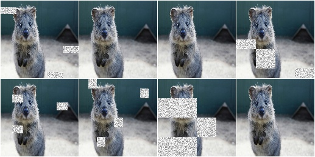

Similar to ``CoarseSaltAndPepper``, this augmenter also supports the
``per_channel`` argument, which is skipped here for brevity

Pepper
------

Replace pixels in images with pepper noise, i.e. black-ish pixels.

This augmenter is similar to ``SaltAndPepper``, but adds no salt noise to
images.

This augmenter is similar to ``Dropout``, but slower and the black pixels are
not uniformly black.

API link: :func:`~imgaug.augmenters.arithmetic.Pepper`

**Example.**
Replace ``10%`` of all pixels with pepper noise (black-ish colors)::

    import imgaug.augmenters as iaa
    aug = iaa.Pepper(0.1)

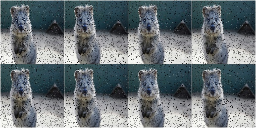

Similar to ``SaltAndPepper``, this augmenter also supports the ``per_channel``
argument, which is skipped here for brevity.

CoarsePepper
------------

Replace rectangular areas in images with black-ish pixel noise.

This augmenter is similar to ``CoarseSaltAndPepper``, but adds no salt noise
to images.

API link: :func:`~imgaug.augmenters.arithmetic.CoarsePepper`

**Example.**
Mark ``5%`` of all pixels in a mask to be replaced by pepper
noise. The mask has ``1%`` to ``10%`` the size of the input image.
The mask is then upscaled to the input image size, leading to large
rectangular areas being marked as to be replaced. These areas are then
replaced in the input image by pepper noise. ::

    import imgaug.augmenters as iaa
    aug = iaa.CoarsePepper(0.05, size_percent=(0.01, 0.1))

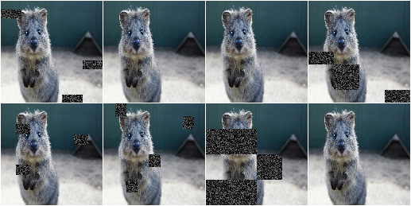

Similar to ``CoarseSaltAndPepper``, this augmenter also supports the
``per_channel`` argument, which is skipped here for brevity

Invert
------

Augmenter that inverts all values in images, i.e. sets a pixel from value
``v`` to ``255-v``.

API link: :class:`~imgaug.augmenters.arithmetic.Invert`

**Example.**
Invert in 50% of all images all pixels::

    import imgaug.augmenters as iaa
    aug = iaa.Invert(0.5)

.. figure:: ../../images/overview_of_augmenters/arithmetic/invert.jpg
    :alt: Invert

**Example.**
For 50% of all images, invert all pixels in these images with 25% probability
(per image). In the remaining 50% of all images, invert 25% of all channels::

    aug = iaa.Invert(0.25, per_channel=0.5)

.. figure:: ../../images/overview_of_augmenters/arithmetic/invert_per_channel.jpg
    :alt: Invert per channel

Solarize
--------

Invert all values above a threshold in images.

This is the same as :class:`Invert`, but sets a default threshold around
``128`` (+/- 64, decided per image) and default `invert_above_threshold`
to ``True`` (i.e. only values above the threshold will be inverted).

API link: :class:`~imgaug.augmenters.arithmetic.Solarize`

**Example.**
Invert the colors in ``50`` percent of all images for pixels with a
value between ``32`` and ``128`` or more. The threshold is sampled once
per image. The thresholding operation happens per channel. ::

    import imgaug.augmenters as iaa
    aug = iaa.Solarize(0.5, threshold=(32, 128))

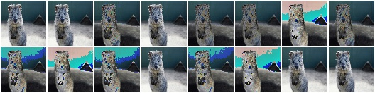

JpegCompression
---------------

Degrade the quality of images by JPEG-compressing them.

API link: :class:`~imgaug.augmenters.arithmetic.JpegCompression`

**Example.**
Remove high frequency components in images via JPEG compression with
a *compression strength* between ``80`` and ``95`` (randomly and
uniformly sampled per image). This corresponds to a (very low) *quality*
setting of ``5`` to ``20``. ::

    import imgaug.augmenters as iaa
    aug = iaa.JpegCompression(compression=(70, 99))

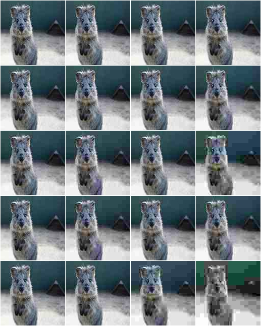
