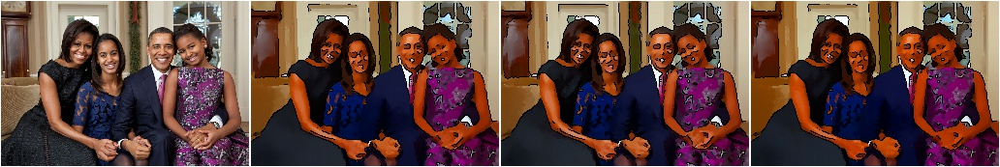
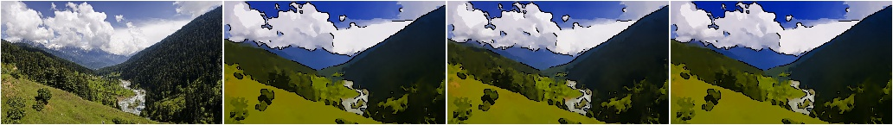
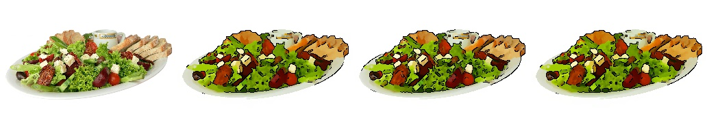
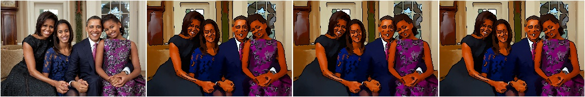
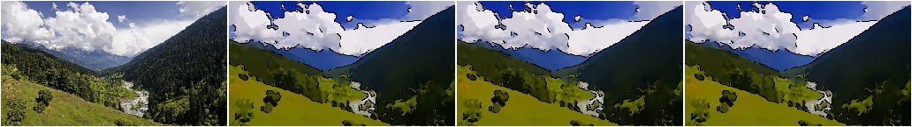
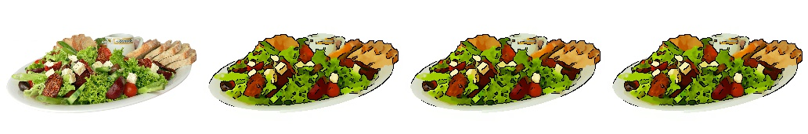

*******************
augmenters.artistic
*******************

Cartoon
-------

Convert the style of images to a more cartoonish one.

This augmenter was primarily designed for images with a size of ``200``
to ``800`` pixels. Smaller or larger images may cause issues.

Note that the quality of the results can currently not compete with
learned style transfer, let alone human-made images. A lack of detected
edges or also too many detected edges are probably the most significant
drawbacks.

API link: :class:`~imgaug.augmenters.artistic.Cartoon`

**Example.**
Create an example image, then apply a cartoon filter to it::

    import imgaug.augmenters as iaa
    aug = iaa.Cartoon()

**Example.**
Create a non-stochastic cartoon augmenter that produces decent-looking
images::

    aug = iaa.Cartoon(blur_ksize=3, segmentation_size=1.0,
                      saturation=2.0, edge_prevalence=1.0)

