****************
augmenters.blend
****************

.. note::

    It is not recommended to use blending augmenter with child augmenters
    that change the geometry of images (e.g. horizontal flips, affine
    transformations) if you *also* want to augment coordinates (e.g.
    keypoints, bounding boxes, polygons, ...), as it is not clear which of
    the two coordinate results (first or second branch) should be used as the
    coordinates after augmentation. Currently, all blending augmenters try
    to use the augmented coordinates of the branch that makes up most of the
    augmented image.

BlendAlpha
----------

Alpha-blend two image sources using an alpha/opacity value.

The two image sources can be imagined as branches.
If a source is not given, it is automatically the same as the input.
Let ``FG`` be the foreground branch and ``BG`` be the background branch.
Then the result images are defined as ``factor * FG + (1-factor) * BG``,
where ``factor`` is an overlay factor.

API link: :class:`~imgaug.augmenters.blend.BlendAlpha`

**Example.**
Convert each image to pure grayscale and alpha-blend the result with the
original image using an alpha of ``50%``, thereby removing about ``50%`` of
all color. This is equivalent to ``iaa.Grayscale(0.5)``. ::

    import imgaug.augmenters as iaa
    aug = iaa.BlendAlpha(0.5, iaa.Grayscale(1.0))

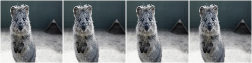

**Example.**
Same as in the previous example, but the alpha factor is sampled uniformly
from the interval ``[0.0, 1.0]`` once per image, thereby removing a random
fraction of all colors. This is equivalent to
``iaa.Grayscale((0.0, 1.0))``. ::

    aug = iaa.BlendAlpha((0.0, 1.0), iaa.Grayscale(1.0))

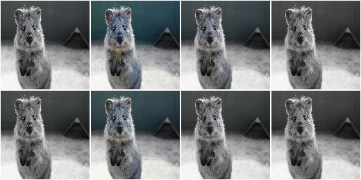

**Example.**
First, rotate each image by a random degree sampled uniformly from the
interval ``[-20, 20]``. Then, alpha-blend that new image with the original
one using a random factor sampled uniformly from the interval
``[0.0, 1.0]``. For ``50%`` of all images, the blending happens
channel-wise and the factor is sampled independently per channel
(``per_channel=0.5``). As a result, e.g. the red channel may look visibly
rotated (factor near ``1.0``), while the green and blue channels may not
look rotated (factors near ``0.0``). ::

    aug = iaa.BlendAlpha(
        (0.0, 1.0),
        iaa.Affine(rotate=(-20, 20)),
        per_channel=0.5)

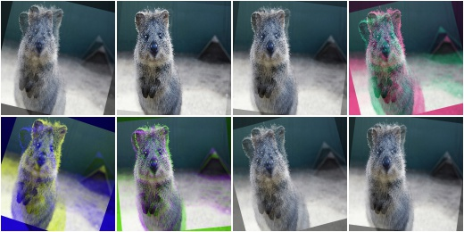

**Example.**
Apply two branches of augmenters -- ``A`` and ``B`` -- *independently*
to input images and alpha-blend the results of these branches using a
factor ``f``. Branch ``A`` increases image pixel intensities by ``100``
and ``B`` multiplies the pixel intensities by ``0.2``. ``f`` is sampled
uniformly from the interval ``[0.0, 1.0]`` per image. The resulting images
contain a bit of ``A`` and a bit of ``B``. ::

    aug = iaa.BlendAlpha(
        (0.0, 1.0),
        foreground=iaa.Add(100),
        background=iaa.Multiply(0.2))

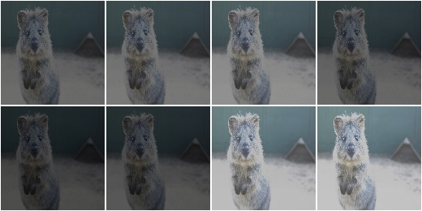

**Example.**
Apply median blur to each image and alpha-blend the result with the original
image using an alpha factor of either exactly ``0.25`` or exactly ``0.75``
(sampled once per image). ::

    aug = iaa.BlendAlpha([0.25, 0.75], iaa.MedianBlur(13))

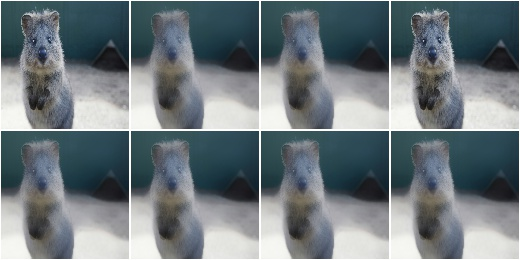

BlendAlphaMask
--------------

Alpha-blend two image sources using non-binary masks generated per image.

This augmenter queries for each image a mask generator to generate
a ``(H,W)`` or ``(H,W,C)`` channelwise mask ``[0.0, 1.0]``, where
``H`` is the image height and ``W`` the width.
The mask will then be used to alpha-blend pixel- and possibly channel-wise
between a foreground branch of augmenters and a background branch.
(Both branches default to the identity operation if not provided.)

See also :class:`~imgaug.augmenters.blend.BlendAlpha`.

API link: :class:`~imgaug.augmenters.blend.BlendAlphaMask`

**Example.**
Create an augmenter that sometimes adds clouds at the bottom and
sometimes at the top of the image::

    import imgaug.augmenters as iaa
    aug = iaa.BlendAlphaMask(
        iaa.InvertMaskGen(0.5, iaa.VerticalLinearGradientMaskGen()),
        iaa.Clouds()
    )

.. figure:: ../../images/overview_of_augmenters/blend/blendalphamask.jpg
    :alt: BlendAlphaMask with vertical gradient and Clouds

BlendAlphaElementwise
---------------------

Alpha-blend two image sources using alpha/opacity values sampled per pixel.

This is the same as :class:`BlendAlpha`, except that the opacity factor is
sampled once per *pixel* instead of once per *image* (or a few times per
image, if ``BlendAlpha.per_channel`` is set to ``True``).

See :class:`BlendAlpha` for more details.

This class is a wrapper around
:class:`~imgaug.augmenters.blend.BlendAlphaMask`.

API link: :class:`~imgaug.augmenters.blend.BlendAlphaElementwise`

**Example.**
Convert each image to pure grayscale and alpha-blend the result with the
original image using an alpha of ``50%`` for all pixels, thereby removing
about ``50%`` of all color. This is equivalent to ``iaa.Grayscale(0.5)``.
This is also equivalent to ``iaa.Alpha(0.5, iaa.Grayscale(1.0))``, as
the opacity has a fixed value of ``0.5`` and is hence identical for all
pixels. ::

    import imgaug.augmenters as iaa
    aug = iaa.BlendAlphaElementwise(0.5, iaa.Grayscale(1.0))

.. figure:: ../../images/overview_of_augmenters/blend/blendalphaelementwise_050_grayscale.jpg
    :alt: Alpha-blend images pixelwise with grayscale images

**Example.**
Same as in the previous example, but here with hue-shift instead
of grayscaling and additionally the alpha factor is sampled uniformly
from the interval ``[0.0, 1.0]`` once per pixel, thereby shifting the
hue by a random fraction for each pixel. ::

    aug = iaa.BlendAlphaElementwise((0, 1.0), iaa.AddToHue(100))

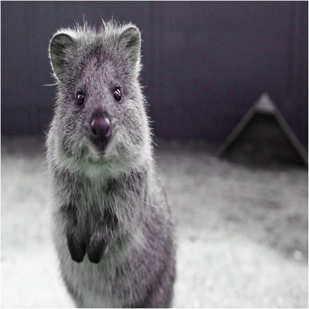

**Example.**
First, rotate each image by a random degree sampled uniformly from the
interval ``[-20, 20]``. Then, alpha-blend that new image with the original
one using a random factor sampled uniformly from the interval
``[0.0, 1.0]`` per pixel. For ``50%`` of all images, the blending happens
channel-wise and the factor is sampled independently per pixel *and*
channel (``per_channel=0.5``). As a result, e.g. the red channel may look
visibly rotated (factor near ``1.0``), while the green and blue channels
may not look rotated (factors near ``0.0``). ::

    aug = iaa.BlendAlphaElementwise(
        (0.0, 1.0),
        iaa.Affine(rotate=(-20, 20)),
        per_channel=0.5)

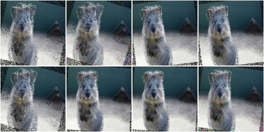

**Example.**
Apply two branches of augmenters -- ``A`` and ``B`` -- *independently*
to input images and alpha-blend the results of these branches using a
factor ``f``. Branch ``A`` increases image pixel intensities by ``100``
and ``B`` multiplies the pixel intensities by ``0.2``. ``f`` is sampled
uniformly from the interval ``[0.0, 1.0]`` per pixel. The resulting images
contain a bit of ``A`` and a bit of ``B``. ::

    aug = iaa.BlendAlphaElementwise(
        (0.0, 1.0),
        foreground=iaa.Add(100),
        background=iaa.Multiply(0.2))

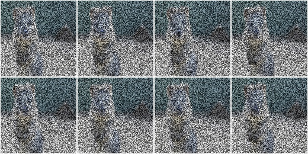

**Example.**
Apply median blur to each image and alpha-blend the result with the
original image using an alpha factor of either exactly ``0.25`` or
exactly ``0.75`` (sampled once per pixel). ::

    aug = iaa.BlendAlphaElementwise([0.25, 0.75], iaa.MedianBlur(13))

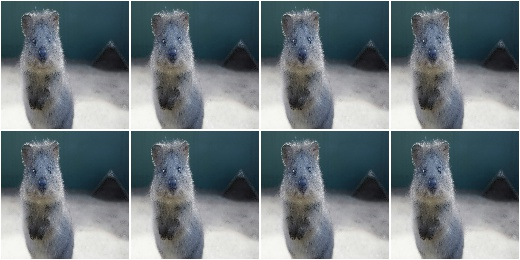

BlendAlphaSimplexNoise
----------------------

Alpha-blend two image sources using simplex noise alpha masks.

The alpha masks are sampled using a simplex noise method, roughly creating
connected blobs of 1s surrounded by 0s. If nearest neighbour
upsampling is used, these blobs can be rectangular with sharp edges.

API link: :class:`~imgaug.augmenters.blend.BlendAlphaSimplexNoise`

**Example.**
Detect per image all edges, mark them in a black and white image and
then alpha-blend the result with the original image using simplex noise
masks. ::

    import imgaug.augmenters as iaa
    aug = iaa.BlendAlphaSimplexNoise(iaa.EdgeDetect(1.0))

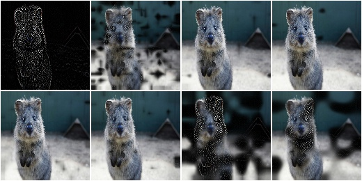

**Example.**
Same as in the previous example, but using only nearest neighbour
upscaling to scale the simplex noise masks to the final image sizes, i.e.
no nearest linear upsampling is used. This leads to rectangles with sharp
edges. ::

    aug = iaa.BlendAlphaSimplexNoise(
        iaa.EdgeDetect(1.0),
        upscale_method="nearest")

.. figure:: ../../images/overview_of_augmenters/blend/blendalphasimplexnoise_nearest.jpg
    :alt: BlendAlphaSimplexNoise with EdgeDetect and nearest neighbour upscaling

**Example.**
Same as in the previous example, but using only linear upscaling to
scale the simplex noise masks to the final image sizes, i.e. no nearest
neighbour upsampling is used. This leads to rectangles with smooth edges. ::

    aug = iaa.BlendAlphaSimplexNoise(
        iaa.EdgeDetect(1.0),
        upscale_method="linear")

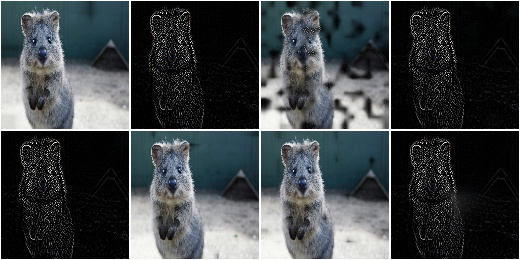

**Example.**
Same as in the first example, but using a threshold for the sigmoid
function that is further to the right. This is more conservative, i.e.
the generated noise masks will be mostly black (values around ``0.0``),
which means that most of the original images (parameter/branch `second`)
will be kept, rather than using the results of the augmentation
(parameter/branch `first`). ::

    import imgaug.parameters as iap
    aug = iaa.BlendAlphaSimplexNoise(
        iaa.EdgeDetect(1.0),
        sigmoid_thresh=iap.Normal(10.0, 5.0))

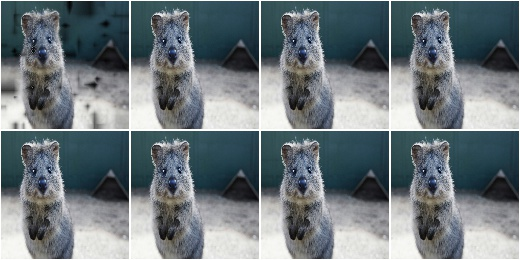

BlendAlphaFrequencyNoise
------------------------

Alpha-blend two image sources using frequency noise masks.

The alpha masks are sampled using frequency noise of varying scales,
which can sometimes create large connected blobs of ``1`` s surrounded
by ``0`` s and other times results in smaller patterns. If nearest
neighbour upsampling is used, these blobs can be rectangular with sharp
edges.

API link: :class:`~imgaug.augmenters.blend.BlendAlphaFrequencyNoise`

**Example.**
Detect per image all edges, mark them in a black and white image and
then alpha-blend the result with the original image using frequency noise
masks. ::

    import imgaug.augmenters as iaa
    aug = iaa.BlendAlphaFrequencyNoise(first=iaa.EdgeDetect(1.0))

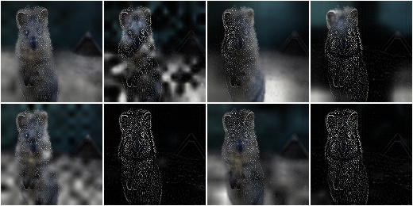

**Example.**
Same as the first example, but using only linear upscaling to
scale the frequency noise masks to the final image sizes, i.e. no nearest
neighbour upsampling is used. This results in smooth edges. ::

    aug = iaa.BlendAlphaFrequencyNoise(
        first=iaa.EdgeDetect(1.0),
        upscale_method="nearest")

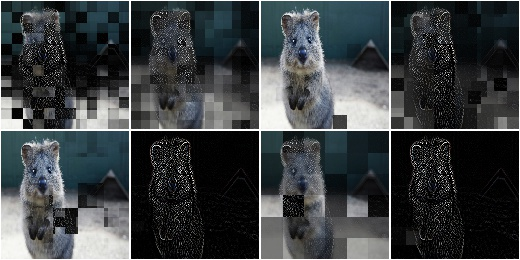

**Example.**
Same as the first example, but using only linear upscaling to
scale the frequency noise masks to the final image sizes, i.e. no nearest
neighbour upsampling is used. This results in smooth edges. ::

    aug = iaa.BlendAlphaFrequencyNoise(
        first=iaa.EdgeDetect(1.0),
        upscale_method="linear")

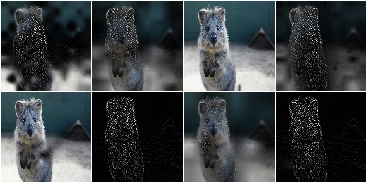

**Example.**
Same as in the previous example, but with the exponent set to a constant
``-2`` and the sigmoid deactivated, resulting in cloud-like patterns
without sharp edges. ::

    aug = iaa.BlendAlphaFrequencyNoise(
        first=iaa.EdgeDetect(1.0),
        upscale_method="linear",
        exponent=-2,
        sigmoid=False)

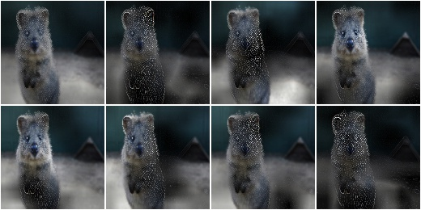

**Example.**
Same as the first example, but using a threshold for the sigmoid function
that is further to the right. This is more conservative, i.e. the generated
noise masks will be mostly black (values around ``0.0``), which means that
most of the original images (parameter/branch `second`) will be kept,
rather than using the results of the augmentation (parameter/branch
`first`). ::

    import imgaug.parameters as iap
    aug = iaa.BlendAlphaFrequencyNoise(
        first=iaa.EdgeDetect(1.0),
        sigmoid_thresh=iap.Normal(10.0, 5.0))

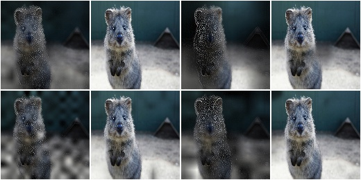

BlendAlphaSomeColors
--------------------

Blend images from two branches using colorwise masks.

This class generates masks that "mark" a few colors and replace the
pixels within these colors with the results of the foreground branch.
The remaining pixels are replaced with the results of the background
branch (usually the identity function). That allows to e.g. selectively
grayscale a few colors, while keeping other colors unchanged.

This class is a thin wrapper around
:class:`~imgaug.augmenters.blend.BlendAlphaMask` together with
:class:`~imgaug.augmenters.blend.SomeColorsMaskGen`.

API link: :class:`~imgaug.augmenters.blend.BlendAlphaSomeColors`

**Example.**
Create an augmenter that turns randomly removes some colors in images by
grayscaling them::

    import imgaug.augmenters as iaa
    aug = iaa.BlendAlphaSomeColors(iaa.Grayscale(1.0))

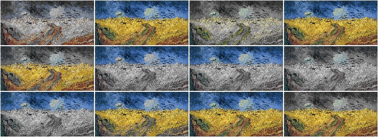

**Example.**
Create an augmenter that removes some colors in images by replacing them
with black pixels::

    aug = iaa.BlendAlphaSomeColors(iaa.TotalDropout(1.0))

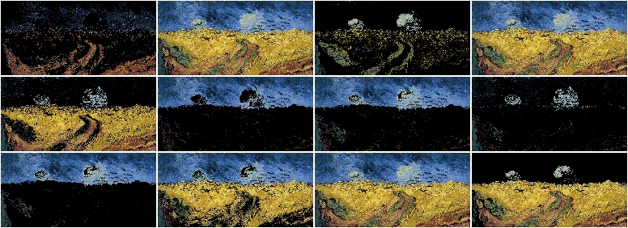

**Example.**
Create an augmenter that desaturates some colors and increases the
saturation of the remaining ones::

    aug = iaa.BlendAlphaSomeColors(
        iaa.MultiplySaturation(0.5), iaa.MultiplySaturation(1.5))

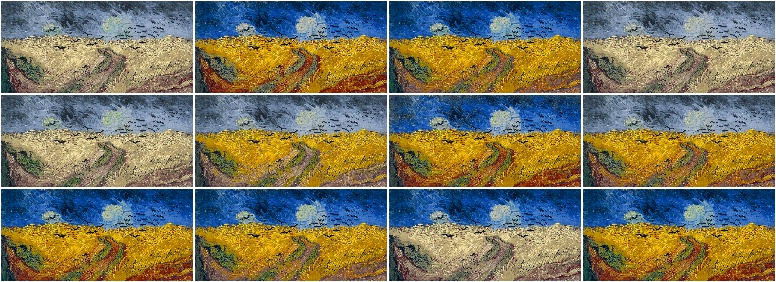

**Example.**
Create an augmenter that applies average pooling to some colors.
Each color tune is either selected (alpha of ``1.0``) or not
selected (``0.0``). There is no gradual change between similar colors. ::

    aug = iaa.BlendAlphaSomeColors(
        iaa.AveragePooling(7), alpha=[0.0, 1.0], smoothness=0.0)

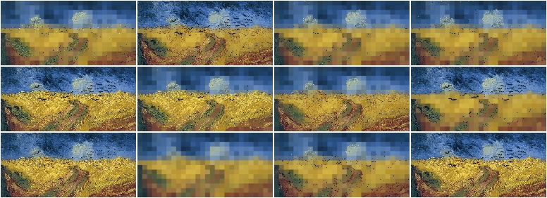

**Example.**
Create an augmenter that applies average pooling to some colors.
Choose on average half of all colors in images for the blending operation. ::

    aug = iaa.BlendAlphaSomeColors(
        iaa.AveragePooling(7), nb_bins=2, smoothness=0.0)

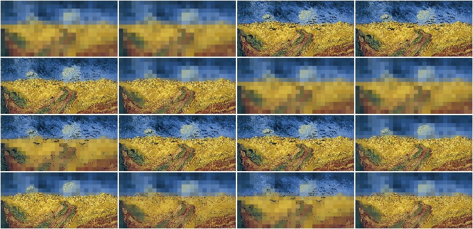

**Example.**
Create an augmenter that applies average pooling to some colors with
input images being in BGR colorspace ::

    aug = iaa.BlendAlphaSomeColors(
        iaa.AveragePooling(7), from_colorspace="BGR")

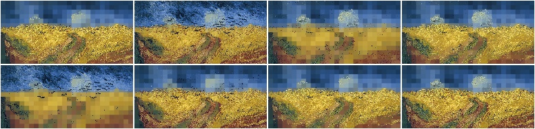

BlendAlphaHorizontalLinearGradient
----------------------------------

Blend images from two branches along a horizontal linear gradient.

This class generates a horizontal linear gradient mask (i.e. usually a
mask with low values on the left and high values on the right) and
alphas-blends between foreground and background branch using that
mask.

This class is a thin wrapper around
:class:`~imgaug.augmenters.blend.BlendAlphaMask` together with
:class:`~imgaug.augmenters.blend.HorizontalLinearGradientMaskGen`.

API link: :class:`~imgaug.augmenters.blend.BlendAlphaHorizontalLinearGradient`

**Example.**
Create an augmenter that removes more color towards the right of the
image::

    import imgaug.augmenters as iaa
    aug = iaa.BlendAlphaHorizontalLinearGradient(iaa.AddToHue((-100, 100)))

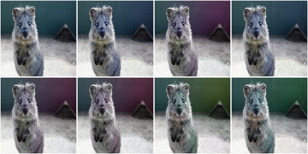

**Example.**
Create an augmenter that replaces pixels towards the right with darker
and darker values. However it always keeps at least
20% (``1.0 - max_value``) of the original pixel value on the far right
and always replaces at least 20% on the far left (``min_value=0.2``). ::

    aug = iaa.BlendAlphaHorizontalLinearGradient(
        iaa.TotalDropout(1.0),
        min_value=0.2, max_value=0.8)

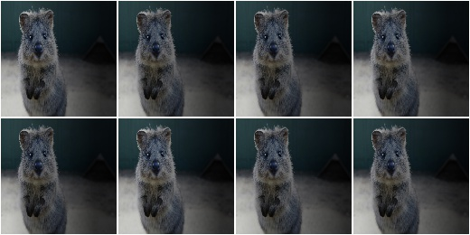

**Example.**
Create an augmenter that blends with an average-pooled image according
to a horizontal gradient that starts at a random x-coordinate and reaches
its maximum at another random x-coordinate. Due to that randomness,
the gradient may increase towards the left or right. ::

    aug = iaa.BlendAlphaHorizontalLinearGradient(
        iaa.AveragePooling(11),
        start_at=(0.0, 1.0), end_at=(0.0, 1.0))

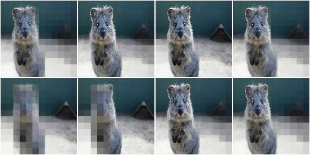

BlendAlphaVerticalLinearGradient
--------------------------------

Blend images from two branches along a vertical linear gradient.

This class generates a vertical linear gradient mask (i.e. usually a
mask with low values on the left and high values on the right) and
alphas-blends between foreground and background branch using that
mask.

This class is a thin wrapper around
:class:`~imgaug.augmenters.blend.BlendAlphaMask` together with
:class:`~imgaug.augmenters.blend.VerticalLinearGradientMaskGen`.

API link: :class:`~imgaug.augmenters.blend.BlendAlphaVerticalLinearGradient`

**Example.**
Create an augmenter that removes more color towards the bottom of the
image::

    import imgaug.augmenters as iaa
    aug = iaa.BlendAlphaVerticalLinearGradient(iaa.AddToHue((-100, 100)))

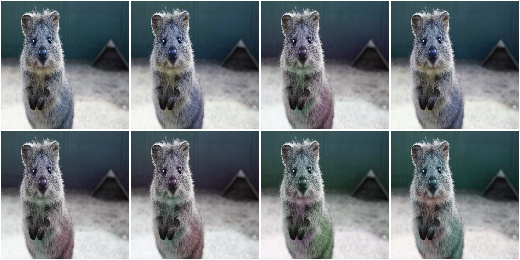

**Example.**
Create an augmenter that replaces pixels towards the bottom with darker
and darker values. However it always keeps at least
20% (``1.0 - max_value``) of the original pixel value on the far bottom
and always replaces at least 20% on the far top (``min_value=0.2``). ::

    aug = iaa.BlendAlphaVerticalLinearGradient(
        iaa.TotalDropout(1.0),
        min_value=0.2, max_value=0.8)

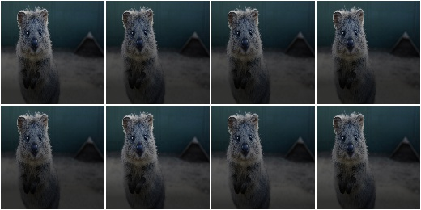

**Example.**
Create an augmenter that blends with an average-pooled image according
to a vertical gradient that starts at a random y-coordinate and reaches
its maximum at another random y-coordinate. Due to that randomness,
the gradient may increase towards the bottom or top. ::

    aug = iaa.BlendAlphaVerticalLinearGradient(
        iaa.AveragePooling(11),
        start_at=(0.0, 1.0), end_at=(0.0, 1.0))

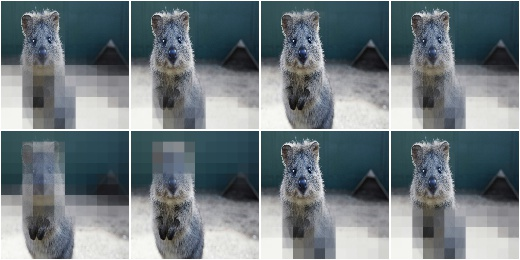

**Example.**
Create an augmenter that draws clouds in roughly the top quarter of the
image::

    aug = iaa.BlendAlphaVerticalLinearGradient(
        iaa.Clouds(),
        start_at=(0.15, 0.35), end_at=0.0)

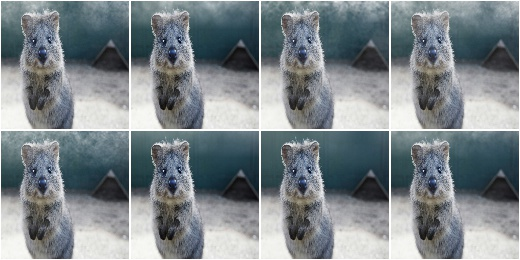

BlendAlphaRegularGrid
---------------------

Blend images from two branches according to a regular grid.

This class generates for each image a mask that splits the image into a
grid-like pattern of ``H`` rows and ``W`` columns. Each cell is then
filled with an alpha value, sampled randomly per cell.

The difference to :class:`AlphaBlendCheckerboard` is that this class
samples random alpha values per grid cell, while in the checkerboard the
alpha values follow a fixed pattern.

This class is a thin wrapper around
:class:`~imgaug.augmenters.blend.BlendAlphaMask` together with
:class:`~imgaug.augmenters.blend.RegularGridMaskGen`.

API link: :class:`~imgaug.augmenters.blend.BlendAlphaRegularGrid`

**Example.**
Create an augmenter that places a ``HxW`` grid on each image, where
``H`` (rows) is randomly and uniformly sampled from the interval ``[4, 6]``
and ``W`` is analogously sampled from the interval ``[1, 4]``. Roughly
half of the cells in the grid are filled with ``0.0``, the remaining ones
are unaltered. Which cells exactly are "dropped" is randomly decided
per image. The resulting effect is similar to
:class:`~imgaug.augmenters.arithmetic.CoarseDropout`. ::

    import imgaug.augmenters as iaa
    aug = iaa.BlendAlphaRegularGrid(nb_rows=(4, 6), nb_cols=(1, 4),
                                    foreground=iaa.Multiply(0.0))

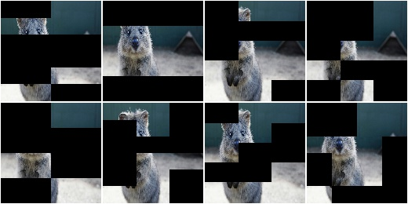

**Example.**
Create an augmenter that always placed ``2x2`` cells on each image
and sets about ``1/3`` of them to zero (foreground branch) and
the remaining ``2/3`` to a pixelated version (background branch). ::

    aug = iaa.BlendAlphaRegularGrid(nb_rows=2, nb_cols=2,
                                    foreground=iaa.Multiply(0.0),
                                    background=iaa.AveragePooling(8),
                                    alpha=[0.0, 0.0, 1.0])

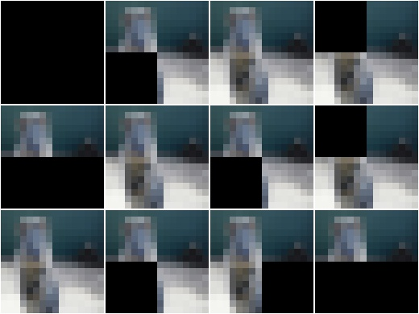

BlendAlphaCheckerboard
----------------------

Blend images from two branches according to a checkerboard pattern.

This class generates for each image a mask following a checkboard layout of
``H`` rows and ``W`` columns. Each cell is then filled with either
``1.0`` or ``0.0``. The cell at the top-left is always ``1.0``. Its right
and bottom neighbour cells are ``0.0``. The 4-neighbours of any cell always
have a value opposite to the cell's value (``0.0`` vs. ``1.0``).

This class is a thin wrapper around
:class:`~imgaug.augmenters.blend.BlendAlphaMask` together with
:class:`~imgaug.augmenters.blend.CheckerboardMaskGen`.

API link: :class:`~imgaug.augmenters.blend.BlendAlphaCheckerboard`

**Example.**
Create an augmenter that places a ``HxW`` grid on each image, where
``H`` (rows) is always ``2`` and ``W`` is randomly and uniformly sampled
from the interval ``[1, 4]``. Half of the cells in the grid are
grayscaled, the other half is unaltered. ::

    import imgaug.augmenters as iaa
    aug = iaa.BlendAlphaCheckerboard(nb_rows=2, nb_cols=(1, 4),
                                     foreground=iaa.AddToHue((-100, 100)))

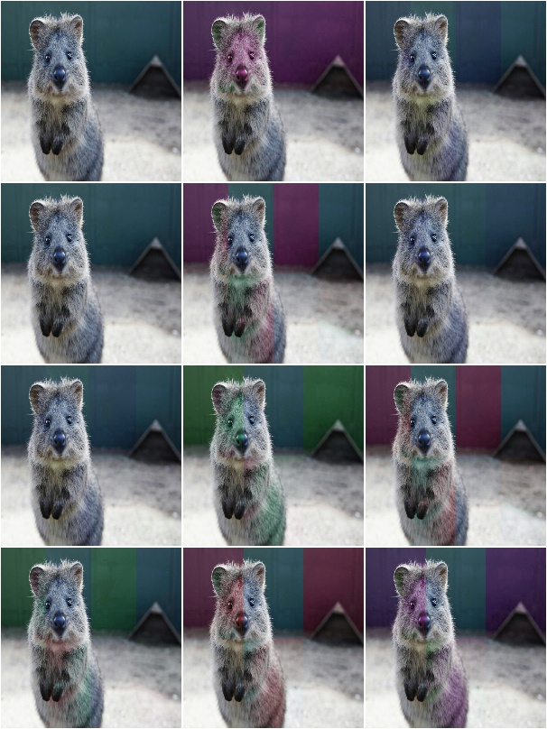

BlendAlphaSegMapClassIds
------------------------

Blend images from two branches based on segmentation map ids.

This class generates masks that are ``1.0`` at pixel locations covered
by specific classes in segmentation maps.

This class is a thin wrapper around
:class:`~imgaug.augmenters.blend.BlendAlphaMask` together with
:class:`~imgaug.augmenters.blend.SegMapClassIdsMaskGen`.

.. note::

    Segmentation maps can have multiple channels. If that is the case
    then for each position ``(x, y)`` it is sufficient that any class id
    in any channel matches one of the desired class ids.

.. note::

    This class will produce an ``AssertionError`` if there are no
    segmentation maps in a batch.

API link: :class:`~imgaug.augmenters.blend.BlendAlphaSegMapClassIds`

**Example.**
Create an augmenter that removes color wherever the segmentation maps
contain the classes ``1`` or ``3``::

    import imgaug.augmenters as iaa
    aug = iaa.BlendAlphaSegMapClassIds(
        [1, 3],
        foreground=iaa.AddToHue((-100, 100)))

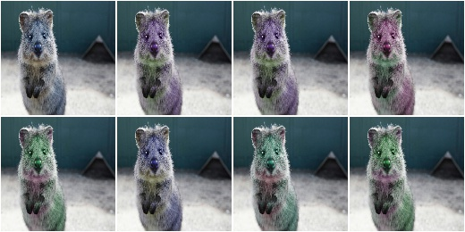

**Example.**
Create an augmenter that randomly picks ``2`` classes from the
list ``[1, 2, 3, 4]`` and blurs the image content wherever these classes
appear in the segmentation map. Note that as the sampling of class ids
happens *with replacement*, it is not guaranteed to sample two *unique*
class ids. ::

    aug = iaa.BlendAlphaSegMapClassIds(
        [1, 2, 3, 4],
        nb_sample_classes=2,
        foreground=iaa.GaussianBlur(3.0))

**Example.**
Create an augmenter that zeros for roughly every fifth image all
image pixels that do *not* belong to class id ``2`` (note that the
`background` branch was used, not the `foreground` branch).
Example use case: Human body landmark detection where both the
landmarks/keypoints and the body segmentation map are known. Train the
model to detect landmarks and sometimes remove all non-body information
to force the model to become more independent of the background. ::

    aug = iaa.Sometimes(0.2,
        iaa.BlendAlphaSegMapClassIds(
            2,
            background=iaa.TotalDropout(1.0)))

BlendAlphaBoundingBoxes
-----------------------

Blend images from two branches based on areas enclosed in bounding boxes.

This class generates masks that are ``1.0`` within bounding boxes of given
labels. A mask pixel will be set to ``1.0`` if *at least* one bounding box
covers the area and has one of the requested labels.

This class is a thin wrapper around
:class:`~imgaug.augmenters.blend.BlendAlphaMask` together with
:class:`~imgaug.augmenters.blend.BoundingBoxesMaskGen`.

.. note::

    Avoid using augmenters as children that affect pixel locations (e.g.
    horizontal flips). See
    :class:`~imgaug.augmenters.blend.BlendAlphaMask` for details.

.. note::

    This class will produce an ``AssertionError`` if there are no
    bounding boxes in a batch.

API link: :class:`~imgaug.augmenters.blend.BlendAlphaBoundingBoxes`

**Example.**
Create an augmenter that removes color within bounding boxes having the
label ``person``::

    import imgaug.augmenters as iaa
    aug = iaa.BlendAlphaBoundingBoxes("person",
                                      foreground=iaa.Grayscale(1.0))

**Example.**
Create an augmenter that randomizes the hue within bounding boxes that
have the label ``person`` or ``car``::

    aug = iaa.BlendAlphaBoundingBoxes(["person", "car"],
                                      foreground=iaa.AddToHue((-255, 255)))

**Example.**
Create an augmenter that randomizes the hue within bounding boxes that
have either the label ``person`` or ``car``. Only one label is picked per
image. Note that the sampling happens with replacement, so if
``nb_sample_classes`` would be ``>1``, it could still lead to only one
*unique* label being sampled. ::

    aug = iaa.BlendAlphaBoundingBoxes(["person", "car"],
                                      foreground=iaa.AddToHue((-255, 255)),
                                      nb_sample_labels=1)

**Example.**
Create an augmenter that zeros all pixels (``Multiply(0.0)``)
that are *not* (``background`` branch) within bounding boxes of
*any* (``None``) label. In other words, all pixels outside of bounding
boxes become black.
Note that we don't use ``TotalDropout`` here, because by default it will
also remove all coordinate-based augmentables, which will break the
blending of such inputs. ::

    aug = iaa.BlendAlphaBoundingBoxes(None,
                                      background=iaa.Multiply(0.0))

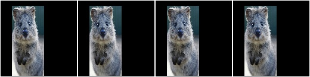
