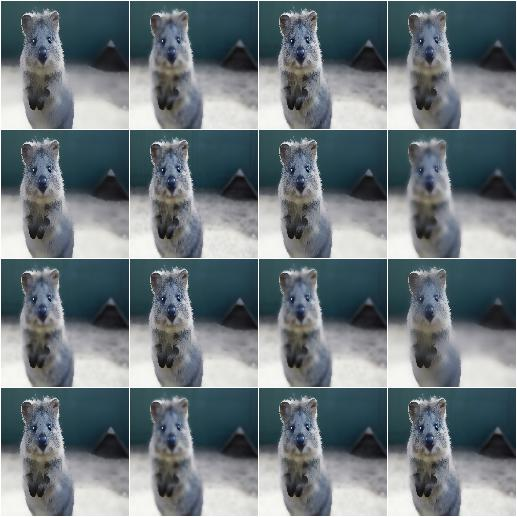
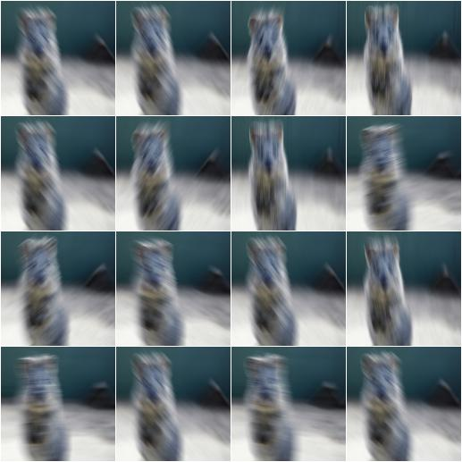
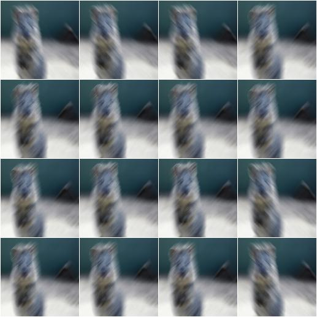
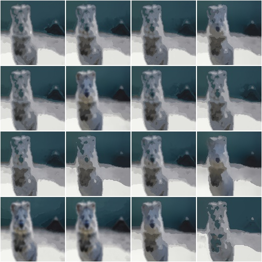

***************
augmenters.blur
***************

GaussianBlur
------------

Augmenter to blur images using gaussian kernels.

API link: :class:`~imgaug.augmenters.blur.GaussianBlur`

**Example.**
Blur each image with a gaussian kernel with a sigma of ``3.0``::

    import imgaug.augmenters as iaa
    aug = iaa.GaussianBlur(sigma=(0.0, 3.0))

.. figure:: ../../images/overview_of_augmenters/blur/gaussianblur.jpg
    :alt: GaussianBlur

AverageBlur
-----------

Blur an image by computing simple means over neighbourhoods.

API link: :class:`~imgaug.augmenters.blur.AverageBlur`

**Example.**
Blur each image using a mean over neihbourhoods that have a random size
between 2x2 and 11x11::

    import imgaug.augmenters as iaa
    aug = iaa.AverageBlur(k=(2, 11))

.. figure:: ../../images/overview_of_augmenters/blur/averageblur.jpg
    :alt: AverageBlur

**Example.**
Blur each image using a mean over neihbourhoods that have random sizes,
which can vary between 5 and 11 in height and 1 and 3 in width::

    aug = iaa.AverageBlur(k=((5, 11), (1, 3)))

.. figure:: ../../images/overview_of_augmenters/blur/averageblur_mixed.jpg
    :alt: AverageBlur varying height/width

MedianBlur
----------

Blur an image by computing median values over neighbourhoods.

API link: :class:`~imgaug.augmenters.blur.MedianBlur`

**Example.**
Blur each image using a median over neihbourhoods that have a random size
between 3x3 and 11x11::

    import imgaug.augmenters as iaa
    aug = iaa.MedianBlur(k=(3, 11))

.. figure:: ../../images/overview_of_augmenters/blur/medianblur.jpg
    :alt: MedianBlur

BilateralBlur
-------------

Blur/Denoise an image using a bilateral filter.

Bilateral filters blur homogenous and textured areas, while trying to
preserve edges.

API link: :class:`~imgaug.augmenters.blur.BilateralBlur`

**Example.**
Blur all images using a bilateral filter with a `max distance` sampled
uniformly from the interval ``[3, 10]`` and wide ranges for `sigma_color`
and `sigma_space`::

    import imgaug.augmenters as iaa
    aug = iaa.BilateralBlur(
        d=(3, 10), sigma_color=(10, 250), sigma_space=(10, 250))

MotionBlur
----------

Blur images in a way that fakes camera or object movements.

API link: :class:`~imgaug.augmenters.blur.MotionBlur`

**Example.**
Apply motion blur with a kernel size of ``15x15`` pixels to images::

    import imgaug.augmenters as iaa
    aug = iaa.MotionBlur(k=15)

**Example.**
Apply motion blur with a kernel size of ``15x15`` pixels and a blur angle
of either ``-45`` or ``45`` degrees (randomly picked per image)::

    aug = iaa.MotionBlur(k=15, angle=[-45, 45])

MeanShiftBlur
-------------

Apply a pyramidic mean shift filter to each image.

See also :func:`~imgaug.augmenters.blur.blur_mean_shift_` for details.

This augmenter expects input images of shape ``(H,W)`` or ``(H,W,1)``
or ``(H,W,3)``.

.. note::

    This augmenter is quite slow.

API link: :class:`~imgaug.augmenters.blur.MeanShiftBlur`

**Example.**
Create a mean shift blur augmenter::

    import imgaug.augmenters as iaa
    aug = iaa.MeanShiftBlur()

