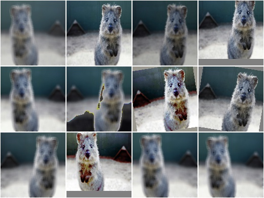
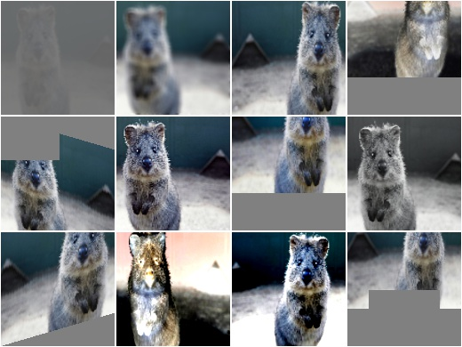
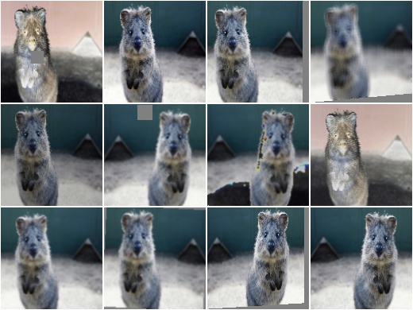
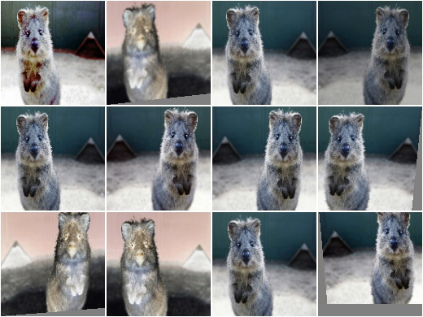

**********************
augmenters.collections
**********************

RandAugment
-----------

Apply RandAugment to inputs as described in the corresponding paper.

See paper::

    Cubuk et al.

    RandAugment: Practical automated data augmentation with a reduced
    search space

.. note::

    The paper contains essentially no hyperparameters for the individual
    augmentation techniques. The hyperparameters used here come mostly
    from the official code repository, which however seems to only contain
    code for CIFAR10 and SVHN, not for ImageNet. So some guesswork was
    involved and a few of the hyperparameters were also taken from
    https://github.com/ildoonet/pytorch-randaugment/blob/master/RandAugment/augmentations.py .

    This implementation deviates from the code repository for all PIL
    enhance operations. In the repository these use a factor of
    ``0.1 + M*1.8/M_max``, which would lead to a factor of ``0.1`` for the
    weakest ``M`` of ``M=0``. For e.g. ``Brightness`` that would result in
    a basically black image. This definition is fine for AutoAugment (from
    where the code and hyperparameters are copied), which optimizes
    each transformation's ``M`` individually, but not for RandAugment,
    which uses a single fixed ``M``. We hence redefine these
    hyperparameters to ``1.0 + S * M * 0.9/M_max``, where ``S`` is
    randomly either ``1`` or ``-1``.

    We also note that it is not entirely clear which transformations
    were used in the ImageNet experiments. The paper lists some
    transformations in Figure 2, but names others in the text too (e.g.
    crops, flips, cutout). While Figure 2 lists the Identity function,
    this transformation seems to not appear in the repository (and in fact,
    the function ``randaugment(N, M)`` doesn't seem to exist in the
    repository either). So we also make a best guess here about what
    transformations might have been used.

.. warning::

    This augmenter only works with image data, not e.g. bounding boxes.
    The used PIL-based affine transformations are not yet able to
    process non-image data. (This augmenter uses PIL-based affine
    transformations to ensure that outputs are as similar as possible
    to the paper's implementation.)

API link: :class:`~imgaug.augmenters.collections.RandAugment`

**Example.**
Create a RandAugment augmenter similar to the suggested hyperparameters
in the paper::

    import imgaug.augmenters as iaa
    aug = iaa.RandAugment(n=2, m=9)

**Example.**
Create a RandAugment augmenter with maximum magnitude/strength::

    aug = iaa.RandAugment(m=30)

**Example.**
Create a RandAugment augmenter that applies its transformations with a
random magnitude between ``0`` (very weak) and ``9`` (recommended for
ImageNet and ResNet-50). ``m`` is sampled per transformation::

    aug = iaa.RandAugment(m=(0, 9))

**Example.**
Create a RandAugment augmenter that applies ``0`` to ``3`` of its
child transformations to images. Horizontal flips (p=50%) and crops are
always applied. ::

    aug = iaa.RandAugment(n=(0, 3))

