****************
augmenters.color
****************

WithColorspace
--------------

Apply child augmenters within a specific colorspace.

This augumenter takes a source colorspace A and a target colorspace B
as well as children C. It changes images from A to B, then applies the
child augmenters C and finally changes the colorspace back from B to A.
See also ChangeColorspace() for more.

API link: :class:`~imgaug.augmenters.color.WithColorspace`

**Example.**
Convert to ``HSV`` colorspace, add a value between ``0`` and ``50``
(uniformly sampled per image) to the Hue channel, then convert back to the
input colorspace (``RGB``). ::

    import imgaug.augmenters as iaa
    aug = iaa.WithColorspace(
        to_colorspace="HSV",
        from_colorspace="RGB",
        children=iaa.WithChannels(
            0,
            iaa.Add((0, 50))
        )
    )

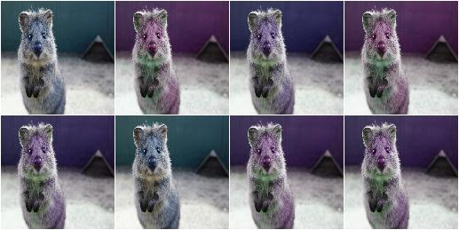

WithBrightnessChannels
----------------------

Augmenter to apply child augmenters to brightness-related image channels.

This augmenter first converts an image to a random colorspace containing a
brightness-related channel (e.g. ``V`` in ``HSV``), then extracts that
channel and applies its child augmenters to this one channel. Afterwards,
it reintegrates the augmented channel into the full image and converts
back to the input colorspace.

API link: :class:`~imgaug.augmenters.color.WithBrightnessChannels`

**Example.**
Add ``-50`` to ``50`` to the brightness-related channels of each image::

    import imgaug.augmenters as iaa
    aug = iaa.WithBrightnessChannels(iaa.Add((-50, 50)))

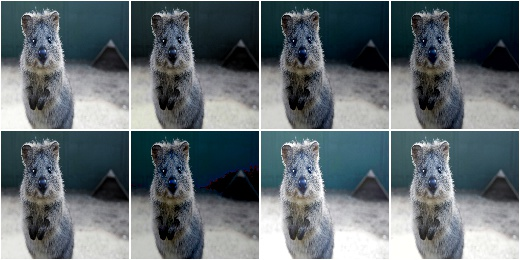

**Example.**
Add ``-50`` to ``50`` to the brightness-related channels of each image, but
pick those brightness-related channels only from ``Lab`` (``L``) and
``HSV`` (``V``) colorspaces. ::

    aug = iaa.WithBrightnessChannels(
        iaa.Add((-50, 50)), to_colorspace=[iaa.CSPACE_Lab, iaa.CSPACE_HSV])

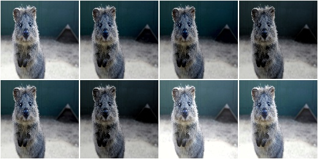

**Example.**
Add ``-50`` to ``50`` to the brightness-related channels of each image, where
the images are provided in ``BGR`` colorspace instead of the standard
``RGB``. ::

    aug = iaa.WithBrightnessChannels(
        iaa.Add((-50, 50)), from_colorspace=iaa.CSPACE_BGR)

MultiplyAndAddToBrightness
--------------------------

Multiply and add to the brightness channels of input images.

This is a wrapper around
:class:`~imgaug.augmenters.color.WithBrightnessChannels` and hence
performs internally the same projection to random colorspaces.

API link: :class:`~imgaug.augmenters.color.MultiplyAndAddToBrightness`

**Example.**
Convert each image to a colorspace with a brightness-related channel,
extract that channel, multiply it by a factor between ``0.5`` and ``1.5``,
add a value between ``-30`` and ``30`` and convert back to the original
colorspace. ::

    import imgaug.augmenters as iaa
    aug = iaa.MultiplyAndAddToBrightness(mul=(0.5, 1.5), add=(-30, 30))

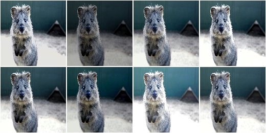

MultiplyBrightness
------------------

Multiply the brightness channels of input images.

This is a wrapper around
:class:`~imgaug.augmenters.color.WithBrightnessChannels` and hence
performs internally the same projection to random colorspaces.

API link: :class:`~imgaug.augmenters.color.MultiplyBrightness`

**Example.**
Convert each image to a colorspace with a brightness-related channel,
extract that channel, multiply it by a factor between ``0.5`` and ``1.5``,
and convert back to the original colorspace. ::

    import imgaug.augmenters as iaa
    aug = iaa.MultiplyBrightness((0.5, 1.5))

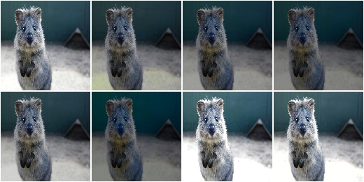

AddToBrightness
---------------

Add to the brightness channels of input images.

This is a wrapper around
:class:`~imgaug.augmenters.color.WithBrightnessChannels` and hence
performs internally the same projection to random colorspaces.

API link: :class:`~imgaug.augmenters.color.AddToBrightness`

**Example.**
Convert each image to a colorspace with a brightness-related channel,
extract that channel, add between ``-30`` and ``30`` and convert back
to the original colorspace::

    import imgaug.augmenters as iaa
    aug = iaa.AddToBrightness((-30, 30))

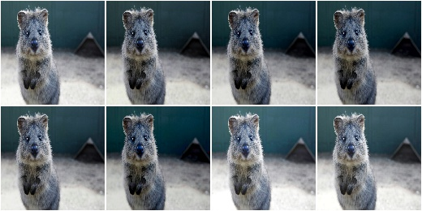

WithHueAndSaturation
--------------------

Apply child augmenters to hue and saturation channels.

This augumenter takes an image in a source colorspace, converts
it to HSV, extracts the H (hue) and S (saturation) channels,
applies the provided child augmenters to these channels
and finally converts back to the original colorspace.

The image array generated by this augmenter and provided to its children
is in ``int16`` (**sic!** only augmenters that can handle ``int16`` arrays
can be children!). The hue channel is mapped to the value
range ``[0, 255]``. Before converting back to the source colorspace, the
saturation channel's values are clipped to ``[0, 255]``. A modulo operation
is applied to the hue channel's values, followed by a mapping from
``[0, 255]`` to ``[0, 180]`` (and finally the colorspace conversion).

API link: :class:`~imgaug.augmenters.color.WithHueAndSaturation`

**Example.**
Create an augmenter that will add a random value between ``0`` and ``50``
(uniformly sampled per image) hue channel in HSV colorspace. It
automatically accounts for the hue being in angular representation, i.e.
if the angle goes beyond 360 degrees, it will start again at 0 degrees.
The colorspace is finally converted back to ``RGB`` (default setting). ::

    import imgaug.augmenters as iaa
    aug = iaa.WithHueAndSaturation(
        iaa.WithChannels(0, iaa.Add((0, 50)))
    )

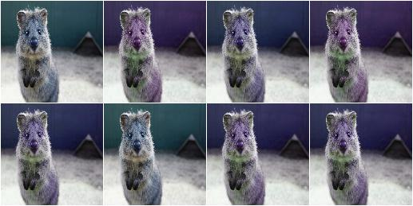

**Example.**
Create an augmenter that adds a random value sampled uniformly
from the range ``[-30, 10]`` to the hue and multiplies the saturation
by a random factor sampled uniformly from ``[0.5, 1.5]``. It also
modifies the contrast of the saturation channel. After these steps,
the ``HSV`` image is converted back to ``RGB``. ::

    aug = iaa.WithHueAndSaturation([
        iaa.WithChannels(0, iaa.Add((-30, 10))),
        iaa.WithChannels(1, [
            iaa.Multiply((0.5, 1.5)),
            iaa.LinearContrast((0.75, 1.25))
        ])
    ])

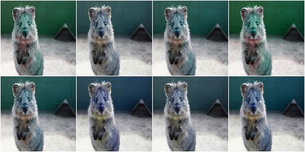

MultiplyHueAndSaturation
------------------------

Multipy hue and saturation by random values.

The augmenter first transforms images to HSV colorspace, then multiplies
the pixel values in the H and S channels and afterwards converts back to
RGB.

This augmenter is a wrapper around ``WithHueAndSaturation``.

API link: :func:`~imgaug.augmenters.color.MultiplyHueAndSaturation`

**Example.**
Multiply hue and saturation by random values between ``0.5`` and ``1.5``
(independently per channel and the same value for all pixels within
that channel). The hue will be automatically projected to an angular
representation. ::

    import imgaug.augmenters as iaa
    aug = iaa.MultiplyHueAndSaturation((0.5, 1.5), per_channel=True)

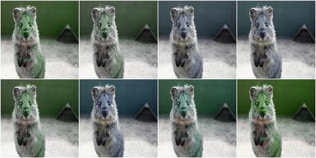

**Example.**
Multiply only the hue by random values between ``0.5`` and ``1.5``. ::

    aug = iaa.MultiplyHueAndSaturation(mul_hue=(0.5, 1.5))

.. figure:: ../../images/overview_of_augmenters/color/multiplyhueandsaturation_mul_hue.jpg
    :alt: MultiplyHueAndSaturation, only applied to the hue

**Example.**
Multiply only the saturation by random values between ``0.5`` and ``1.5``. ::

    aug = iaa.MultiplyHueAndSaturation(mul_saturation=(0.5, 1.5))

.. figure:: ../../images/overview_of_augmenters/color/multiplyhueandsaturation_mul_saturation.jpg
    :alt: MultiplyHueAndSaturation, only applied to the saturation

MultiplyHue
-----------

Multiply the hue of images by random values.

The augmenter first transforms images to HSV colorspace, then multiplies
the pixel values in the H channel and afterwards converts back to
RGB.

This augmenter is a shortcut for ``MultiplyHueAndSaturation(mul_hue=...)``.

API link: :func:`~imgaug.augmenters.color.MultiplyHue`

**Example.**
Multiply the hue channel of images using random values between ``0.5``
and ``1.5``::

    import imgaug.augmenters as iaa
    aug = iaa.MultiplyHue((0.5, 1.5))

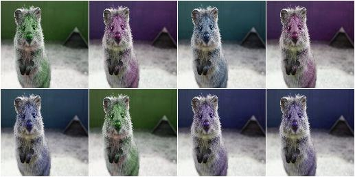

MultiplySaturation
------------------

Multiply the saturation of images by random values.

The augmenter first transforms images to HSV colorspace, then multiplies
the pixel values in the H channel and afterwards converts back to
RGB.

This augmenter is a shortcut for
``MultiplyHueAndSaturation(mul_saturation=...)``.

API link: :func:`~imgaug.augmenters.color.MultiplySaturation`

**Example.**
Multiply the saturation channel of images using random values between
``0.5`` and ``1.5``::

    import imgaug.augmenters as iaa
    aug = iaa.MultiplySaturation((0.5, 1.5))

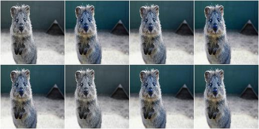

RemoveSaturation
----------------
Decrease the saturation of images by varying degrees.

This creates images looking similar to
:class:`~imgaug.augmenters.color.Grayscale`.

This augmenter is the same as ``MultiplySaturation((0.0, 1.0))``.

API link: :func:`~imgaug.augmenters.color.RemoveSaturation`

**Example.**
Create an augmenter that decreases saturation by varying degrees::

    import imgaug.augmenters as iaa
    aug = iaa.RemoveSaturation()

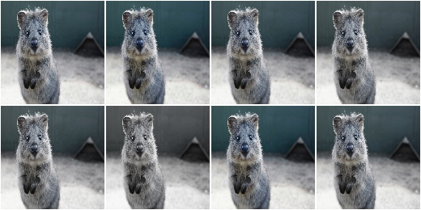

**Example.**
Create an augmenter that removes all saturation from input images.
This is similar to :class:`imgaug.augmenters.color.Grayscale`. ::

    aug = iaa.RemoveSaturation(1.0)

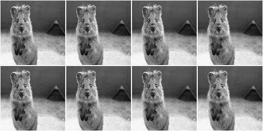

**Example.**
Create an augmenter that decreases saturation of images in ``BGR``
colorspace by varying degrees. ::

    aug = iaa.RemoveSaturation(from_colorspace=iaa.CSPACE_BGR)

AddToHueAndSaturation
---------------------

Increases or decreases hue and saturation by random values.

The augmenter first transforms images to HSV colorspace, then adds random
values to the H and S channels and afterwards converts back to RGB.

This augmenter is faster than using ``WithHueAndSaturation`` in combination
with ``Add``.

API link: :class:`~imgaug.augmenters.color.AddToHueAndSaturation`

**Example.**
Add random values between ``-50`` and ``50`` to the hue and saturation
(independently per channel and the same value for all pixels within
that channel)::

    import imgaug.augmenters as iaa
    aug = iaa.AddToHueAndSaturation((-50, 50), per_channel=True)

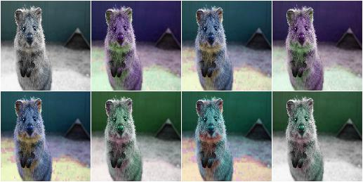

AddToHue
--------

Add random values to the hue of images.

The augmenter first transforms images to HSV colorspace, then adds random
values to the H channel and afterwards converts back to RGB.

If you want to change both the hue and the saturation, it is recommended
to use ``AddToHueAndSaturation`` as otherwise the image will be
converted twice to HSV and back to RGB.

This augmenter is a shortcut for ``AddToHueAndSaturation(value_hue=...)``.

API link: :func:`~imgaug.augmenters.color.AddToHue`

**Example.**
Sample random values from the discrete uniform range ``[-50..50]``,
convert them to angular representation and add them to the hue, i.e.
to the ``H`` channel in ``HSV`` colorspace::

    import imgaug.augmenters as iaa
    aug = iaa.AddToHue((-50, 50))

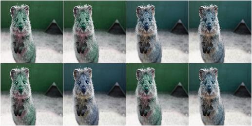

AddToSaturation
---------------

Add random values to the saturation of images.

The augmenter first transforms images to HSV colorspace, then adds random
values to the S channel and afterwards converts back to RGB.

If you want to change both the hue and the saturation, it is recommended
to use ``AddToHueAndSaturation`` as otherwise the image will be
converted twice to HSV and back to RGB.

This augmenter is a shortcut for
``AddToHueAndSaturation(value_saturation=...)``.

API link: :func:`~imgaug.augmenters.color.AddToSaturation`

**Example.**
Sample random values from the discrete uniform range ``[-50..50]``,
and add them to the saturation, i.e. to the ``S`` channel in ``HSV``
colorspace::

    import imgaug.augmenters as iaa
    aug = iaa.AddToSaturation((-50, 50))

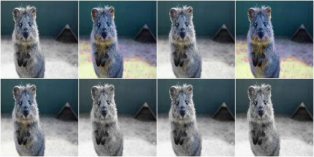

ChangeColorspace
----------------

Augmenter to change the colorspace of images.

API link: :class:`~imgaug.augmenters.color.ChangeColorspace`

**Example.**
The following example shows how to change the colorspace from RGB to HSV,
then add 50-100 to the first channel, then convert back to RGB.
This increases the hue value of each image. ::

    import imgaug.augmenters as iaa
    aug = iaa.Sequential([
        iaa.ChangeColorspace(from_colorspace="RGB", to_colorspace="HSV"),
        iaa.WithChannels(0, iaa.Add((50, 100))),
        iaa.ChangeColorspace(from_colorspace="HSV", to_colorspace="RGB")
    ])

.. figure:: ../../images/overview_of_augmenters/color/changecolorspace.jpg
    :alt: Change colorspace

Grayscale
---------

Augmenter to convert images to their grayscale versions.

API link: :class:`~imgaug.augmenters.color.Grayscale`

**Example.**
Change images to grayscale and overlay them with the original image by varying
strengths, effectively removing 0 to 100% of the color::

    import imgaug.augmenters as iaa
    aug = iaa.Grayscale(alpha=(0.0, 1.0))

.. figure:: ../../images/overview_of_augmenters/color/grayscale.jpg
    :alt: Grayscale

**Example.**
Visualization of increasing ``alpha`` from ``0.0`` to ``1.0`` in eight steps:

.. figure:: ../../images/overview_of_augmenters/color/grayscale_vary_alpha.jpg
    :alt: Grayscale vary alpha

ChangeColorTemperature
----------------------

Change the temperature to a provided Kelvin value.

Low Kelvin values around ``1000`` to ``4000`` will result in red, yellow
or orange images. Kelvin values around ``10000`` to ``40000`` will result
in progressively darker blue tones.

API link: :class:`~imgaug.augmenters.color.ChangeColorTemperature`

**Example.**
Create an augmenter that changes the color temperature of images to
a random value between ``1100`` and ``10000`` Kelvin::

    import imgaug.augmenters as iaa
    aug = iaa.ChangeColorTemperature((1100, 10000))

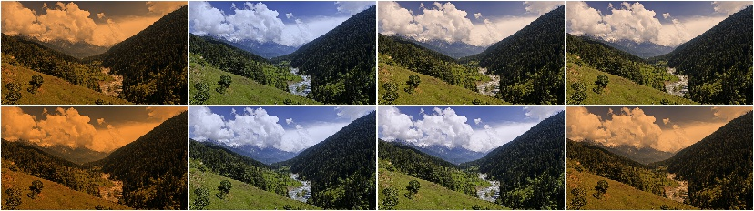

KMeansColorQuantization
-----------------------

Quantize colors using k-Means clustering.

This "collects" the colors from the input image, groups them into
``k`` clusters using k-Means clustering and replaces the colors in the
input image using the cluster centroids.

This is slower than ``UniformColorQuantization``, but adapts dynamically
to the color range in the input image.

.. note::

    This augmenter expects input images to be either grayscale
    or to have 3 or 4 channels and use colorspace `from_colorspace`. If
    images have 4 channels, it is assumed that the 4th channel is an alpha
    channel and it will not be quantized.

API link: :class:`~imgaug.augmenters.color.KMeansColorQuantization`

**Example.**
Create an augmenter to apply k-Means color quantization to images using a
random amount of colors, sampled uniformly from the interval ``[2..16]``.
It assumes the input image colorspace to be ``RGB`` and clusters colors
randomly in ``RGB`` or ``Lab`` colorspace. ::

    import imgaug.augmenters as iaa
    aug = iaa.KMeansColorQuantization()

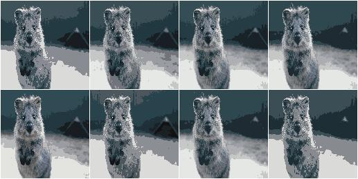

**Example.**
Create an augmenter that quantizes images to (up to) eight colors::

    aug = iaa.KMeansColorQuantization(n_colors=8)

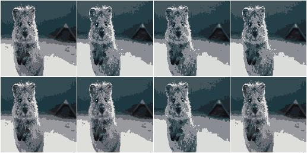

**Example.**
Create an augmenter that quantizes images to (up to) ``n`` colors,
where ``n`` is randomly and uniformly sampled from the discrete interval
``[4..32]``::

    aug = iaa.KMeansColorQuantization(n_colors=(4, 16))

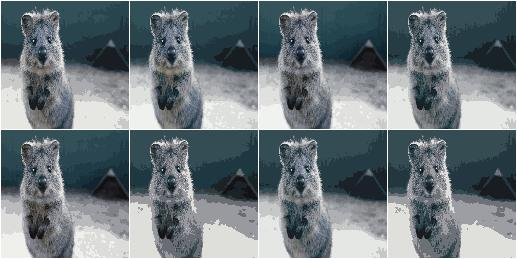

**Example.**
Create an augmenter that quantizes input images that are in
``BGR`` colorspace. The quantization happens in ``RGB`` or ``Lab``
colorspace, into which the images are temporarily converted. ::

    aug = iaa.KMeansColorQuantization(
        from_colorspace=iaa.ChangeColorspace.BGR)

.. figure:: ../../images/overview_of_augmenters/color/kmeanscolorquantization_from_bgr.jpg
    :alt: KMeansColorQuantization with input images in BGR colorspace

**Example.**
Create an augmenter that quantizes images by clustering colors randomly
in either ``RGB`` or ``HSV`` colorspace. The assumed input colorspace
of images is ``RGB``. ::

    aug = iaa.KMeansColorQuantization(
        to_colorspace=[iaa.ChangeColorspace.RGB, iaa.ChangeColorspace.HSV])

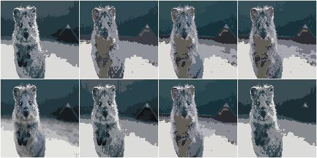

UniformColorQuantization
------------------------

Quantize colors into N bins with regular distance.

For ``uint8`` images the equation is ``floor(v/q)*q + q/2`` with
``q = 256/N``, where ``v`` is a pixel intensity value and ``N`` is
the target number of colors after quantization.

This augmenter is faster than ``KMeansColorQuantization``, but the
set of possible output colors is constant (i.e. independent of the
input images). It may produce unsatisfying outputs for input images
that are made up of very similar colors.

.. note::

    This augmenter expects input images to be either grayscale
    or to have 3 or 4 channels and use colorspace `from_colorspace`. If
    images have 4 channels, it is assumed that the 4th channel is an alpha
    channel and it will not be quantized.

API link: :class:`~imgaug.augmenters.color.UniformColorQuantization`

**Example.**
Create an augmenter to apply uniform color quantization to images using a
random amount of colors, sampled uniformly from the discrete interval
``[2..16]``::

    import imgaug.augmenters as iaa
    aug = iaa.UniformColorQuantization()

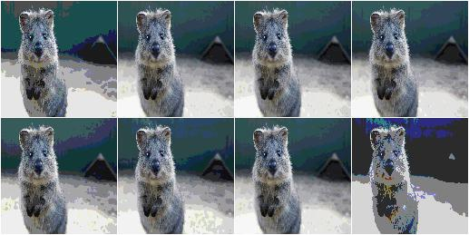

**Example.**
Create an augmenter that quantizes images to (up to) eight colors::

    aug = iaa.UniformColorQuantization(n_colors=8)

.. figure:: ../../images/overview_of_augmenters/color/uniformcolorquantization_with_8_colors.jpg
    :alt: UniformColorQuantization with eight colors

**Example.**
Create an augmenter that quantizes images to (up to) ``n`` colors,
where ``n`` is randomly and uniformly sampled from the discrete interval
``[4..32]``::

    aug = iaa.UniformColorQuantization(n_colors=(4, 16))

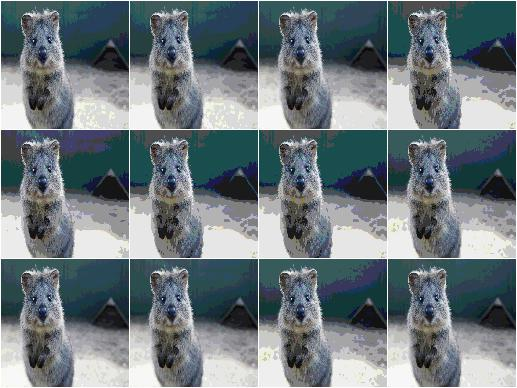

**Example.**
Create an augmenter that uniformly quantizes images in either ``RGB``
or ``HSV`` colorspace (randomly picked per image). The input colorspace
of all images has to be ``BGR``. ::

    aug = iaa.UniformColorQuantization(
        from_colorspace=iaa.ChangeColorspace.BGR,
        to_colorspace=[iaa.ChangeColorspace.RGB, iaa.ChangeColorspace.HSV])

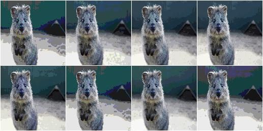

UniformColorQuantizationToNBits
-------------------------------

Quantize images by setting ``8-B`` bits of each component to zero.

This augmenter sets the ``8-B`` highest frequency (rightmost) bits of
each array component to zero. For ``B`` bits this is equivalent to
changing each component's intensity value ``v`` to
``v' = v & (2**(8-B) - 1)``, e.g. for ``B=3`` this results in
``v' = c & ~(2**(3-1) - 1) = c & ~3 = c & ~0000 0011 = c & 1111 1100``.

This augmenter behaves for ``B`` similarly to
``UniformColorQuantization(2**B)``, but quantizes each bin with interval
``(a, b)`` to ``a`` instead of to ``a + (b-a)/2``.

This augmenter is comparable to :func:`~PIL.ImageOps.posterize`.

.. note::

    This augmenter expects input images to be either grayscale
    or to have 3 or 4 channels and use colorspace `from_colorspace`. If
    images have 4 channels, it is assumed that the 4th channel is an alpha
    channel and it will not be quantized.

API link: :class:`~imgaug.augmenters.color.UniformColorQuantizationToNBits`

**Example.**
Create an augmenter to apply uniform color quantization to
images using a random amount of bits to remove, sampled uniformly from the
discrete interval ``[1..8]``::

    import imgaug.augmenters as iaa
    aug = iaa.UniformColorQuantizationToNBits()

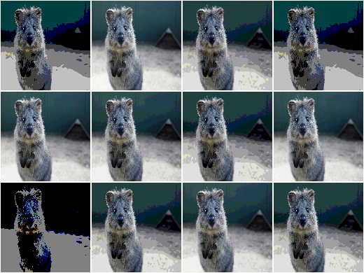

**Example.**
Create an augmenter that quantizes images by removing ``8-B`` rightmost
bits from each component, where ``B`` is uniformly sampled from the
discrete interval ``[2..8]``::

    aug = iaa.UniformColorQuantizationToNBits(nb_bits=(2, 8))

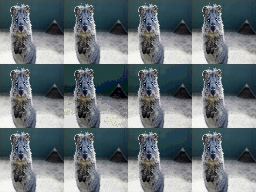

**Example.**
Create an augmenter that uniformly quantizes images in either ``RGB``
or ``HSV`` colorspace (randomly picked per image). The input colorspace
of all images has to be ``BGR``::

    aug = iaa.UniformColorQuantizationToNBits(
        from_colorspace=iaa.CSPACE_BGR,
        to_colorspace=[iaa.CSPACE_RGB, iaa.CSPACE_HSV])

Posterize
---------

Alias for :class:`imgaug.augmenters.color.UniformColorQuantizationToNBits`.

API link: :class:`~imgaug.augmenters.color.Posterize`
