*******************
augmenters.contrast
*******************

GammaContrast
-------------

Adjust image contrast by scaling pixel values to ``255*((v/255)**gamma)``.

Values in the range ``gamma=(0.5, 2.0)`` seem to be sensible.

API link: :func:`~imgaug.augmenters.contrast.GammaContrast`

**Example.**
Modify the contrast of images according to ``255*((v/255)**gamma)``,
where ``v`` is a pixel value and ``gamma`` is sampled uniformly from
the interval ``[0.5, 2.0]`` (once per image)::

    import imgaug.augmenters as iaa
    aug = iaa.GammaContrast((0.5, 2.0))

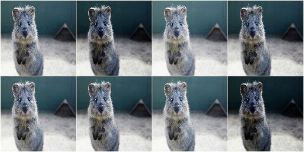

**Example.**
Same as in the previous example, but ``gamma`` is sampled once per image
*and* channel::

    aug = iaa.GammaContrast((0.5, 2.0), per_channel=True)

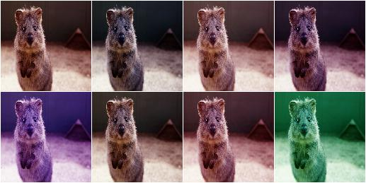

SigmoidContrast
---------------

Adjust image contrast to ``255*1/(1+exp(gain*(cutoff-I_ij/255)))``.

Values in the range ``gain=(5, 20)`` and ``cutoff=(0.25, 0.75)`` seem to
be sensible.

API link: :func:`~imgaug.augmenters.contrast.SigmoidContrast`

**Example.**
Modify the contrast of images according to
``255*1/(1+exp(gain*(cutoff-v/255)))``, where ``v`` is a pixel value,
``gain`` is sampled uniformly from the interval ``[3, 10]`` (once per
image) and ``cutoff`` is sampled uniformly from the interval
``[0.4, 0.6]`` (also once per image). ::

    import imgaug.augmenters as iaa
    aug = iaa.SigmoidContrast(gain=(3, 10), cutoff=(0.4, 0.6))

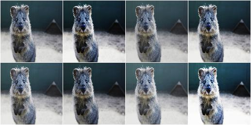

**Example.**
Same as in the previous example, but ``gain`` and ``cutoff`` are each
sampled once per image *and* channel::

    aug = iaa.SigmoidContrast(
        gain=(3, 10), cutoff=(0.4, 0.6), per_channel=True)

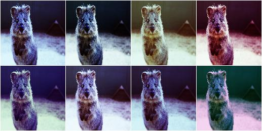

LogContrast
-----------

Adjust image contrast by scaling pixels to ``255*gain*log_2(1+v/255)``.

This augmenter is fairly similar to
``imgaug.augmenters.arithmetic.Multiply``.

API link: :func:`~imgaug.augmenters.contrast.LogContrast`

**Example.**
Modify the contrast of images according to ``255*gain*log_2(1+v/255)``,
where ``v`` is a pixel value and ``gain`` is sampled uniformly from the
interval ``[0.6, 1.4]`` (once per image)::

    import imgaug.augmenters as iaa
    aug = iaa.LogContrast(gain=(0.6, 1.4))

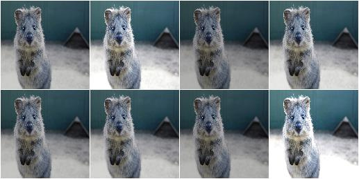

**Example.**
Same as in the previous example, but ``gain`` is sampled once per image
*and* channel::

    aug = iaa.LogContrast(gain=(0.6, 1.4), per_channel=True)

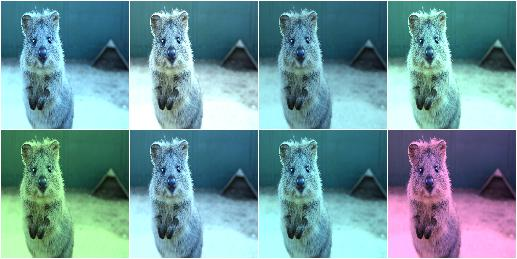

LinearContrast
--------------

Adjust contrast by scaling each pixel to ``127 + alpha*(v-127)``.

API link: :func:`~imgaug.augmenters.contrast.LinearContrast`

**Example.**
Modify the contrast of images according to `127 + alpha*(v-127)``,
where ``v`` is a pixel value and ``alpha`` is sampled uniformly from the
interval ``[0.4, 1.6]`` (once per image)::

    import imgaug.augmenters as iaa
    aug = iaa.LinearContrast((0.4, 1.6))

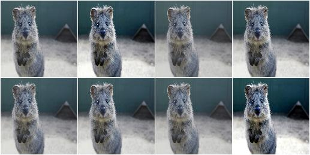

**Example.**
Same as in the previous example, but ``alpha`` is sampled once per image
*and* channel::

    aug = iaa.LinearContrast((0.4, 1.6), per_channel=True)

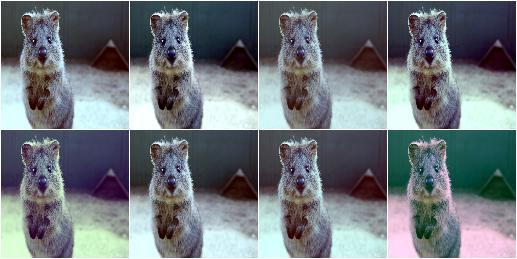

AllChannelsCLAHE
----------------

Apply CLAHE to all channels of images in their original colorspaces.

CLAHE (Contrast Limited Adaptive Histogram Equalization) performs
histogram equilization within image patches, i.e. over local
neighbourhoods.

In contrast to ``imgaug.augmenters.contrast.CLAHE``, this augmenter
operates directly on all channels of the input images. It does not
perform any colorspace transformations and does not focus on specific
channels (e.g. ``L`` in ``Lab`` colorspace).

API link: :class:`~imgaug.augmenters.contrast.AllChannelsCLAHE`

**Example.**
Create an augmenter that applies CLAHE to all channels of input images::

    import imgaug.augmenters as iaa
    aug = iaa.AllChannelsCLAHE()

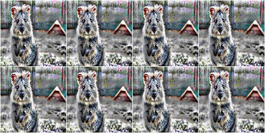

**Example.**
Same as in the previous example, but the `clip_limit` used by CLAHE is
uniformly sampled per image from the interval ``[1, 10]``. Some images
will therefore have stronger contrast than others (i.e. higher clip limit
values). ::

    aug = iaa.AllChannelsCLAHE(clip_limit=(1, 10))

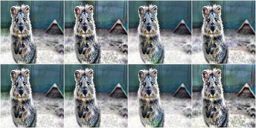

**Example.**
Same as in the previous example, but the `clip_limit` is sampled per
image *and* channel, leading to different levels of contrast for each
channel::

    aug = iaa.AllChannelsCLAHE(clip_limit=(1, 10), per_channel=True)

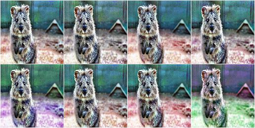

CLAHE
-----

Apply CLAHE to L/V/L channels in HLS/HSV/Lab colorspaces.

This augmenter applies CLAHE (Contrast Limited Adaptive Histogram
Equalization) to images, a form of histogram equalization that normalizes
within local image patches.
The augmenter transforms input images to a target colorspace (e.g.
``Lab``), extracts an intensity-related channel from the converted
images (e.g. ``L`` for ``Lab``), applies CLAHE to the channel and then
converts the resulting image back to the original colorspace.

Grayscale images (images without channel axis or with only one channel
axis) are automatically handled, `from_colorspace` does not have to be
adjusted for them. For images with four channels (e.g. ``RGBA``), the
fourth channel is ignored in the colorspace conversion (e.g. from an
``RGBA`` image, only the ``RGB`` part is converted, normalized, converted
back and concatenated with the input ``A`` channel). Images with unusual
channel numbers (2, 5 or more than 5) are normalized channel-by-channel
(same behaviour as ``AllChannelsCLAHE``, though a warning will be raised).

If you want to apply CLAHE to each channel of the original input image's
colorspace (without any colorspace conversion), use
``imgaug.augmenters.contrast.AllChannelsCLAHE`` instead.

API link: :class:`~imgaug.augmenters.contrast.CLAHE`

**Example.**
Create a standard CLAHE augmenter::

    import imgaug.augmenters as iaa
    aug = iaa.CLAHE()

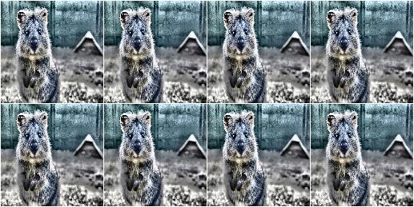

**Example.**
Create a CLAHE augmenter with a clip limit uniformly sampled from
``[1..10]``, where ``1`` is rather low contrast and ``10`` is rather
high contrast::

    aug = iaa.CLAHE(clip_limit=(1, 10))

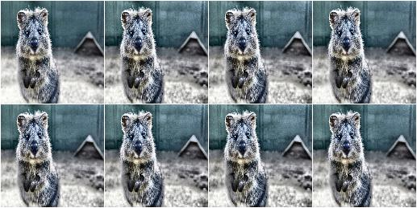

**Example.**
Create a CLAHE augmenter with kernel sizes of ``SxS``, where ``S`` is
uniformly sampled from ``[3..21]``. Sampling happens once per image. ::

    aug = iaa.CLAHE(tile_grid_size_px=(3, 21))

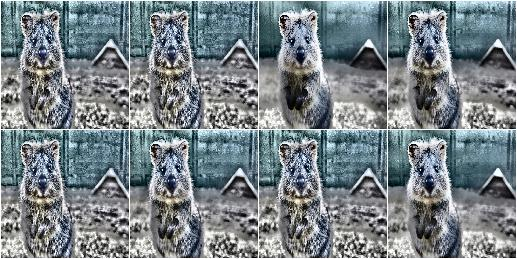

**Example.**
Create a CLAHE augmenter with kernel sizes of ``SxS``, where ``S`` is
sampled from ``N(7, 2)``, but does not go below ``3``::

    import imgaug.parameters as iap
    aug = iaa.CLAHE(
        tile_grid_size_px=iap.Discretize(iap.Normal(loc=7, scale=2)),
        tile_grid_size_px_min=3)

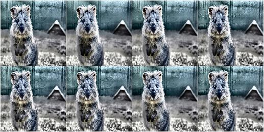

**Example.**
Create a CLAHE augmenter with kernel sizes of ``HxW``, where ``H`` is
uniformly sampled from ``[3..21]`` and ``W`` is randomly picked from the
list ``[3, 5, 7]``::

    aug = iaa.CLAHE(tile_grid_size_px=((3, 21), [3, 5, 7]))

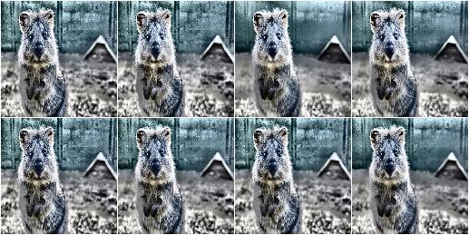

**Example.**
Create a CLAHE augmenter that converts images from BGR colorspace to
HSV colorspace and then applies the local histogram equalization to the
``V`` channel of the images (before converting back to ``BGR``).
Alternatively, ``Lab`` (default) or ``HLS`` can be used as the target
colorspace. Grayscale images (no channels / one channel) are never
converted and are instead directly normalized (i.e. `from_colorspace`
does not have to be changed for them). ::

    aug = iaa.CLAHE(
        from_colorspace=iaa.CLAHE.BGR,
        to_colorspace=iaa.CLAHE.HSV)

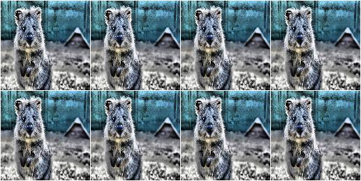

AllChannelsHistogramEqualization
--------------------------------
Apply Histogram Eq. to all channels of images in their original colorspaces.

In contrast to ``imgaug.augmenters.contrast.HistogramEqualization``, this
augmenter operates directly on all channels of the input images. It does
not perform any colorspace transformations and does not focus on specific
channels (e.g. ``L`` in ``Lab`` colorspace).

API link: :class:`~imgaug.augmenters.contrast.AllChannelsHistogramEqualization`

**Example.**
Create an augmenter that applies histogram equalization to all channels
of input images in the original colorspaces::

    import imgaug.augmenters as iaa
    aug = iaa.AllChannelsHistogramEqualization()

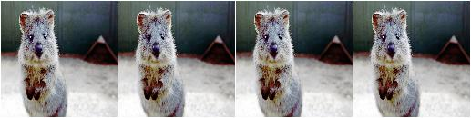

**Example.**
Same as in the previous example, but alpha-blends the contrast-enhanced
augmented images with the original input images using random blend
strengths. This leads to random strengths of the contrast adjustment. ::

    aug = iaa.Alpha((0.0, 1.0), iaa.AllChannelsHistogramEqualization())

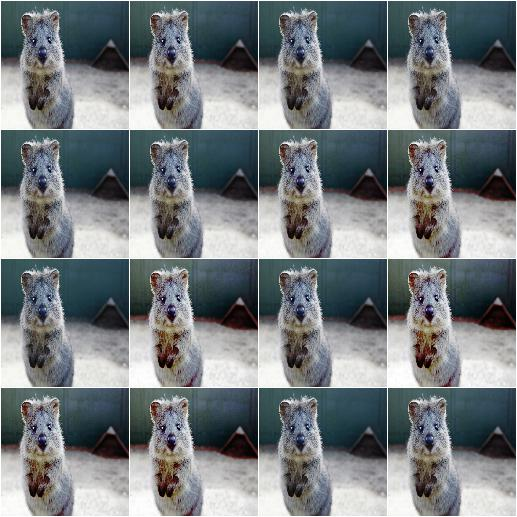

HistogramEqualization
---------------------

Apply Histogram Eq. to L/V/L channels of images in HLS/HSV/Lab colorspaces.

This augmenter is similar to ``imgaug.augmenters.contrast.CLAHE``.

The augmenter transforms input images to a target colorspace (e.g.
``Lab``), extracts an intensity-related channel from the converted images
(e.g. ``L`` for ``Lab``), applies Histogram Equalization to the channel
and then converts the resulting image back to the original colorspace.

Grayscale images (images without channel axis or with only one channel
axis) are automatically handled, `from_colorspace` does not have to be
adjusted for them. For images with four channels (e.g. RGBA), the fourth
channel is ignored in the colorspace conversion (e.g. from an ``RGBA``
image, only the ``RGB`` part is converted, normalized, converted back and
concatenated with the input ``A`` channel). Images with unusual channel
numbers (2, 5 or more than 5) are normalized channel-by-channel (same
behaviour as ``AllChannelsHistogramEqualization``, though a warning will
be raised).

If you want to apply HistogramEqualization to each channel of the original
input image's colorspace (without any colorspace conversion), use
``imgaug.augmenters.contrast.AllChannelsHistogramEqualization`` instead.

API link: :class:`~imgaug.augmenters.contrast.HistogramEqualization`

**Example.**
Create an augmenter that converts images to ``HLS``/``HSV``/``Lab``
colorspaces, extracts intensity-related channels (i.e. ``L``/``V``/``L``),
applies histogram equalization to these channels and converts back to the
input colorspace::

    import imgaug.augmenters as iaa
    aug = iaa.HistogramEqualization()

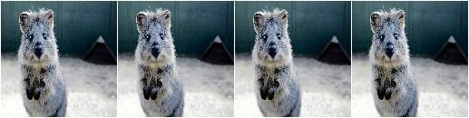

**Example.**
Same as in the previous example, but alpha blends the result, leading
to various strengths of contrast normalization::

    aug = iaa.Alpha((0.0, 1.0), iaa.HistogramEqualization())

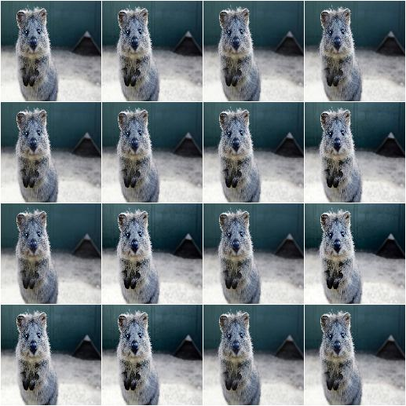

**Example.**
Same as in the first example, but the colorspace of input images has
to be ``BGR`` (instead of default ``RGB``) and the histogram equalization
is applied to the ``V`` channel in ``HSV`` colorspace::

    aug = iaa.HistogramEqualization(
        from_colorspace=iaa.HistogramEqualization.BGR,
        to_colorspace=iaa.HistogramEqualization.HSV)

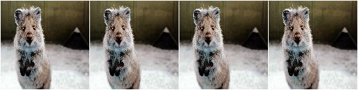

