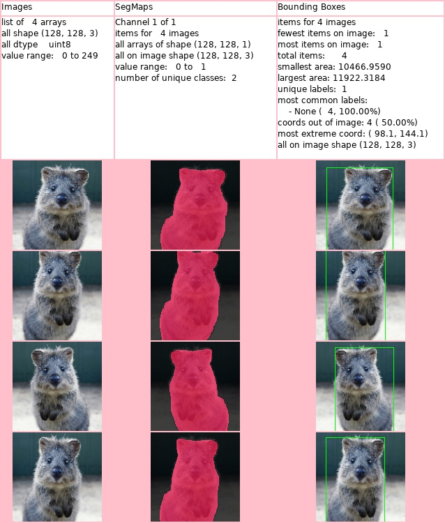

****************
augmenters.debug
****************

SaveDebugImageEveryNBatches
---------------------------

Visualize data in batches and save corresponding plots to a folder.

API link: :func:`~imgaug.augmenters.debug.SaveDebugImageEveryNBatches`

**Example.**
Save a debug plot to a temporary folder every ``100`` batches.
Set ``folder_path`` to a string, e.g. ``/tmp/experiments/debug-images``,
in order to save to that filepath instead of the temporary folder. ::

    import imgaug.augmenters as iaa
    import tempfile
    with tempfile.TemporaryDirectory() as folder_path:
        seq = iaa.Sequential([
            iaa.Sequential([
                iaa.Fliplr(0.5),
                iaa.Crop(px=(0, 16))
            ], random_order=True),
            iaa.SaveDebugImageEveryNBatches(folder_path, 100)
        ])

