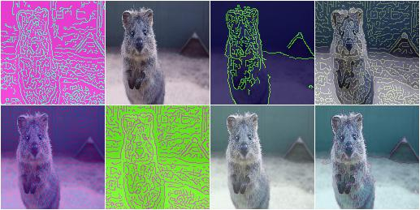
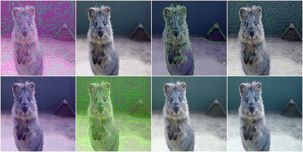
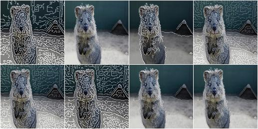
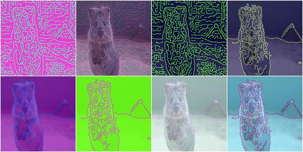
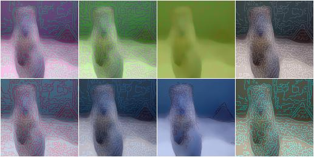

****************
augmenters.edges
****************

Canny
-----

Apply a canny edge detector to input images.

API link: :class:`~imgaug.augmenters.edges.Canny`

**Example.**
Create an augmenter that generates random blends between images and
their canny edge representations::

    import imgaug.augmenters as iaa
    aug = iaa.Canny()

**Example.**
Create a canny edge augmenter that generates edge images with a blending
factor of max ``50%``, i.e. the original (non-edge) image is always at
least partially visible::

    aug = iaa.Canny(alpha=(0.0, 0.5))

**Example.**
Same as in the previous example, but the edge image always uses the
color white for edges and black for the background::

    aug = iaa.Canny(
        alpha=(0.0, 0.5),
        colorizer=iaa.RandomColorsBinaryImageColorizer(
            color_true=255,
            color_false=0
        )
    )

**Example.**
Create a canny edge augmenter that initially preprocesses images using
a sobel filter with kernel size of either ``3x3`` or ``13x13`` and
alpha-blends with result using a strength of ``50%`` (both images
equally visible) to ``100%`` (only edge image visible). ::

    aug = iaa.Canny(alpha=(0.5, 1.0), sobel_kernel_size=[3, 7])

**Example.**
Create an augmenter that blends a canny edge image with a median-blurred
version of the input image. The median blur uses a fixed kernel size
of ``13x13`` pixels. ::

    aug = iaa.Alpha(
        (0.0, 1.0),
        iaa.Canny(alpha=1),
        iaa.MedianBlur(13)
    )

