********************
augmenters.geometric
********************

Affine
------

Augmenter to apply affine transformations to images.

API link: :class:`~imgaug.augmenters.geometric.Affine`

**Example.**
Scale images to a value of 50 to 150% of their original size::

    import imgaug.augmenters as iaa
    aug = iaa.Affine(scale=(0.5, 1.5))

.. figure:: ../../images/overview_of_augmenters/geometric/affine_scale.jpg
    :alt: Affine scale

**Example.**
Scale images to a value of 50 to 150% of their original size,
but do this independently per axis (i.e. sample two values per image)::

    aug = iaa.Affine(scale={"x": (0.5, 1.5), "y": (0.5, 1.5)})

.. figure:: ../../images/overview_of_augmenters/geometric/affine_scale_independently.jpg
    :alt: Affine scale independently

**Example.**
Translate images by -20 to +20% on x- and y-axis independently::

    aug = iaa.Affine(translate_percent={"x": (-0.2, 0.2), "y": (-0.2, 0.2)})

.. figure:: ../../images/overview_of_augmenters/geometric/affine_translate_percent.jpg
    :alt: Affine translate percent

**Example.**
Translate images by -20 to 20 pixels on x- and y-axis independently::

    aug = iaa.Affine(translate_px={"x": (-20, 20), "y": (-20, 20)})

.. figure:: ../../images/overview_of_augmenters/geometric/affine_translate_px.jpg
    :alt: Affine translate pixel

**Example.**
Rotate images by -45 to 45 degrees::

    aug = iaa.Affine(rotate=(-45, 45))

.. figure:: ../../images/overview_of_augmenters/geometric/affine_rotate.jpg
    :alt: Affine rotate

**Example.**
Shear images by -16 to 16 degrees::

    aug = iaa.Affine(shear=(-16, 16))

.. figure:: ../../images/overview_of_augmenters/geometric/affine_shear.jpg
    :alt: Affine shear

**Example.**
When applying affine transformations, new pixels are often generated, e.g. when
translating to the left, pixels are generated on the right. Various modes
exist to set how these pixels are ought to be filled. Below code shows an
example that uses all modes, sampled randomly per image. If the mode is
``constant`` (fill all with one constant value), then a random brightness
between 0 and 255 is used::

    aug = iaa.Affine(translate_percent={"x": -0.20}, mode=ia.ALL, cval=(0, 255))

.. figure:: ../../images/overview_of_augmenters/geometric/affine_fill.jpg
    :alt: Affine fill modes

ScaleX
------

Apply affine scaling on the x-axis to input data.

This is a wrapper around :class:`imgaug.augmenters.geometric.Affine`.

API link: :class:`~imgaug.augmenters.geometric.ScaleX`

**Example.**
Create an augmenter that scales images along the width to sizes between
``50%`` and ``150%``. This does not change the image shape (i.e. height
and width), only the pixels within the image are remapped and potentially
new ones are filled in. ::

    import imgaug.augmenters as iaa
    aug = iaa.ScaleX((0.5, 1.5))

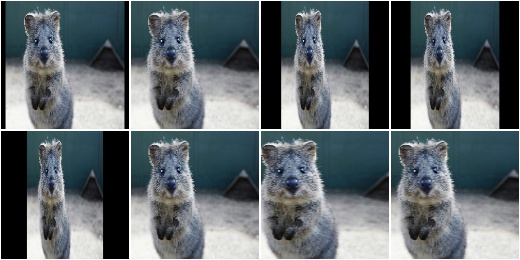

ScaleY
------

Apply affine scaling on the y-axis to input data.

This is a wrapper around :class:`imgaug.augmenters.geometric.Affine`.

API link: :class:`~imgaug.augmenters.geometric.ScaleY`

**Example.**
Create an augmenter that scales images along the height to sizes between
``50%`` and ``150%``. This does not change the image shape (i.e. height
and width), only the pixels within the image are remapped and potentially
new ones are filled in. ::

    import imgaug.augmenters as iaa
    aug = iaa.ScaleY((0.5, 1.5))

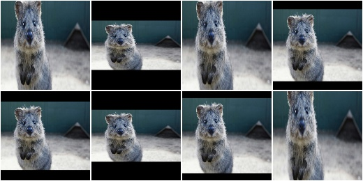

TranslateX
----------

Apply affine translation on the x-axis to input data.

This is a wrapper around :class:`imgaug.augmenters.geometric.Affine`.

API link: :class:`~imgaug.augmenters.geometric.TranslateX`

**Example.**
Create an augmenter that translates images along the x-axis by
``-20`` to ``20`` pixels::

    import imgaug.augmenters as iaa
    aug = iaa.TranslateX(px=(-20, 20))

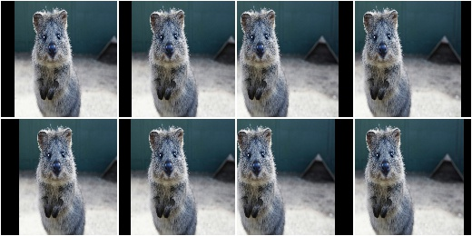

**Example.**
Create an augmenter that translates images along the x-axis by
``-10%`` to ``10%`` (relative to the x-axis size)::

    aug = iaa.TranslateX(percent=(-0.1, 0.1))

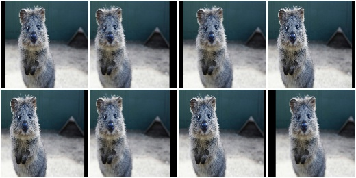

TranslateY
----------

Apply affine translation on the y-axis to input data.

This is a wrapper around :class:`imgaug.augmenters.geometric.Affine`.

API link: :class:`~imgaug.augmenters.geometric.TranslateY`

**Example.**
Create an augmenter that translates images along the y-axis by
``-20`` to ``20`` pixels::

    import imgaug.augmenters as iaa
    aug = iaa.TranslateY(px=(-20, 20))

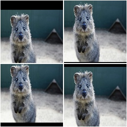

**Example.**
Create an augmenter that translates images along the y-axis by
``-10%`` to ``10%`` (relative to the y-axis size)::

    aug = iaa.TranslateY(percent=(-0.1, 0.1))

.. figure:: ../../images/overview_of_augmenters/geometric/translatey_relative.jpg
    :alt: TranslateY with relative translation amounts

Rotate
------

Apply affine rotation on the y-axis to input data.

This is a wrapper around :class:`imgaug.augmenters.geometric.Affine`.
It is the same as ``Affine(rotate=<value>)``.

API link: :class:`~imgaug.augmenters.geometric.Rotate`

**Example.**
Create an augmenter that rotates images by a random value between ``-45``
and ``45`` degress::

    import imgaug.augmenters as iaa
    aug = iaa.Rotate((-45, 45))

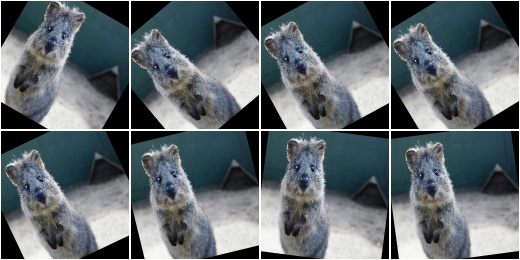

ShearX
------

Apply affine shear on the x-axis to input data.

This is a wrapper around :class:`Affine`.

API link: :class:`~imgaug.augmenters.geometric.ShearX`

**Example.**
Create an augmenter that shears images along the x-axis by random amounts
between ``-20`` and ``20`` degrees::

    import imgaug.augmenters as iaa
    aug = iaa.ShearX((-20, 20))

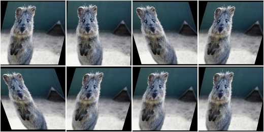

ShearY
------

Apply affine shear on the y-axis to input data.

This is a wrapper around :class:`Affine`.

API link: :class:`~imgaug.augmenters.geometric.ShearY`

**Example.**
Create an augmenter that shears images along the y-axis by random amounts
between ``-20`` and ``20`` degrees::

    import imgaug.augmenters as iaa
    aug = iaa.ShearY((-20, 20))

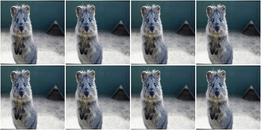

PiecewiseAffine
---------------

Apply affine transformations that differ between local neighbourhoods.

This augmenter places a regular grid of points on an image and randomly
moves the neighbourhood of these point around via affine transformations.
This leads to local distortions.

This is mostly a wrapper around scikit-image's ``PiecewiseAffine``.
See also ``Affine`` for a similar technique.

.. note::

    This augmenter is very slow. See :ref:`performance`.
    Try to use ``ElasticTransformation`` instead, which is at least 10x
    faster.

.. note::

    For coordinate-based inputs (keypoints, bounding boxes, polygons,
    ...), this augmenter still has to perform an image-based augmentation,
    which will make it significantly slower for such inputs than other
    augmenters. See :ref:`performance`.

API link: :class:`~imgaug.augmenters.geometric.PiecewiseAffine`

**Example.**
Distort images locally by moving points around, each with a distance v (percent
relative to image size), where v is sampled per point from ``N(0, z)``
``z`` is sampled per image from the range 0.01 to 0.05::

    import imgaug.augmenters as iaa
    aug = iaa.PiecewiseAffine(scale=(0.01, 0.05))

.. figure:: ../../images/overview_of_augmenters/geometric/piecewiseaffine.jpg
    :alt: PiecewiseAffine

.. figure:: ../../images/overview_of_augmenters/geometric/piecewiseaffine_checkerboard.jpg
    :alt: PiecewiseAffine

**Example.**
Effect of increasing ``scale`` from ``0.01`` to ``0.3`` in eight steps:

.. figure:: ../../images/overview_of_augmenters/geometric/piecewiseaffine_vary_scales.jpg
    :alt: PiecewiseAffine varying scales

**Example.**
PiecewiseAffine works by placing a regular grid of points on the image
and moving them around. By default this grid consists of 4x4 points.
The below image shows the effect of increasing that value from 2x2 to 16x16
in 8 steps:

.. figure:: ../../images/overview_of_augmenters/geometric/piecewiseaffine_vary_grid.jpg
    :alt: PiecewiseAffine varying grid

PerspectiveTransform
--------------------

Apply random four point perspective transformations to images.

Each of the four points is placed on the image using a random distance from
its respective corner. The distance is sampled from a normal distribution.
As a result, most transformations don't change the image very much, while
some "focus" on polygons far inside the image.

The results of this augmenter have some similarity with ``Crop``.

API link: :class:`~imgaug.augmenters.geometric.PerspectiveTransform`

**Example.**
Apply perspective transformations using a random scale between ``0.01``
and ``0.15`` per image, where the scale is roughly a measure of how far
the perspective transformation's corner points may be distanced from the
image's corner points::

    import imgaug.augmenters as iaa
    aug = iaa.PerspectiveTransform(scale=(0.01, 0.15))

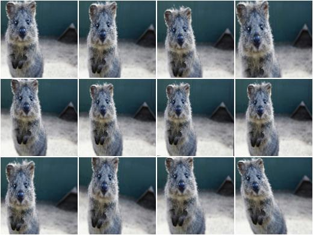

**Example.**
Same as in the previous example, but images are not resized back to
the input image size after augmentation. This will lead to smaller
output images. ::

    aug = iaa.PerspectiveTransform(scale=(0.01, 0.15), keep_size=False)

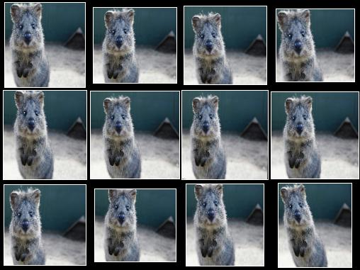

    ``PerspectiveTransform`` with ``keep_size`` set to ``False``.
    Note that the individual images are here padded after augmentation in
    order to align them in a grid (i.e. purely for visualization purposes).

ElasticTransformation
---------------------

Transform images by moving pixels locally around using displacement fields.

The augmenter has the parameters ``alpha`` and ``sigma``. ``alpha``
controls the strength of the displacement: higher values mean that pixels
are moved further. ``sigma`` controls the smoothness of the displacement:
higher values lead to smoother patterns -- as if the image was below water
-- while low values will cause indivdual pixels to be moved very
differently from their neighbours, leading to noisy and pixelated images.

A relation of 10:1 seems to be good for ``alpha`` and ``sigma``, e.g.
``alpha=10`` and ``sigma=1`` or ``alpha=50``, ``sigma=5``. For ``128x128``
a setting of ``alpha=(0, 70.0)``, ``sigma=(4.0, 6.0)`` may be a good
choice and will lead to a water-like effect.

For a detailed explanation, see ::

    Simard, Steinkraus and Platt
    Best Practices for Convolutional Neural Networks applied to Visual
    Document Analysis
    in Proc. of the International Conference on Document Analysis and
    Recognition, 2003

.. note::

    For coordinate-based inputs (keypoints, bounding boxes, polygons,
    ...), this augmenter still has to perform an image-based augmentation,
    which will make it significantly slower for such inputs than other
    augmenters. See :ref:`performance`.

API link: :class:`~imgaug.augmenters.geometric.ElasticTransformation`

**Example.**
Distort images locally by moving individual pixels around following
a distortions field with strength 0.25. The strength of the movement is
sampled per pixel from the range 0 to 5.0::

    import imgaug.augmenters as iaa
    aug = iaa.ElasticTransformation(alpha=(0, 5.0), sigma=0.25)

.. figure:: ../../images/overview_of_augmenters/geometric/elastictransformations.jpg
    :alt: ElasticTransformation

**Example.**
Effect of keeping sigma fixed at ``0.25`` and increasing alpha from ``0`` to
``5.0`` in eight steps:

.. figure:: ../../images/overview_of_augmenters/geometric/elastictransformations_vary_alpha.jpg
    :alt: ElasticTransformation varying alpha

**Example.**
Effect of keeping alpha fixed at ``2.5`` and increasing sigma from ``0.01``
to ``1.0`` in eight steps:

.. figure:: ../../images/overview_of_augmenters/geometric/elastictransformations_vary_sigmas.jpg
    :alt: ElasticTransformation varying sigma

.. TODO add examples for large sigmas / watery effects

Rot90
-----

Rotate images clockwise by multiples of 90 degrees.

This could also be achieved using ``Affine``, but ``Rot90`` is
significantly more efficient.

API link: :class:`~imgaug.augmenters.geometric.Rot90`

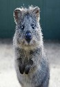

    The below examples use this input image, which slightly deviates
    from the examples for other augmenters (i.e. it is not square).

**Example.**
Rotate all images by 90 degrees.
Resize these images afterwards to keep the size that they had before
augmentation.
This may cause the images to look distorted. ::

    import imgaug.augmenters as iaa
    aug = iaa.Rot90(1)

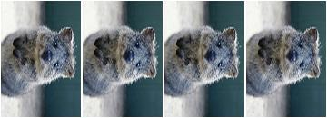

**Example.**
Rotate all images by 90 or 270 degrees.
Resize these images afterwards to keep the size that they had before
augmentation.
This may cause the images to look distorted. ::

    aug = iaa.Rot90([1, 3])

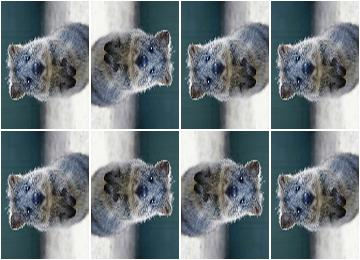

**Example.**
Rotate all images by 90, 180 or 270 degrees.
Resize these images afterwards to keep the size that they had before
augmentation.
This may cause the images to look distorted. ::

    aug = iaa.Rot90((1, 3))

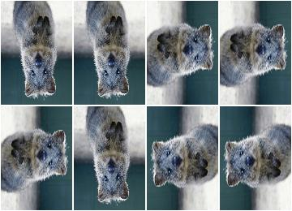

**Example.**
Rotate all images by 90, 180 or 270 degrees.
Does not resize to the original image size afterwards, i.e. each image's
size may change. ::

    aug = iaa.Rot90((1, 3), keep_size=False)

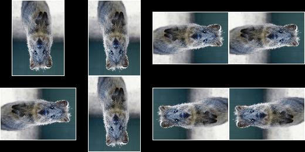

    ``Rot90`` with ``keep_size`` set to ``False``.
    Note that the individual images are here padded after augmentation in
    order to align them in a grid (i.e. purely for visualization purposes).

WithPolarWarping
----------------

Augmenter that applies other augmenters in a polar-transformed space.

This augmenter first transforms an image into a polar representation,
then applies its child augmenter, then transforms back to cartesian
space. The polar representation is still in the image's input dtype
(i.e. ``uint8`` stays ``uint8``) and can be visualized. It can be thought
of as an "unrolled" version of the image, where previously circular lines
appear straight. Hence, applying child augmenters in that space can lead
to circular effects. E.g. replacing rectangular pixel areas in the polar
representation with black pixels will lead to curved black areas in
the cartesian result.

This augmenter can create new pixels in the image. It will fill these
with black pixels. For segmentation maps it will fill with class
id ``0``. For heatmaps it will fill with ``0.0``.

This augmenter is limited to arrays with a height and/or width of
``32767`` or less.

.. warning::

    When augmenting coordinates in polar representation, it is possible
    that these are shifted outside of the polar image, but are inside the
    image plane after transforming back to cartesian representation,
    usually on newly created pixels (i.e. black backgrounds).
    These coordinates are currently not removed. It is recommended to
    not use very strong child transformations when also augmenting
    coordinate-based augmentables.

.. warning::

    For bounding boxes, this augmenter suffers from the same problem as
    affine rotations applied to bounding boxes, i.e. the resulting
    bounding boxes can have unintuitive (seemingly wrong) appearance.
    This is due to coordinates being "rotated" that are inside the
    bounding box, but do not fall on the object and actually are
    background.
    It is recommended to use this augmenter with caution when augmenting
    bounding boxes.

.. warning::

    For polygons, this augmenter should not be combined with
    augmenters that perform automatic polygon recovery for invalid
    polygons, as the polygons will frequently appear broken in polar
    representation and their "fixed" version will be very broken in
    cartesian representation. Augmenters that perform such polygon
    recovery are currently ``PerspectiveTransform``, ``PiecewiseAffine``
    and ``ElasticTransformation``.

API link: :class:`~imgaug.augmenters.geometric.WithPolarWarping`

**Example.**
Apply cropping and padding in polar representation, then warp back to
cartesian representation::

    import imgaug.augmenters as iaa
    aug = iaa.WithPolarWarping(iaa.CropAndPad(percent=(-0.1, 0.1)))

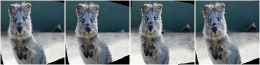

**Example.**
Apply affine translations in polar representation::

    aug = iaa.WithPolarWarping(
        iaa.Affine(
            translate_percent={"x": (-0.1, 0.1), "y": (-0.1, 0.1)}
        )
    )

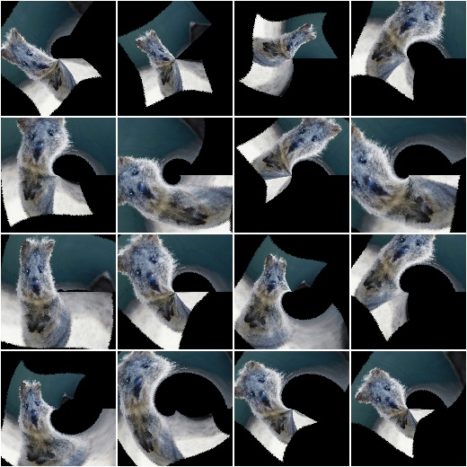

**Example.**
Apply average pooling in polar representation. This leads to circular
bins::

    aug = iaa.WithPolarWarping(iaa.AveragePooling((2, 8)))

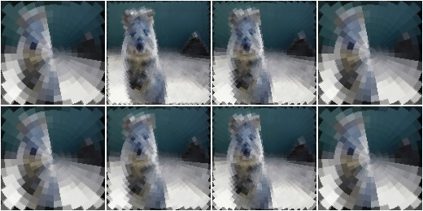

Jigsaw
------

Move cells within images similar to jigsaw patterns.

.. note::

    This augmenter will by default pad images until their height is a
    multiple of `nb_rows`. Analogous for `nb_cols`.

.. note::

    This augmenter will resize heatmaps and segmentation maps to the
    image size, then apply similar padding as for the corresponding images
    and resize back to the original map size. That also means that images
    may change in shape (due to padding), but heatmaps/segmaps will not
    change. For heatmaps/segmaps, this deviates from pad augmenters that
    will change images and heatmaps/segmaps in corresponding ways and then
    keep the heatmaps/segmaps at the new size.

.. warning::

    This augmenter currently only supports augmentation of images,
    heatmaps, segmentation maps and keypoints. Other augmentables,
    i.e. bounding boxes, polygons and line strings, will result in errors.

API link: :class:`~imgaug.augmenters.geometric.Jigsaw`

**Example.**
Create a jigsaw augmenter that splits images into ``10x10`` cells
and shifts them around by ``0`` to ``2`` steps (default setting)::

    import imgaug.augmenters as iaa
    aug = iaa.Jigsaw(nb_rows=10, nb_cols=10)

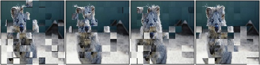

**Example.**
Create a jigsaw augmenter that splits each image into ``1`` to ``4``
cells along each axis::

    aug = iaa.Jigsaw(nb_rows=(1, 4), nb_cols=(1, 4))

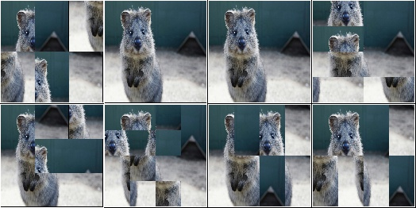

**Example.**
Create a jigsaw augmenter that moves the cells in each image by a random
amount between ``1`` and ``5`` times (decided per image). Some images will
be barely changed, some will be fairly distorted. ::

    aug = iaa.Jigsaw(nb_rows=10, nb_cols=10, max_steps=(1, 5))

.. figure:: ../../images/overview_of_augmenters/geometric/jigsaw_random_max_steps.jpg
    :alt: Jigsaw with random number of max_steps
