*************************
augmenters.imgcorruptlike
*************************

GaussianNoise
-------------

Wrapper around :func:`~imagecorruptions.corruptions.gaussian_noise`.

.. note::

    This augmenter only affects images. Other data is not changed.

API link: :class:`~imgaug.augmenters.imgcorruptlike.GaussianNoise`

The image below visualizes severities ``1`` to ``5`` -- one severity per row:

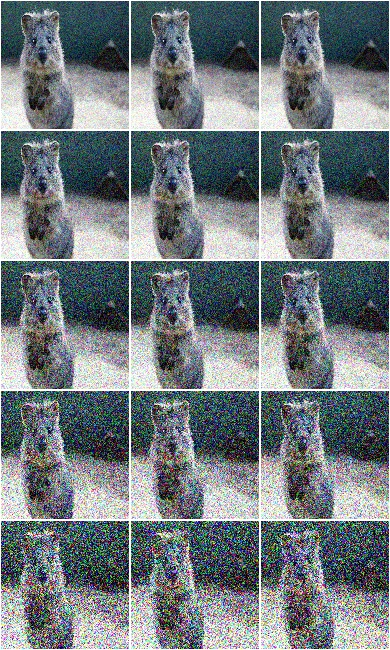

**Example.**
Create an augmenter around
:func:`~imagecorruptions.corruptions.gaussian_noise`.
Apply it to images using e.g. ``aug(images=[image1, image2, ...])``::

    import imgaug.augmenters as iaa
    aug = iaa.imgcorruptlike.GaussianNoise(severity=2)

ShotNoise
---------

Wrapper around :func:`~imagecorruptions.corruptions.shot_noise`.

.. note::

    This augmenter only affects images. Other data is not changed.

API link: :class:`~imgaug.augmenters.imgcorruptlike.ShotNoise`

The image below visualizes severities ``1`` to ``5`` -- one severity per row:

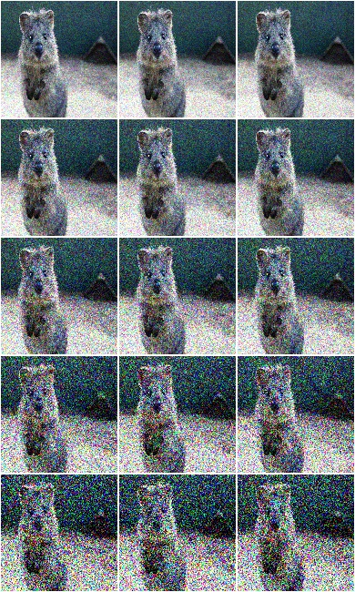

**Example.**
Create an augmenter around
:func:`~imagecorruptions.corruptions.shot_noise`.
Apply it to images using e.g. ``aug(images=[image1, image2, ...])``::

    import imgaug.augmenters as iaa
    aug = iaa.imgcorruptlike.ShotNoise(severity=2)

ImpulseNoise
------------

Wrapper around :func:`~imagecorruptions.corruptions.impulse_noise`.

.. note::

    This augmenter only affects images. Other data is not changed.

API link: :class:`~imgaug.augmenters.imgcorruptlike.ImpulseNoise`

The image below visualizes severities ``1`` to ``5`` -- one severity per row:

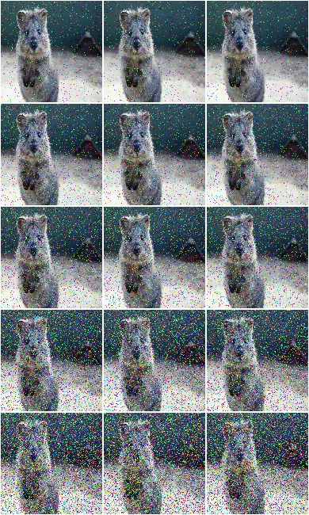

**Example.**
Create an augmenter around
:func:`~imagecorruptions.corruptions.impulse_noise`.
Apply it to images using e.g. ``aug(images=[image1, image2, ...])``::

    import imgaug.augmenters as iaa
    aug = iaa.imgcorruptlike.ImpulseNoise(severity=2)

SpeckleNoise
------------

Wrapper around :func:`~imagecorruptions.corruptions.speckle_noise`.

.. note::

    This augmenter only affects images. Other data is not changed.

API link: :class:`~imgaug.augmenters.imgcorruptlike.SpeckleNoise`

The image below visualizes severities ``1`` to ``5`` -- one severity per row:

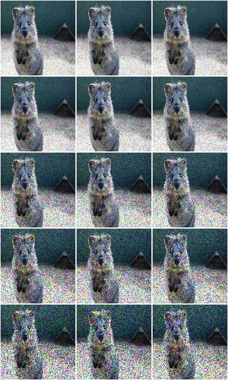

**Example.**
Create an augmenter around
:func:`~imagecorruptions.corruptions.speckle_noise`.
Apply it to images using e.g. ``aug(images=[image1, image2, ...])``::

    import imgaug.augmenters as iaa
    aug = iaa.imgcorruptlike.SpeckleNoise(severity=2)

GaussianBlur
------------

Wrapper around :func:`~imagecorruptions.corruptions.gaussian_blur`.

.. note::

    This augmenter only affects images. Other data is not changed.

API link: :class:`~imgaug.augmenters.imgcorruptlike.GaussianBlur`

The image below visualizes severities ``1`` to ``5`` -- one severity per row:

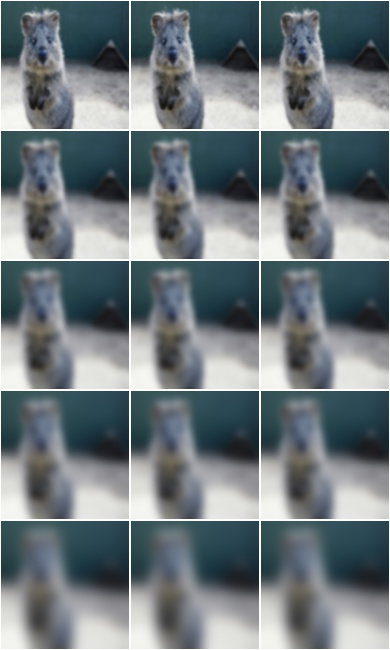

**Example.**
Create an augmenter around
:func:`~imagecorruptions.corruptions.gaussian_blur`.
Apply it to images using e.g. ``aug(images=[image1, image2, ...])``::

    import imgaug.augmenters as iaa
    aug = iaa.imgcorruptlike.GaussianBlur(severity=2)

GlassBlur
------------

Wrapper around :func:`~imagecorruptions.corruptions.glass_blur`.

.. note::

    This augmenter only affects images. Other data is not changed.

API link: :class:`~imgaug.augmenters.imgcorruptlike.GlassBlur`

The image below visualizes severities ``1`` to ``5`` -- one severity per row:

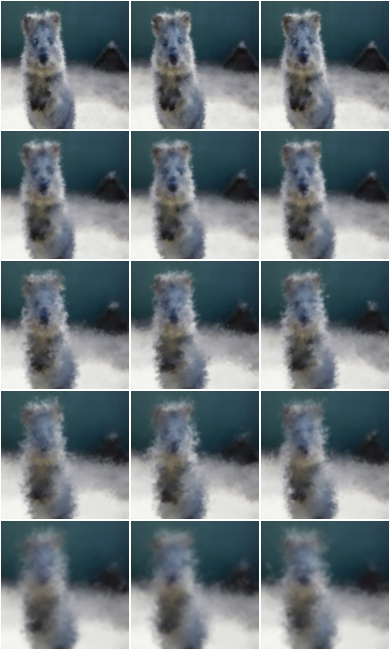

**Example.**
Create an augmenter around
:func:`~imagecorruptions.corruptions.glass_blur`.
Apply it to images using e.g. ``aug(images=[image1, image2, ...])``::

    import imgaug.augmenters as iaa
    aug = iaa.imgcorruptlike.GlassBlur(severity=2)

DefocusBlur
------------

Wrapper around :func:`~imagecorruptions.corruptions.defocus_blur`.

.. note::

    This augmenter only affects images. Other data is not changed.

API link: :class:`~imgaug.augmenters.imgcorruptlike.DefocusBlur`

The image below visualizes severities ``1`` to ``5`` -- one severity per row:

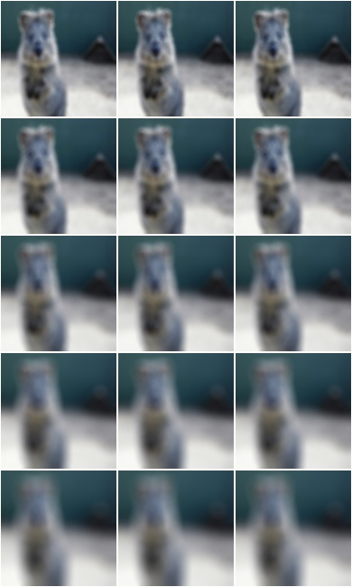

**Example.**
Create an augmenter around
:func:`~imagecorruptions.corruptions.defocus_blur`.
Apply it to images using e.g. ``aug(images=[image1, image2, ...])``::

    import imgaug.augmenters as iaa
    aug = iaa.imgcorruptlike.DefocusBlur(severity=2)

MotionBlur
------------

Wrapper around :func:`~imagecorruptions.corruptions.motion_blur`.

.. note::

    This augmenter only affects images. Other data is not changed.

API link: :class:`~imgaug.augmenters.imgcorruptlike.MotionBlur`

The image below visualizes severities ``1`` to ``5`` -- one severity per row:

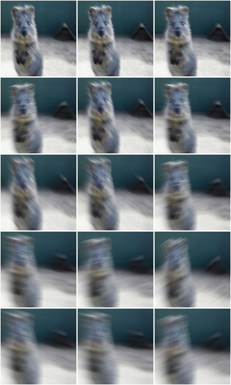

**Example.**
Create an augmenter around
:func:`~imagecorruptions.corruptions.motion_blur`.
Apply it to images using e.g. ``aug(images=[image1, image2, ...])``::

    import imgaug.augmenters as iaa
    aug = iaa.imgcorruptlike.MotionBlur(severity=2)

ZoomBlur
------------

Wrapper around :func:`~imagecorruptions.corruptions.zoom_blur`.

.. note::

    This augmenter only affects images. Other data is not changed.

API link: :class:`~imgaug.augmenters.imgcorruptlike.ZoomBlur`

The image below visualizes severities ``1`` to ``5`` -- one severity per row:

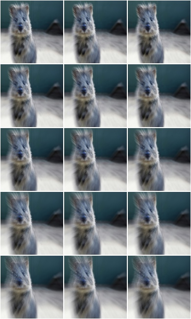

**Example.**
Create an augmenter around
:func:`~imagecorruptions.corruptions.zoom_blur`.
Apply it to images using e.g. ``aug(images=[image1, image2, ...])``::

    import imgaug.augmenters as iaa
    aug = iaa.imgcorruptlike.ZoomBlur(severity=2)

Fog
------------

Wrapper around :func:`~imagecorruptions.corruptions.fog`.

.. note::

    This augmenter only affects images. Other data is not changed.

API link: :class:`~imgaug.augmenters.imgcorruptlike.Fog`

The image below visualizes severities ``1`` to ``5`` -- one severity per row:

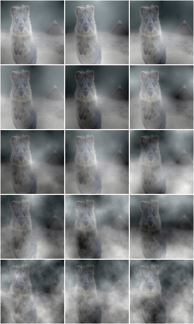

**Example.**
Create an augmenter around
:func:`~imagecorruptions.corruptions.fog`.
Apply it to images using e.g. ``aug(images=[image1, image2, ...])``::

    import imgaug.augmenters as iaa
    aug = iaa.imgcorruptlike.Fog(severity=2)

Frost
------------

Wrapper around :func:`~imagecorruptions.corruptions.frost`.

.. note::

    This augmenter only affects images. Other data is not changed.

API link: :class:`~imgaug.augmenters.imgcorruptlike.Frost`

The image below visualizes severities ``1`` to ``5`` -- one severity per row:

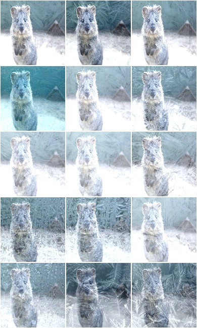

**Example.**
Create an augmenter around
:func:`~imagecorruptions.corruptions.frost`.
Apply it to images using e.g. ``aug(images=[image1, image2, ...])``::

    import imgaug.augmenters as iaa
    aug = iaa.imgcorruptlike.Frost(severity=2)

Snow
------------

Wrapper around :func:`~imagecorruptions.corruptions.snow`.

.. note::

    This augmenter only affects images. Other data is not changed.

API link: :class:`~imgaug.augmenters.imgcorruptlike.Snow`

The image below visualizes severities ``1`` to ``5`` -- one severity per row:

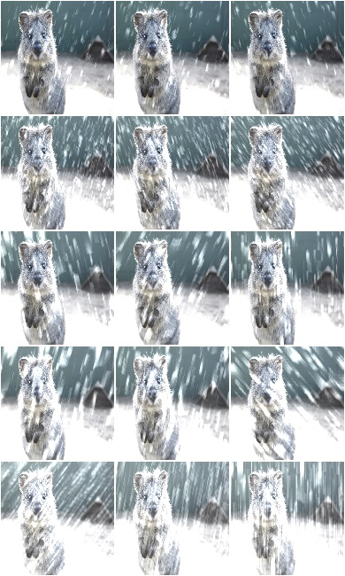

**Example.**
Create an augmenter around
:func:`~imagecorruptions.corruptions.snow`.
Apply it to images using e.g. ``aug(images=[image1, image2, ...])``::

    import imgaug.augmenters as iaa
    aug = iaa.imgcorruptlike.Snow(severity=2)

Spatter
------------

Wrapper around :func:`~imagecorruptions.corruptions.spatter`.

.. note::

    This augmenter only affects images. Other data is not changed.

API link: :class:`~imgaug.augmenters.imgcorruptlike.Spatter`

The image below visualizes severities ``1`` to ``5`` -- one severity per row:

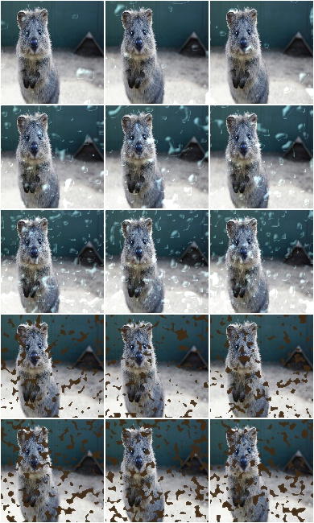

**Example.**
Create an augmenter around
:func:`~imagecorruptions.corruptions.spatter`.
Apply it to images using e.g. ``aug(images=[image1, image2, ...])``::

    import imgaug.augmenters as iaa
    aug = iaa.imgcorruptlike.Spatter(severity=2)

Contrast
------------

Wrapper around :func:`~imagecorruptions.corruptions.contrast`.

.. note::

    This augmenter only affects images. Other data is not changed.

API link: :class:`~imgaug.augmenters.imgcorruptlike.Contrast`

The image below visualizes severities ``1`` to ``5`` -- one severity per row:

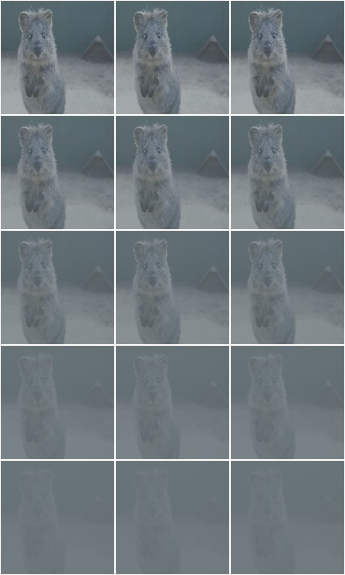

**Example.**
Create an augmenter around
:func:`~imagecorruptions.corruptions.contrast`.
Apply it to images using e.g. ``aug(images=[image1, image2, ...])``::

    import imgaug.augmenters as iaa
    aug = iaa.imgcorruptlike.Contrast(severity=2)

Brightness
------------

Wrapper around :func:`~imagecorruptions.corruptions.brightness`.

.. note::

    This augmenter only affects images. Other data is not changed.

API link: :class:`~imgaug.augmenters.imgcorruptlike.Brightness`

The image below visualizes severities ``1`` to ``5`` -- one severity per row:

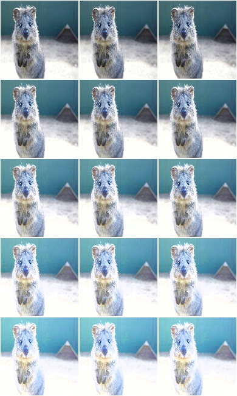

**Example.**
Create an augmenter around
:func:`~imagecorruptions.corruptions.brightness`.
Apply it to images using e.g. ``aug(images=[image1, image2, ...])``::

    import imgaug.augmenters as iaa
    aug = iaa.imgcorruptlike.Brightness(severity=2)

Saturate
------------

Wrapper around :func:`~imagecorruptions.corruptions.saturate`.

.. note::

    This augmenter only affects images. Other data is not changed.

API link: :class:`~imgaug.augmenters.imgcorruptlike.Saturate`

The image below visualizes severities ``1`` to ``5`` -- one severity per row:

.. figure:: ../../images/overview_of_augmenters/imgcorruptlike/saturate.jpg
    :alt: Saturate

**Example.**
Create an augmenter around
:func:`~imagecorruptions.corruptions.saturate`.
Apply it to images using e.g. ``aug(images=[image1, image2, ...])``::

    import imgaug.augmenters as iaa
    aug = iaa.imgcorruptlike.Saturate(severity=2)

JpegCompression
---------------

Wrapper around :func:`~imagecorruptions.corruptions.jpeg_compression`.

.. note::

    This augmenter only affects images. Other data is not changed.

API link: :class:`~imgaug.augmenters.imgcorruptlike.JpegCompression`

The image below visualizes severities ``1`` to ``5`` -- one severity per row:

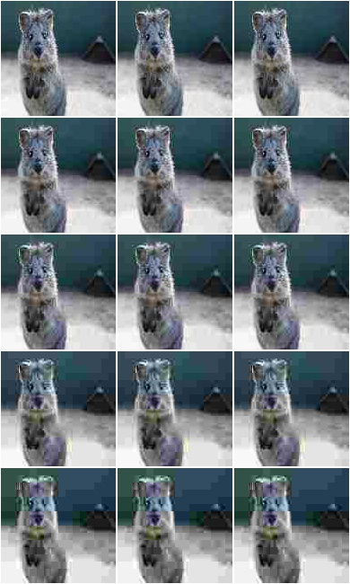

**Example.**
Create an augmenter around
:func:`~imagecorruptions.corruptions.jpeg_compression`.
Apply it to images using e.g. ``aug(images=[image1, image2, ...])``::

    import imgaug.augmenters as iaa
    aug = iaa.imgcorruptlike.JpegCompression(severity=2)

Pixelate
------------

Wrapper around :func:`~imagecorruptions.corruptions.jpeg_compression`.

.. note::

    This augmenter only affects images. Other data is not changed.

Wrapper around :func:`~imagecorruptions.corruptions.pixelate`.

.. note::

    This augmenter only affects images. Other data is not changed.

API link: :class:`~imgaug.augmenters.imgcorruptlike.Pixelate`

The image below visualizes severities ``1`` to ``5`` -- one severity per row:

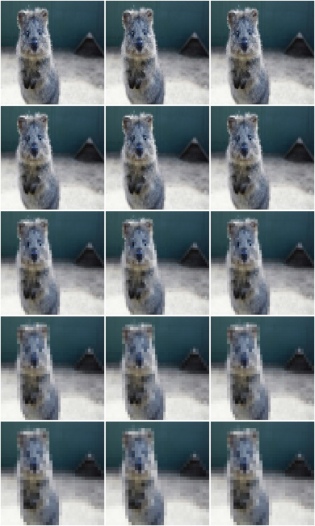

**Example.**
Create an augmenter around
:func:`~imagecorruptions.corruptions.pixelate`.
Apply it to images using e.g. ``aug(images=[image1, image2, ...])``::

    import imgaug.augmenters as iaa
    aug = iaa.imgcorruptlike.Pixelate(severity=2)

ElasticTransform
----------------

Wrapper around :func:`~imagecorruptions.corruptions.elastic_transform`.

.. note::

    This augmenter only affects images. Other data is not changed.

API link: :class:`~imgaug.augmenters.imgcorruptlike.ElasticTransform`

The image below visualizes severities ``1`` to ``5`` -- one severity per row:

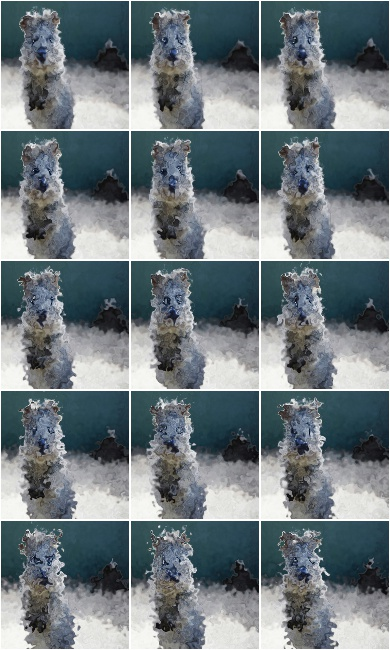

**Example.**
Create an augmenter around
:func:`~imagecorruptions.corruptions.elastic_transform`.
Apply it to images using e.g. ``aug(images=[image1, image2, ...])``::

    import imgaug.augmenters as iaa
    aug = iaa.imgcorruptlike.ElasticTransform(severity=2)
