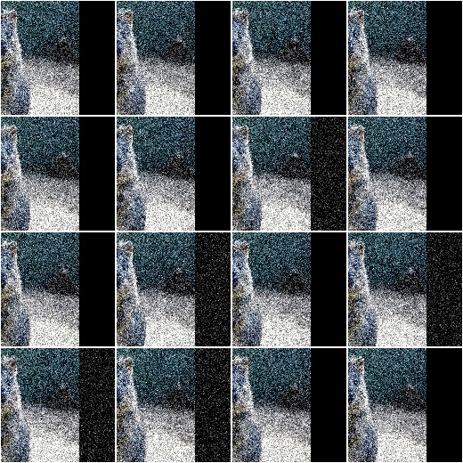
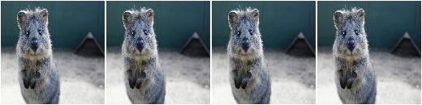
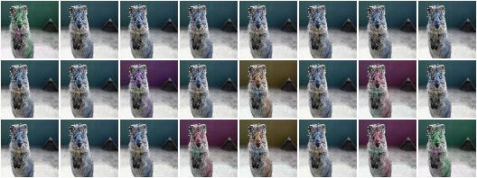
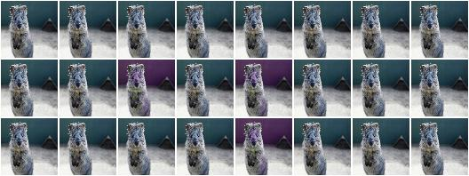
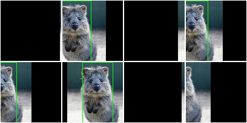
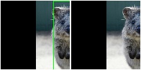

***************
augmenters.meta
***************

Sequential
----------

List augmenter that may contain other augmenters to apply in sequence
or random order.

API link: :class:`~imgaug.augmenters.meta.Sequential`

**Example.**
Apply in predefined order::

    import imgaug.augmenters as iaa
    aug = iaa.Sequential([
        iaa.Affine(translate_px={"x":-40}),
        iaa.AdditiveGaussianNoise(scale=0.1*255)
    ])

.. figure:: ../../images/overview_of_augmenters/meta/sequential.jpg
    :alt: Sequential

**Example.**
Apply in random order (note that the order is sampled once per batch and then
the same for all images within the batch)::

    aug = iaa.Sequential([
          iaa.Affine(translate_px={"x":-40}),
          iaa.AdditiveGaussianNoise(scale=0.1*255)
    ], random_order=True)

SomeOf
------

List augmenter that applies only some of its children to images.

API link: :class:`~imgaug.augmenters.meta.SomeOf`

**Example.**
Apply two of four given augmenters::

    import imgaug.augmenters as iaa
    aug = iaa.SomeOf(2, [
        iaa.Affine(rotate=45),
        iaa.AdditiveGaussianNoise(scale=0.2*255),
        iaa.Add(50, per_channel=True),
        iaa.Sharpen(alpha=0.5)
    ])

.. figure:: ../../images/overview_of_augmenters/meta/someof.jpg
    :alt: SomeOf

**Example.**
Apply ``0`` to ``<max>`` given augmenters (where ``<max>`` is automatically
replaced with the number of children)::

    aug = iaa.SomeOf((0, None), [
        iaa.Affine(rotate=45),
        iaa.AdditiveGaussianNoise(scale=0.2*255),
        iaa.Add(50, per_channel=True),
        iaa.Sharpen(alpha=0.5)
    ])

.. figure:: ../../images/overview_of_augmenters/meta/someof_0_to_none.jpg
    :alt: SomeOf 0 to None

**Example.**
Pick two of four given augmenters and apply them in random order::

    aug = iaa.SomeOf(2, [
        iaa.Affine(rotate=45),
        iaa.AdditiveGaussianNoise(scale=0.2*255),
        iaa.Add(50, per_channel=True),
        iaa.Sharpen(alpha=0.5)
    ], random_order=True)

.. figure:: ../../images/overview_of_augmenters/meta/someof_random_order.jpg
    :alt: SomeOf random order

OneOf
-----

Augmenter that always executes exactly one of its children.

API link: :func:`~imgaug.augmenters.meta.OneOf`

**Example.**
Apply one of four augmenters to each image::

    import imgaug.augmenters as iaa
    aug = iaa.OneOf([
        iaa.Affine(rotate=45),
        iaa.AdditiveGaussianNoise(scale=0.2*255),
        iaa.Add(50, per_channel=True),
        iaa.Sharpen(alpha=0.5)
    ])

.. figure:: ../../images/overview_of_augmenters/meta/oneof.jpg
    :alt: OneOf

Sometimes
---------

Augment only p percent of all images with one or more augmenters.

API link: :class:`~imgaug.augmenters.meta.Sometimes`

**Example.**
Apply gaussian blur to about 50% of all images::

    import imgaug.augmenters as iaa
    aug = iaa.Sometimes(0.5, iaa.GaussianBlur(sigma=2.0))

.. figure:: ../../images/overview_of_augmenters/meta/sometimes.jpg
    :alt: Sometimes

**Example.**
Apply gaussian blur to about 50% of all images. Apply a mixture of affine
rotations and sharpening to the other 50%. ::

    aug = iaa.Sometimes(
          0.5,
          iaa.GaussianBlur(sigma=2.0),
          iaa.Sequential([iaa.Affine(rotate=45), iaa.Sharpen(alpha=1.0)])
      )

.. figure:: ../../images/overview_of_augmenters/meta/sometimes_if_else.jpg
    :alt: Sometimes if else

WithChannels
------------

Apply child augmenters to specific channels.

API link: :class:`~imgaug.augmenters.meta.WithChannels`

**Example.**
Increase each pixel's R-value (redness) by ``10`` to ``100``::

    import imgaug.augmenters as iaa
    aug = iaa.WithChannels(0, iaa.Add((10, 100)))

.. figure:: ../../images/overview_of_augmenters/meta/withchannels.jpg
    :alt: WithChannels

**Example.**
Rotate each image's red channel by ``0`` to ``45`` degrees::

    aug = iaa.WithChannels(0, iaa.Affine(rotate=(0, 45)))

.. figure:: ../../images/overview_of_augmenters/meta/withchannels_affine.jpg
    :alt: WithChannels + Affine

Identity
--------

Augmenter that does not change the input data.

This augmenter is useful e.g. during validation/testing as it allows
to re-use the training code without actually performing any augmentation.

API link: :class:`~imgaug.augmenters.meta.Identity`

**Example.**
Create an augmenter that does not change inputs::

    import imgaug.augmenters as iaa
    aug = iaa.Identity()

Noop
----

Alias for augmenter :class:`Identity`.

It is recommended to now use :class:`Identity`. :class:`Noop` might be
deprecated in the future.

API link: :class:`~imgaug.augmenters.meta.Noop`

**Example.**
Create an augmenter that does nothing::

    import imgaug.augmenters as iaa
    aug = iaa.Noop()

.. figure:: ../../images/overview_of_augmenters/meta/noop.jpg
    :alt: Noop

Lambda
------

Augmenter that calls a lambda function for each batch of input image.

API link: :class:`~imgaug.augmenters.meta.Lambda`

**Example.**
Replace in every image each fourth row with black pixels::

    import imgaug.augmenters as iaa

    def img_func(images, random_state, parents, hooks):
        for img in images:
            img[::4] = 0
        return images

    def keypoint_func(keypoints_on_images, random_state, parents, hooks):
        return keypoints_on_images

    aug = iaa.Lambda(img_func, keypoint_func)

.. figure:: ../../images/overview_of_augmenters/meta/lambda.jpg
    :alt: Lambda

AssertLambda
------------

Augmenter that runs an assert on each batch of input images
using a lambda function as condition.

API link: :class:`~imgaug.augmenters.meta.AssertLambda`

TODO examples

AssertShape
-----------

Augmenter to make assumptions about the shape of input image(s)
and keypoints.

API link: :class:`~imgaug.augmenters.meta.AssertShape`

**Example.**
Check if each image in a batch has shape ``32x32x3``, otherwise raise an
exception::

    import imgaug.augmenters as iaa
    seq = iaa.Sequential([
        iaa.AssertShape((None, 32, 32, 3)),
        iaa.Fliplr(0.5) # only executed if shape matches
    ])

**Example.**
Check if each image in a batch has a height in the range ``32<=x<64``,
a width of exactly ``64`` and either ``1`` or ``3`` channels::

    seq = iaa.Sequential([
        iaa.AssertShape((None, (32, 64), 32, [1, 3])),
        iaa.Fliplr(0.5)
    ])

ChannelShuffle
--------------

Randomize the order of channels in input images.

API link: :class:`~imgaug.augmenters.meta.ChannelShuffle`

**Example.**
Shuffle all channels of 35% of all images::

    import imgaug.augmenters as iaa
    aug = iaa.ChannelShuffle(0.35)

**Example.**
Shuffle only channels ``0`` and ``1`` of 35% of all images. As the new
channel orders ``0, 1`` and ``1, 0`` are both valid outcomes of the
shuffling, it means that for ``0.35 * 0.5 = 0.175`` or 17.5% of all images
the order of channels ``0`` and ``1`` is inverted. ::

    aug = iaa.ChannelShuffle(0.35, channels=[0, 1])

RemoveCBAsByOutOfImageFraction
------------------------------

Remove coordinate-based augmentables exceeding an out of image fraction.

This augmenter inspects all coordinate-based augmentables (e.g.
bounding boxes, line strings) within a given batch and removes any such
augmentable which's out of image fraction is exactly a given value or
greater than that. The out of image fraction denotes the fraction of the
augmentable's area that is outside of the image, e.g. for a bounding box
that has half of its area outside of the image it would be ``0.5``.

API link: :class:`~imgaug.augmenters.meta.RemoveCBAsByOutOfImageFraction`

**Example.**
Translate all inputs by ``-100`` to ``100`` pixels on the x-axis, then
remove any coordinate-based augmentable (e.g. bounding boxes) which has
at least ``50%`` of its area outside of the image plane::

    import imgaug.augmenters as iaa
    aug = iaa.Sequential([
        iaa.Affine(translate_px={"x": (-100, 100)}),
        iaa.RemoveCBAsByOutOfImageFraction(0.5)
    ])

**Example.**
Create a bounding box on an example image, then translate the image so that
``50%`` of the bounding box's area is outside of the image and compare
the effects and using ``RemoveCBAsByOutOfImageFraction`` with not using it. ::

    import imgaug as ia
    import imgaug.augmenters as iaa
    image = ia.quokka_square((100, 100))
    bb = ia.BoundingBox(x1=50-25, y1=0, x2=50+25, y2=100)
    bbsoi = ia.BoundingBoxesOnImage([bb], shape=image.shape)
    aug_without = iaa.Affine(translate_px={"x": 51})
    aug_with = iaa.Sequential([
        iaa.Affine(translate_px={"x": 51}),
        iaa.RemoveCBAsByOutOfImageFraction(0.5)
    ])

    image_without, bbsoi_without = aug_without(
        image=image, bounding_boxes=bbsoi)
    image_with, bbsoi_with = aug_with(
        image=image, bounding_boxes=bbsoi)

    assert len(bbsoi_without.bounding_boxes) == 1
    assert len(bbsoi_with.bounding_boxes) == 0

ClipCBAsToImagePlanes
---------------------

Clip coordinate-based augmentables to areas within the image plane.

This augmenter inspects all coordinate-based augmentables (e.g.
bounding boxes, line strings) within a given batch and from each of them
parts that are outside of the image plane. Parts within the image plane
will be retained. This may e.g. shrink down bounding boxes. For keypoints,
it removes any single points outside of the image plane. Any augmentable
that is completely outside of the image plane will be removed.

API link: :class:`~imgaug.augmenters.meta.ClipCBAsToImagePlanes`

**Example.**
Translate input data on the x-axis by ``-100`` to ``100`` pixels,
then cut all coordinate-based augmentables (e.g. bounding boxes) down
to areas that are within the image planes of their corresponding images::

    import imgaug.augmenters as iaa
    aug = iaa.Sequential([
        iaa.Affine(translate_px={"x": (-100, 100)}),
        iaa.ClipCBAsToImagePlanes()
    ])

.. figure:: ../../images/overview_of_augmenters/meta/clipcbastoimageplanes.jpg
    :alt: ClipCBAsToImagePlanes
