******************
augmenters.pillike
******************

Solarize
--------

Augmenter with identical outputs to PIL's ``solarize()`` function.

This augmenter inverts all pixel values above a threshold.

The outputs are identical to PIL's ``solarize()``.

API link: :func:`~imgaug.augmenters.pillike.Solarize`

**Example.**
Invert the colors in ``50`` percent of all images for pixels with a
value between ``32`` and ``128`` or more. The threshold is sampled once
per image. The thresholding operation happens per channel. ::

    import imgaug.augmenters as iaa
    aug = iaa.Solarize(0.5, threshold=(32, 128))

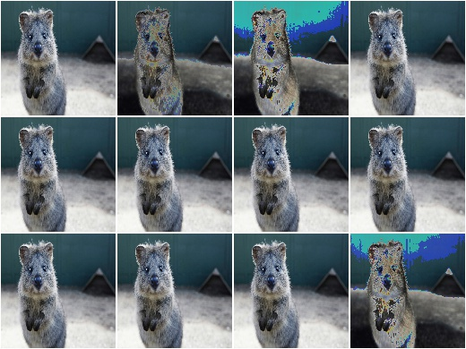

Posterize
---------

Augmenter with identical outputs to PIL's ``posterize()`` function.

This augmenter quantizes each array component to ``N`` bits.

This class is currently an alias for
:class:`~imgaug.augmenters.color.Posterize`, which again is an alias
for :class:`~imgaug.augmenters.color.UniformColorQuantizationToNBits`,
i.e. all three classes are right now guarantueed to have the same
outputs as PIL's function.

API link: :func:`~imgaug.augmenters.pillike.Posterize`

Equalize
--------

Equalize the image histogram.

This augmenter has identical outputs to :func:`~PIL.ImageOps.equalize`.

API link: :func:`~imgaug.augmenters.pillike.Equalize`

**Example.**
Equalize the histograms of all input images::

    import imgaug.augmenters as iaa
    aug = iaa.pillike.Equalize()

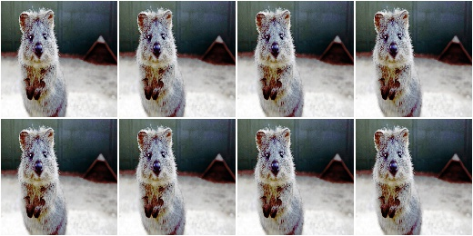

Autocontrast
------------

Adjust contrast by cutting off ``p%`` of lowest/highest histogram values.

This augmenter has identical outputs to :func:`~PIL.ImageOps.autocontrast`.

See :func:`~imgaug.augmenters.pillike.autocontrast` for more details.

API link: :func:`~imgaug.augmenters.pillike.Autocontrast`

**Example.**
Modify the contrast of images by cutting off the ``0`` to ``20%`` lowest
and highest values from the histogram, then stretching it to full length::

    import imgaug.augmenters as iaa
    aug = iaa.pillike.Autocontrast()

**Example.**
Modify the contrast of images by cutting off the ``10`` to ``20%`` lowest
and highest values from the histogram, then stretching it to full length.
The cutoff value is sampled per *channel* instead of per *image*. ::

    aug = iaa.pillike.Autocontrast((10, 20), per_channel=True)

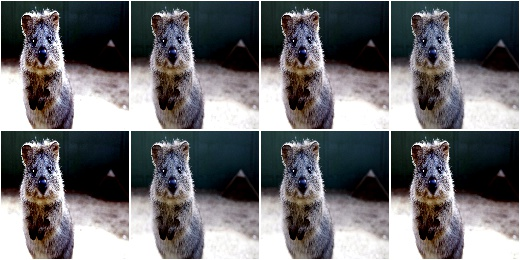

EnhanceColor
------------

Convert images to grayscale.

This augmenter has identical outputs to :class:`~PIL.ImageEnhance.Color`.

API link: :func:`~imgaug.augmenters.pillike.EnhanceColor`

**Example.**
Create an augmenter to remove a random fraction of color from
input images::

    import imgaug.augmenters as iaa
    aug = iaa.pillike.EnhanceColor()

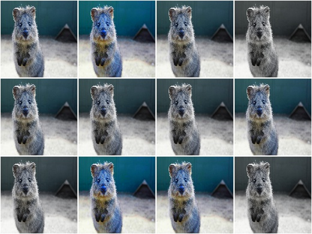

EnhanceContrast
---------------

Change the contrast of images.

This augmenter has identical outputs to :class:`~PIL.ImageEnhance.Contrast`.

API link: :func:`~imgaug.augmenters.pillike.EnhanceContrast`

**Example.**
Create an augmenter that worsens the contrast of an image by a random
factor::

    import imgaug.augmenters as iaa
    aug = iaa.pillike.EnhanceContrast()

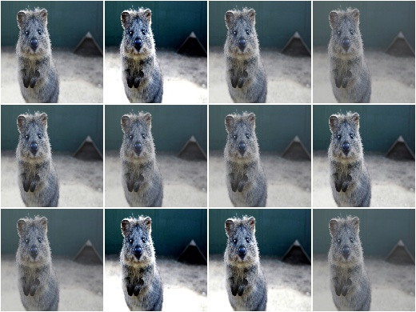

EnhanceBrightness
-----------------

Change the brightness of images.

This augmenter has identical outputs to
:class:`~PIL.ImageEnhance.Brightness`.

API link: :func:`~imgaug.augmenters.pillike.EnhanceBrightness`

**Example.**
Create an augmenter that worsens the brightness of an image by a random
factor::

    import imgaug.augmenters as iaa
    aug = iaa.pillike.EnhanceBrightness()

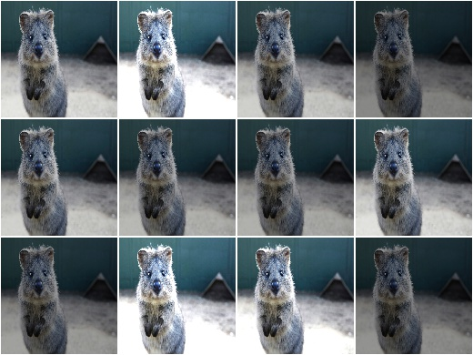

EnhanceSharpness
----------------

Change the sharpness of images.

This augmenter has identical outputs to
:class:`~PIL.ImageEnhance.Sharpness`.

API link: :func:`~imgaug.augmenters.pillike.EnhanceSharpness`

**Example.**
Create an augmenter that randomly decreases or increases the sharpness
of an image::

    import imgaug.augmenters as iaa
    aug = iaa.pillike.EnhanceSharpness()

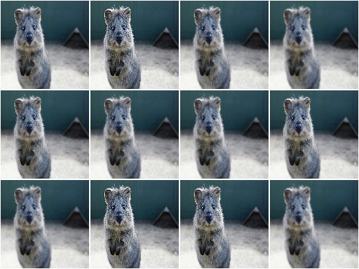

FilterBlur
------------

Apply a blur filter kernel to images.

This augmenter has identical outputs to
calling :func:`~PIL.Image.filter` with kernel ``PIL.ImageFilter.BLUR``.

API link: :func:`~imgaug.augmenters.pillike.FilterBlur`

**Example.**
Create an augmenter that applies a blur filter kernel to images::

    import imgaug.augmenters as iaa
    aug = iaa.pillike.FilterBlur()

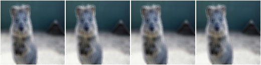

FilterSmooth
------------

Apply a smoothening filter kernel to images.

This augmenter has identical outputs to
calling :func:`~PIL.Image.filter` with kernel ``PIL.ImageFilter.SMOOTH``.

API link: :func:`~imgaug.augmenters.pillike.FilterSmooth`

**Example.**
Create an augmenter that applies a smoothening filter kernel to images::

    import imgaug.augmenters as iaa
    aug = iaa.pillike.FilterSmooth()

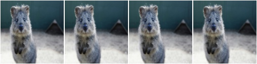

FilterSmoothMore
----------------

Apply a strong smoothening filter kernel to images.

This augmenter has identical outputs to
calling :func:`~PIL.Image.filter` with kernel ``PIL.ImageFilter.BLUR``.

API link: :func:`~imgaug.augmenters.pillike.FilterSmoothMore`

**Example.**
Create an augmenter that applies a strong smoothening filter kernel to
images::

    import imgaug.augmenters as iaa
    aug = iaa.pillike.FilterSmoothMore()

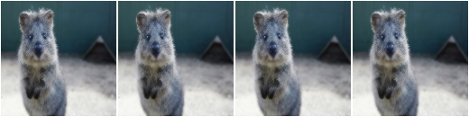

FilterEdgeEnhance
-----------------

Apply an edge enhance filter kernel to images.

This augmenter has identical outputs to
calling :func:`~PIL.Image.filter` with kernel
``PIL.ImageFilter.EDGE_ENHANCE``.

API link: :func:`~imgaug.augmenters.pillike.FilterEdgeEnhance`

**Example.**
Create an augmenter that applies a edge enhancement filter kernel to
images::

    import imgaug.augmenters as iaa
    aug = iaa.pillike.FilterEdgeEnhance()

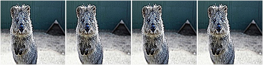

FilterEdgeEnhanceMore
---------------------

Apply a strong edge enhancement filter kernel to images.

This augmenter has identical outputs to
calling :func:`~PIL.Image.filter` with kernel
``PIL.ImageFilter.EDGE_ENHANCE_MORE``.

API link: :func:`~imgaug.augmenters.pillike.FilterEdgeEnhanceMore`

**Example.**
Create an augmenter that applies a strong edge enhancement filter kernel
to images::

    import imgaug.augmenters as iaa
    aug = iaa.pillike.FilterEdgeEnhanceMore()

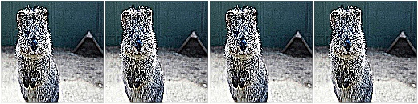

FilterFindEdges
---------------

Apply a edge detection kernel to images.

This augmenter has identical outputs to
calling :func:`~PIL.Image.filter` with kernel
``PIL.ImageFilter.FIND_EDGES``.

API link: :func:`~imgaug.augmenters.pillike.FilterFindEdges`

**Example.**
Create an augmenter that applies an edge detection filter kernel to images::

    import imgaug.augmenters as iaa
    aug = iaa.pillike.FilterFindEdges()

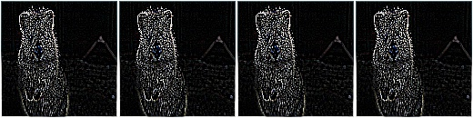

FilterContour
-------------

Apply a contour detection filter kernel to images.

This augmenter has identical outputs to
calling :func:`~PIL.Image.filter` with kernel ``PIL.ImageFilter.CONTOUR``.

API link: :func:`~imgaug.augmenters.pillike.FilterContour`

**Example.**
Create an augmenter that applies a contour detection filter kernel to
images::

    import imgaug.augmenters as iaa
    aug = iaa.pillike.FilterContour()

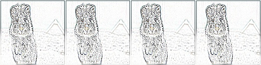

FilterEmboss
------------

Apply an emboss filter kernel to images.

This augmenter has identical outputs to
calling :func:`~PIL.Image.filter` with kernel ``PIL.ImageFilter.EMBOSS``.

API link: :func:`~imgaug.augmenters.pillike.FilterEmboss`

**Example.**
Create an augmenter that applies an emboss filter kernel to images::

    import imgaug.augmenters as iaa
    aug = iaa.pillike.FilterEmboss()

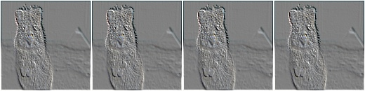

FilterSharpen
-------------

Apply a sharpening filter kernel to images.

This augmenter has identical outputs to
calling :func:`~PIL.Image.filter` with kernel ``PIL.ImageFilter.SHARPEN``.

API link: :func:`~imgaug.augmenters.pillike.FilterSharpen`

**Example.**
Create an augmenter that applies a sharpening filter kernel to images::

    import imgaug.augmenters as iaa
    aug = iaa.pillike.FilterSharpen()

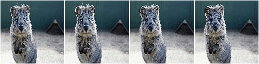

FilterDetail
-------------

Apply a detail enhancement filter kernel to images.

This augmenter has identical outputs to
calling :func:`~PIL.Image.filter` with kernel ``PIL.ImageFilter.DETAIL``.

API link: :func:`~imgaug.augmenters.pillike.FilterDetail`

**Example.**
Create an augmenter that applies a detail enhancement filter kernel to
images::

    import imgaug.augmenters as iaa
    aug = iaa.pillike.FilterDetail()

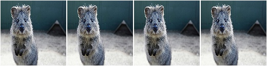

Affine
-------------

Apply PIL-like affine transformations to images.

This augmenter has identical outputs to
:func:`~PIL.Image.transform` with parameter ``method=PIL.Image.AFFINE``.

.. note::

    This augmenter can currently only transform image-data.
    Batches containing heatmaps, segmentation maps and
    coordinate-based augmentables will be rejected with an error.
    Use :class:`~imgaug.augmenters.geometric.Affine` if you have to
    transform such inputs.

.. note::

    This augmenter uses the image center as the transformation center.
    This has to be explicitly enforced in PIL using corresponding
    translation matrices. Without such translation, PIL uses the image
    top left corner as the transformation center. To mirror that
    behaviour, use ``center=(0.0, 0.0)``.

API link: :func:`~imgaug.augmenters.pillike.Affine`

**Example.**
Create an augmenter that applies affine scaling (zoom in/out) to images.
Along the x-axis they are scaled to 80-120% of their size, along
the y-axis to 50-150% (both values randomly and uniformly chosen per
image). ::

    import imgaug.augmenters as iaa
    aug = iaa.pillike.Affine(scale={"x": (0.8, 1.2), "y": (0.5, 1.5)})

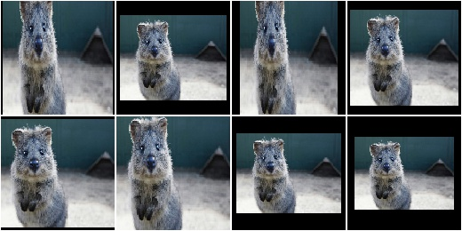

**Example.**
Create an augmenter that translates images along the y-axis by either
``-10px`` or ``10px``. Newly created pixels are always filled with
the value ``128`` (along all channels). ::

    aug = iaa.pillike.Affine(translate_px={"x": 0, "y": [-10, 10]},
                             fillcolor=128)

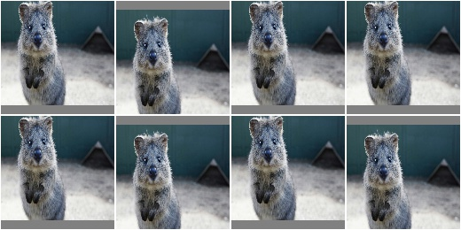

**Example.**
Rotate an image by ``-20`` to ``20`` degress and fill up all newly
created pixels with a random RGB color::

    aug = iaa.pillike.Affine(rotate=(-20, 20), fillcolor=(0, 256))

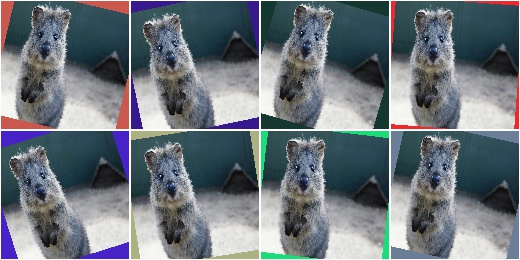

See the similar augmenter :class:`~imgaug.augmenters.geometric.Affine`
for more examples.
