******************
augmenters.pooling
******************

AveragePooling
--------------

Apply average pooling to images.

This augmenter pools images with kernel sizes ``H x W`` by averaging the
pixel values within these windows. For e.g. ``2 x 2`` this halves the image
size. Optionally, the augmenter will automatically re-upscale the image
to the input size (by default this is activated).

This augmenter does not affect heatmaps, segmentation maps or
coordinates-based augmentables (e.g. keypoints, bounding boxes, ...).

Note that this augmenter is very similar to ``AverageBlur``.
``AverageBlur`` applies averaging within windows of given kernel size
*without* striding, while ``AveragePooling`` applies striding corresponding
to the kernel size, with optional upscaling afterwards. The upscaling
is configured to create "pixelated"/"blocky" images by default.

API link: :class:`~imgaug.augmenters.pooling.AveragePooling`

**Example.**
Create an augmenter that always pools with a kernel size of ``2 x 2``::

    import imgaug.augmenters as iaa
    aug = iaa.AveragePooling(2)

.. figure:: ../../images/overview_of_augmenters/pooling/averagepooling.jpg
    :alt: AveragePooling

**Example.**
Create an augmenter that always pools with a kernel size of ``2 x 2``
and does *not* resize back to the input image size, i.e. the resulting
images have half the resolution::

    aug = iaa.AveragePooling(2, keep_size=False)

.. figure:: ../../images/overview_of_augmenters/pooling/averagepooling_keep_size_false.jpg
    :alt: AveragePooling with keep_size=False

**Example.**
Create an augmenter that always pools either with a kernel size
of ``2 x 2`` or ``8 x 8``::

    aug = iaa.AveragePooling([2, 8])

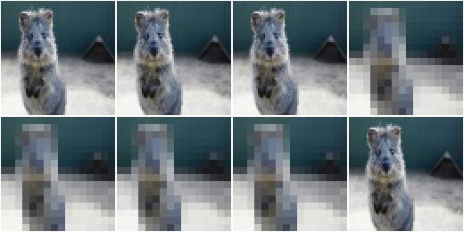

**Example.**
Create an augmenter that always pools with a kernel size of
``1 x 1`` (does nothing) to ``7 x 7``. The kernel sizes are always
symmetric. ::

    aug = iaa.AveragePooling((1, 7))

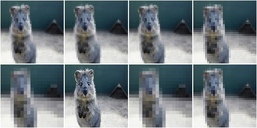

**Example.**
Create an augmenter that always pools with a kernel size of
``H x W`` where ``H`` and ``W`` are both sampled independently from the
range ``[1..7]``. E.g. resulting kernel sizes could be ``3 x 7``
or ``5 x 1``. ::

    aug = iaa.AveragePooling(((1, 7), (1, 7)))

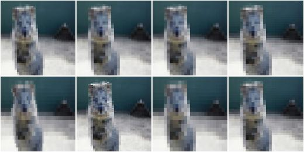

MaxPooling
----------

Apply max pooling to images.

This augmenter pools images with kernel sizes ``H x W`` by taking the
maximum pixel value over windows. For e.g. ``2 x 2`` this halves the image
size. Optionally, the augmenter will automatically re-upscale the image
to the input size (by default this is activated).

The maximum within each pixel window is always taken channelwise.

This augmenter does not affect heatmaps, segmentation maps or
coordinates-based augmentables (e.g. keypoints, bounding boxes, ...).

API link: :class:`~imgaug.augmenters.pooling.MaxPooling`

**Example.**
Create an augmenter that always pools with a kernel size of ``2 x 2``::

    import imgaug.augmenters as iaa
    aug = iaa.MaxPooling(2)

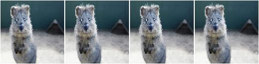

**Example.**
Create an augmenter that always pools with a kernel size of ``2 x 2``
and does *not* resize back to the input image size, i.e. the resulting
images have half the resolution::

    aug = iaa.MaxPooling(2, keep_size=False)

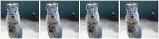

**Example.**
Create an augmenter that always pools either with a kernel size
of ``2 x 2`` or ``8 x 8``::

    aug = iaa.MaxPooling([2, 8])

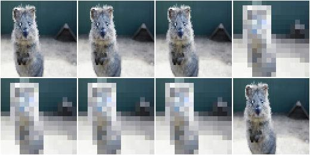

**Example.**
Create an augmenter that always pools with a kernel size of
``1 x 1`` (does nothing) to ``7 x 7``. The kernel sizes are always
symmetric. ::

    aug = iaa.MaxPooling((1, 7))

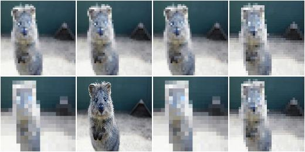

**Example.**
Create an augmenter that always pools with a kernel size of
``H x W`` where ``H`` and ``W`` are both sampled independently from the
range ``[1..7]``. E.g. resulting kernel sizes could be ``3 x 7``
or ``5 x 1``. ::

    aug = iaa.MaxPooling(((1, 7), (1, 7)))

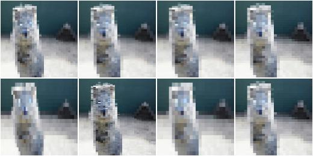

MinPooling
----------

Apply minimum pooling to images.

This augmenter pools images with kernel sizes ``H x W`` by taking the
minimum pixel value over windows. For e.g. ``2 x 2`` this halves the image
size. Optionally, the augmenter will automatically re-upscale the image
to the input size (by default this is activated).

The minimum within each pixel window is always taken channelwise.

This augmenter does not affect heatmaps, segmentation maps or
coordinates-based augmentables (e.g. keypoints, bounding boxes, ...).

API link: :class:`~imgaug.augmenters.pooling.MinPooling`

**Example.**
Create an augmenter that always pools with a kernel size of ``2 x 2``::

    import imgaug.augmenters as iaa
    aug = iaa.MinPooling(2)

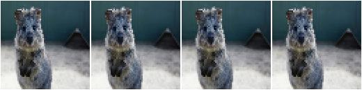

**Example.**
Create an augmenter that always pools with a kernel size of ``2 x 2``
and does *not* resize back to the input image size, i.e. the resulting
images have half the resolution. ::

    aug = iaa.MinPooling(2, keep_size=False)

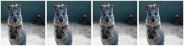

**Example.**
Create an augmenter that always pools either with a kernel size
of ``2 x 2`` or ``8 x 8``::

    aug = iaa.MinPooling([2, 8])

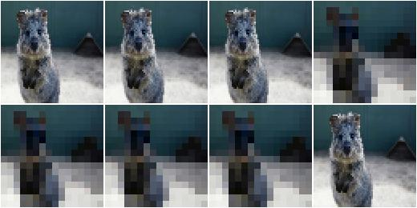

**Example.**
Create an augmenter that always pools with a kernel size of
``1 x 1`` (does nothing) to ``7 x 7``. The kernel sizes are always
symmetric. ::

    aug = iaa.MinPooling((1, 7))

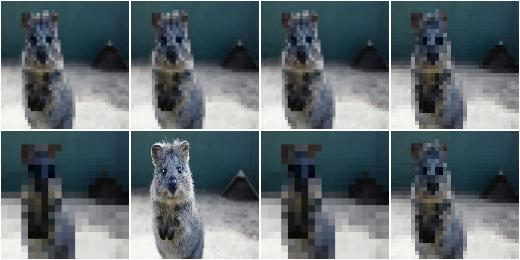

**Example.**
Create an augmenter that always pools with a kernel size of
``H x W`` where ``H`` and ``W`` are both sampled independently from the
range ``[1..7]``. E.g. resulting kernel sizes could be ``3 x 7``
or ``5 x 1``. ::

    aug = iaa.MinPooling(((1, 7), (1, 7)))

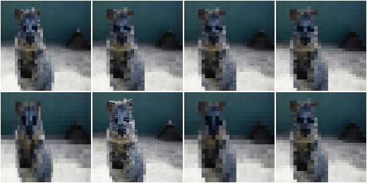

MedianPooling
-------------

Apply median pooling to images.

This augmenter pools images with kernel sizes ``H x W`` by taking the
median pixel value over windows. For e.g. ``2 x 2`` this halves the image
size. Optionally, the augmenter will automatically re-upscale the image
to the input size (by default this is activated).

The median within each pixel window is always taken channelwise.

This augmenter does not affect heatmaps, segmentation maps or
coordinates-based augmentables (e.g. keypoints, bounding boxes, ...).

API link: :class:`~imgaug.augmenters.pooling.MedianPooling`

**Example.**
Create an augmenter that always pools with a kernel size of ``2 x 2``::

    import imgaug.augmenters as iaa
    aug = iaa.MedianPooling(2)

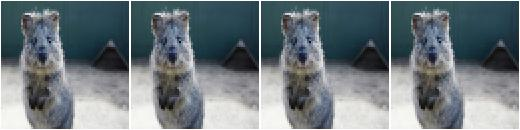

**Example.**
Create an augmenter that always pools with a kernel size of ``2 x 2``
and does *not* resize back to the input image size, i.e. the resulting
images have half the resolution::

    aug = iaa.MedianPooling(2, keep_size=False)

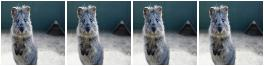

**Example.**
Create an augmenter that always pools either with a kernel size
of ``2 x 2`` or ``8 x 8``::

    aug = iaa.MedianPooling([2, 8])

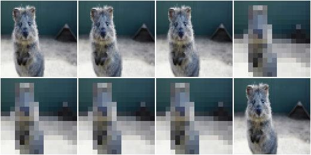

**Example.**
Create an augmenter that always pools with a kernel size of
``1 x 1`` (does nothing) to ``7 x 7``. The kernel sizes are always
symmetric. ::

    aug = iaa.MedianPooling((1, 7))

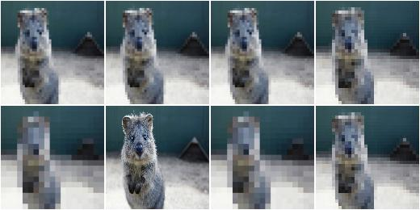

**Example.**
Create an augmenter that always pools with a kernel size of
``H x W`` where ``H`` and ``W`` are both sampled independently from the
range ``[1..7]``. E.g. resulting kernel sizes could be ``3 x 7``
or ``5 x 1``. ::

    aug = iaa.MedianPooling(((1, 7), (1, 7)))

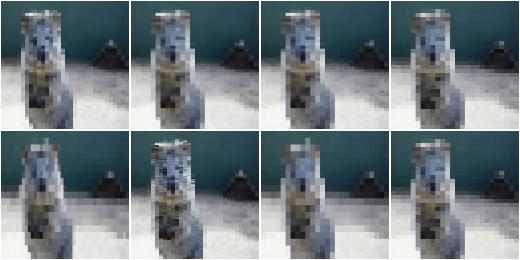

