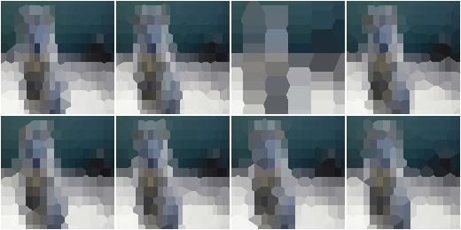
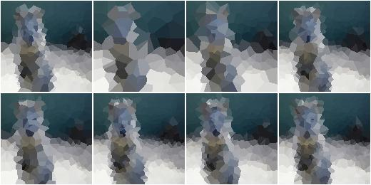
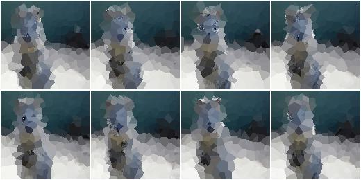
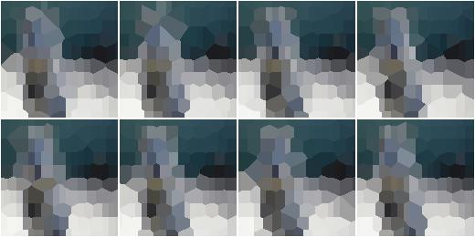
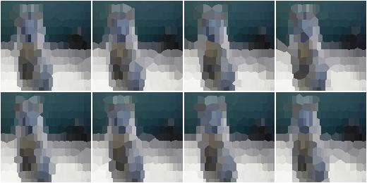
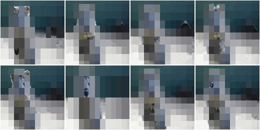

***********************
augmenters.segmentation
***********************

Superpixels
-----------

Completely or partially transform images to their superpixel representation.

.. note::

    This augmenter is fairly slow. See :ref:`performance`.

API link: :class:`~imgaug.augmenters.segmentation.Superpixels`

**Example.**
Generate about ``64`` superpixels per image. Replace each one with a
probability of ``50%`` by its average pixel color. ::

    import imgaug.augmenters as iaa
    aug = iaa.Superpixels(p_replace=0.5, n_segments=64)

.. figure:: ../../images/overview_of_augmenters/segmentation/superpixels_50_64.jpg
    :alt: Superpixels

**Example.**
Generate ``16`` to ``128`` superpixels per image. Replace each superpixel with
a probability between ``10`` and ``100%`` (sampled once per image) by its
average pixel color. ::

    aug = iaa.Superpixels(p_replace=(0.1, 1.0), n_segments=(16, 128))

.. figure:: ../../images/overview_of_augmenters/segmentation/superpixels.jpg
    :alt: Superpixels random

**Example.**
Effect of setting ``n_segments`` to a fixed value of ``64`` and then
increasing ``p_replace`` from ``0.0`` and ``1.0``:

.. figure:: ../../images/overview_of_augmenters/segmentation/superpixels_vary_p.jpg
    :alt: Superpixels varying p

**Example.**
Effect of setting ``p_replace`` to a fixed value of ``1.0`` and then
increasing ``n_segments`` from ``1*16`` to ``9*16=144``:

.. figure:: ../../images/overview_of_augmenters/segmentation/superpixels_vary_n.jpg
    :alt: Superpixels varying n

Voronoi
-------

Average colors of an image within Voronoi cells.

This augmenter performs the following steps:

    1. Query `points_sampler` to sample random coordinates of cell
       centers. On the image.
    2. Estimate for each pixel to which voronoi cell (i.e. segment)
       it belongs. Each pixel belongs to the cell with the closest center
       coordinate (euclidean distance).
    3. Compute for each cell the average color of the pixels within it.
    4. Replace the pixels of `p_replace` percent of all cells by their
       average color. Do not change the pixels of ``(1 - p_replace)``
       percent of all cells. (The percentages are average values over
       many images. Some images may get more/less cells replaced by
       their average color.)

API link: :class:`~imgaug.augmenters.segmentation.Voronoi`

**Example.**
Create an augmenter that places a ``20x40`` (``HxW``) grid of cells on
the image and replaces all pixels within each cell by the cell's average
color. The process is performed at an image size not exceeding 128px on
any side. If necessary, the downscaling is performed using linear
interpolation. ::

    import imgaug.augmenters as iaa
    points_sampler = iaa.RegularGridPointsSampler(n_cols=20, n_rows=40)
    aug = iaa.Voronoi(points_sampler)

.. figure:: ../../images/overview_of_augmenters/segmentation/voronoi_regular_grid.jpg
    :alt: Voronoi with a regular grid points sampler

**Example.**
Create a voronoi augmenter that generates a grid of cells dynamically
adapted to the image size. Larger images get more cells. On the x-axis,
the distance between two cells is ``w * W`` pixels, where ``W`` is the
width of the image and ``w`` is always ``0.1``. On the y-axis,
the distance between two cells is ``h * H`` pixels, where ``H`` is the
height of the image and ``h`` is sampled uniformly from the interval
``[0.05, 0.2]``. To make the voronoi pattern less regular, about ``20``
percent of the cell coordinates are randomly dropped (i.e. the remaining
cells grow in size). In contrast to the first example, the image is not
resized (if it was, the sampling would happen *after* the resizing,
which would affect ``W`` and ``H``). Not all voronoi cells are replaced
by their average color, only around ``90`` percent of them. The
remaining ``10`` percent's pixels remain unchanged. ::

    points_sampler = iaa.DropoutPointsSampler(
        iaa.RelativeRegularGridPointsSampler(
            n_cols_frac=(0.05, 0.2),
            n_rows_frac=0.1),
        0.2)
    aug = iaa.Voronoi(points_sampler, p_replace=0.9, max_size=None)

UniformVoronoi
--------------

Uniformly sample Voronoi cells on images and average colors within them.

This augmenter is a shortcut for the combination of ``Voronoi`` with
``UniformPointsSampler``. Hence, it generates a fixed amount of ``N``
random coordinates of voronoi cells on each image. The cell coordinates
are sampled uniformly using the image height and width as maxima.

API link: :class:`~imgaug.augmenters.segmentation.UniformVoronoi`

**Example.**
Sample for each image uniformly the number of voronoi cells ``N`` from the
interval ``[100, 500]``. Then generates ``N`` coordinates by sampling
uniformly the x-coordinates from ``[0, W]`` and the y-coordinates from
``[0, H]``, where ``H`` is the image height and ``W`` the image width.
Then uses these coordinates to group the image pixels into voronoi
cells and averages the colors within them. The process is performed at an
image size not exceeding 128px on any side. If necessary, the downscaling
is performed using linear interpolation. ::

    import imgaug.augmenters as iaa
    aug = iaa.UniformVoronoi((100, 500))

**Example.**
Same as above, but always samples ``N=250`` cells, replaces only
``90`` percent of them with their average color (the pixels of the
remaining ``10`` percent are not changed) and performs the transformation
at the original image size. ::

    aug = iaa.UniformVoronoi(250, p_replace=0.9, max_size=None)

RegularGridVoronoi
------------------

Sample Voronoi cells from regular grids and color-average them.

This augmenter is a shortcut for the combination of ``Voronoi``,
``RegularGridPointsSampler`` and ``DropoutPointsSampler``. Hence, it
generates a regular grid with ``R`` rows and ``C`` columns of coordinates
on each image. Then, it drops ``p`` percent of the ``R*C`` coordinates
to randomize the grid. Each image pixel then belongs to the voronoi
cell with the closest coordinate.

API link: :class:`~imgaug.augmenters.segmentation.RegularGridVoronoi`

**Example.**
Place a regular grid of ``10x20`` (``height x width``) coordinates on
each image. Randomly drop on average ``20`` percent of these points
to create a less regular pattern. Then use the remaining coordinates
to group the image pixels into voronoi cells and average the colors
within them. The process is performed at an image size not exceeding
128px on any side. If necessary, the downscaling is performed using
linear interpolation. ::

    import imgaug.augmenters as iaa
    aug = iaa.RegularGridVoronoi(10, 20)

**Example.**
Same as above, generates a grid with randomly ``10`` to ``30`` rows,
drops none of the generated points, replaces only ``90`` percent of
the voronoi cells with their average color (the pixels of the remaining
``10`` percent are not changed) and performs the transformation
at the original image size. ::

    aug = iaa.RegularGridVoronoi(
        (10, 30), 20, p_drop_points=0.0, p_replace=0.9, max_size=None)

RelativeRegularGridVoronoi
--------------------------

Sample Voronoi cells from image-dependent grids and color-average them.

This augmenter is a shortcut for the combination of ``Voronoi``,
``RegularGridPointsSampler`` and ``DropoutPointsSampler``. Hence, it
generates a regular grid with ``R`` rows and ``C`` columns of coordinates
on each image. Then, it drops ``p`` percent of the ``R*C`` coordinates
to randomize the grid. Each image pixel then belongs to the voronoi
cell with the closest coordinate.

.. note::
    In contrast to the other Voronoi augmenters, this one uses
    ``None`` as the default value for `max_size`, i.e. the color averaging
    is always performed at full resolution. This enables the augmenter to
    make most use of the added points for larger images. It does however
    slow down the augmentation process.

API link: :class:`~imgaug.augmenters.segmentation.RelativeRegularGridVoronoi`

**Example.**
Place a regular grid of ``R x C`` coordinates on each image, where
``R`` is the number of rows and computed as ``R=0.1*H`` with ``H`` being
the height of the input image. ``C`` is the number of columns and
analogously estimated from the image width ``W`` as ``C=0.25*W``.
Larger images will lead to larger ``R`` and ``C`` values.
On average, ``20`` percent of these grid coordinates are randomly
dropped to create a less regular pattern. Then, the remaining coordinates
are used to group the image pixels into voronoi cells and the colors
within them are averaged. ::

    import imgaug.augmenters as iaa
    aug = iaa.RelativeRegularGridVoronoi(0.1, 0.25)

**Example.**
Same as above, generates a grid with randomly ``R=r*H`` rows, where
``r`` is sampled uniformly from the interval ``[0.03, 0.1]`` and
``C=0.1*W`` rows. No points are dropped. The augmenter replaces only
``90`` percent of the voronoi cells with their average color (the pixels
of the remaining ``10`` percent are not changed). Images larger than
``512px`` are temporarily downscaled (*before* sampling the grid points)
so that no side exceeds ``512px``. This improves performance, but
degrades the quality of the resulting image. ::

    aug = iaa.RelativeRegularGridVoronoi(
        (0.03, 0.1), 0.1, p_drop_points=0.0, p_replace=0.9, max_size=512)

