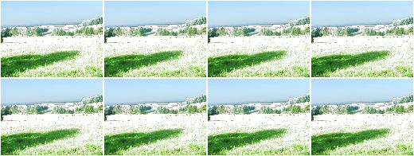
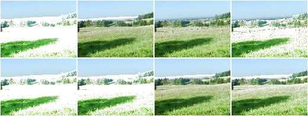
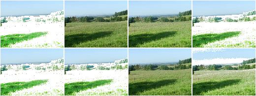
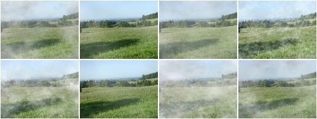
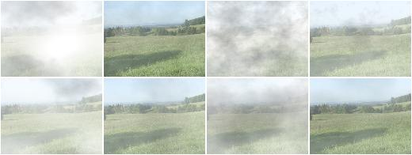
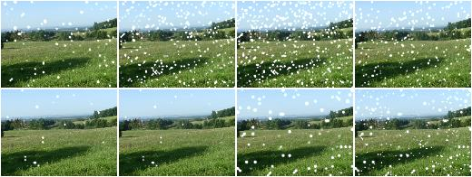
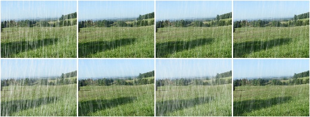

******************
augmenters.weather
******************

.. note::

    All examples below use the following input image:

    .. figure:: ../../images/overview_of_augmenters/weather/input_image.jpg
        :alt: Landscape

FastSnowyLandscape
------------------

Convert non-snowy landscapes to snowy ones.

This augmenter expects to get an image that roughly shows a landscape.

API link: :class:`~imgaug.augmenters.weather.FastSnowyLandscape`

**Example.**
Search for all pixels in the image with a lightness value in HLS
colorspace of less than ``140`` and increase their lightness by a factor
of ``2.5``. ::

    import imgaug.augmenters as iaa
    aug = iaa.FastSnowyLandscape(
        lightness_threshold=140,
        lightness_multiplier=2.5
    )

**Example.**
Search for all pixels in the image with a lightness value in HLS
colorspace of less than ``128`` or less than ``200`` (one of these
values is picked per image) and multiply their lightness by a factor
of ``x`` with ``x`` being sampled from ``uniform(1.5, 3.5)`` (once per
image). ::

    aug = iaa.FastSnowyLandscape(
        lightness_threshold=[128, 200],
        lightness_multiplier=(1.5, 3.5)
    )

**Example.**
Similar to the previous example, but the lightness threshold is sampled
from ``uniform(100, 255)`` (per image) and the multiplier
from ``uniform(1.0, 4.0)`` (per image). This seems to produce good and
varied results. ::

    aug = iaa.FastSnowyLandscape(
        lightness_threshold=(100, 255),
        lightness_multiplier=(1.0, 4.0)
    )

Clouds
------

Add clouds to images.

This is a wrapper around ``CloudLayer``. It executes 1 to 2 layers per
image, leading to varying densities and frequency patterns of clouds.

This augmenter seems to be fairly robust w.r.t. the image size. Tested
with ``96x128``, ``192x256`` and ``960x1280``.

API link: :func:`~imgaug.augmenters.weather.Clouds`

**Example.**
Create an augmenter that adds clouds to images::

    import imgaug.augmenters as iaa
    aug = iaa.Clouds()

Fog
---

Add fog to images.

This is a wrapper around ``CloudLayer``. It executes a single layer per
image with a configuration leading to fairly dense clouds with
low-frequency patterns.

This augmenter seems to be fairly robust w.r.t. the image size. Tested
with ``96x128``, ``192x256`` and ``960x1280``.

API link: :func:`~imgaug.augmenters.weather.Fog`

**Example.**
Create an augmenter that adds fog to images::

    import imgaug.augmenters as iaa
    aug = iaa.Fog()

CloudLayer
----------

Add a single layer of clouds to an image.

API link: :class:`~imgaug.augmenters.weather.CloudLayer`

Snowflakes
----------

Add falling snowflakes to images.

This is a wrapper around ``SnowflakesLayer``. It executes 1 to 3 layers
per image.

API link: :func:`~imgaug.augmenters.weather.Snowflakes`

**Example.**
Add snowflakes to small images (around ``96x128``)::

    import imgaug.augmenters as iaa
    aug = iaa.Snowflakes(flake_size=(0.1, 0.4), speed=(0.01, 0.05))

**Example.**
Add snowflakes to medium-sized images (around ``192x256``)::

    aug = iaa.Snowflakes(flake_size=(0.2, 0.7), speed=(0.007, 0.03))

**Example.**
Add snowflakes to large images (around ``960x1280``)::

    aug = iaa.Snowflakes(flake_size=(0.7, 0.95), speed=(0.001, 0.03))

SnowflakesLayer
---------------

Add a single layer of falling snowflakes to images.

API link: :class:`~imgaug.augmenters.weather.SnowflakesLayer`

Rain
----

Add falling snowflakes to images.

This is a wrapper around
:class:`~imgaug.augmenters.weather.RainLayer`. It executes 1 to 3
layers per image.

.. note::

    This augmenter currently seems to work best for medium-sized images
    around ``192x256``. For smaller images, you may want to increase the
    `speed` value to e.g. ``(0.1, 0.3)``, otherwise the drops tend to
    look like snowflakes. For larger images, you may want to increase
    the `drop_size` to e.g. ``(0.10, 0.20)``.

API link: :class:`~imgaug.augmenters.weather.Rain`

**Example.**
Add rain to small images (around ``96x128``)::

    import imgaug.augmenters as iaa
    aug = iaa.Rain(speed=(0.1, 0.3))

**Example.**
Add rain to medium sized images (around ``192x256``)::

    aug = iaa.Rain()

**Example.**
Add rain to large images (around ``960x1280``)::

    aug = iaa.Rain(drop_size=(0.10, 0.20))

RainLayer
---------

Add a single layer of falling raindrops to images.

API link: :class:`~imgaug.augmenters.weather.RainLayer`
